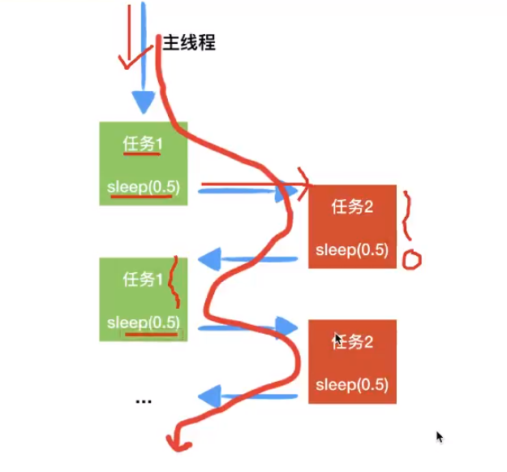

# 协程


协程，又称微线程，纤程。英文名Coroutine。从技术的角度来说，“协程就是你可以暂停执行的函数”。用户态的轻量级线程

- 协程即在不开辟新线程的基础上实现多任务，例如一个线程实现两个任务

- 一个特殊的生成器

线程和进程的操作是由程序触发系统接口，最后的执行者是系统；协程的操作则是程序员



CPU不断切换达到多任务执行，在切换任务时要保存任务的状态（底层使用了yield）


> 在实现多任务时，线程切换从系统层面远不止保存和恢复CPU上下文这么简单·操作系统为了程序运行的高效性每个线程都有自己缓存Cache等等数据，操作系统还会帮你做这些数据的恢复操作。所以线程的切换非常耗性能。但是协程的切换只是单纯的操作CPU的上下文，所以一秒钟切换个上百万次系统都抗的住


协程的适用场景：当程序中存在大量不需要CPU的操作时（IO），适用于协程

## python库

- greenlet

>是python的一个C扩展，来源于Stackless python

```python
"""
greenlet实现协程的步骤：
1`导入模块
2`创建任务work1 work2
3`创建 greenlet对象
4`手动switch任务
"""
import time
from greenlet import greenlet   # 若不这样导入，则需要greenlet.greenlet


# 1、创建work1的生成器
def work1():
    while True:
        print("正在执行work1...")
        time.sleep(1)
        # 切换到第二个任务
        g2.switch()


# 2、创建work2的生成器
def work2():
    while True:
        print("正在执行work2......")

        # yield greenlet底层已实现这个步骤
        time.sleep(1)
        # 切换到第一个任务
        g1.switch()

if __name__ == '__main__':

    # 创建greenlet的对象
    # greenlet(函数名)
    g1 = greenlet(work1)
    g2 = greenlet(work2)

    # 执行work1任务
    g1.switch()
```

- gevent

比greenlet更强大，不再需要人工自行切换，可以自动检测那些代码消耗时间并自动切换

> 关于猴子补丁为啥叫猴子补丁，据说是这样子的：
> 这个叫法起源于Zope框架，大家在修正Zope的Bug的时候经常在程序后面追加更新部分，这些被称作是“杂牌军补丁(guerilla patch)”，后来guerilla就渐渐的写成了gorlia（（猩猩），再后来就写了monkey（猴子），所以猴子补丁的叫法是这么莫名其妙的得来的。

猴子补丁主要有以下几个用处：

1. 在运行时替换方法、属性等
2. 在不修改第三方代码的情况下增加原来不支持的功能
3. 在运行时为内存中的对象增加patch而不是在磁盘的源代码中增加、


## 案例

并发下载器

使用到的库：urllib

```
"""
1、定义要下载的图片路径
2、词用文件下载的函数，专门下载文件
文件下载函数
1、根据url地址请求网络资源
2、在本地创建文件，准备保存
3、读取网络资源数据（循环）
4、把读取的网络资源写入到本地文件中
5、做异常捕获
"""
from gevent import monkey
monkey.patch_all()

import urllib.request
import gevent

def download_img(imgUrl, file_name):
    try:
        # 1、根据url地址请求网络资源
        response_data = urllib.request.urlopen(imgUrl)
        # 2、在本地创建文件，准备保存
        with open(file_name, "wb") as file:  # file指资源的变量？
            while True:
                # 3、读取网络资源数据（循环）
                file_data = response_data.read(1024)
                # 判断读取的数据不为空
                if file_data:
                    # 4、把读取的网络资源写入到本地文件中
                    file.write(file_data)
                else:
                    break
    # 5、做异常捕获
    except Exception as e:
        print("下载失败")
    else:
        print("下载完成")


def main():
    # 1、定义要下载的图片路径
    img_url1 = "http://img.mp.itc.cn/upload/20170716/8e1b835f198242caa85034f6391bc27f.jpg"
    img_url2 = "https://timgsa.baidu.com/timg?image&quality=80&size=b9999_10000&sec=1604341761781&di=840d00e2d515e141f5763b885edf3b61&imgtype=0&src=http%3A%2F%2Fa0.att.hudong.com%2F70%2F91%2F01300000261284122542917592865.jpg"
    img_url3 = "http://image.uczzd.cn/11867042470350090334.gif?id=0Sfrom=exports"

    # 2、词用文件下载的函数，专门下载文件
    # 文件下载函数
    # download_img(img_url1, "1.gif")
    # download_img(img_url2, "2.gif")
    # download_img(img_url3, "3.gif")

    # 批量把协程给join() 需要一个列表参数
    # gevent.joinall([列表])
    gevent.joinall([
        gevent.spawn(download_img, img_url1, "1.gif"),
        gevent.spawn(download_img, img_url2, "2.gif"),
        gevent.spawn(download_img, img_url3, "3.gif")
    ])  # 列表别忘了用 , 分隔元素

if __name__ == '__main__':
    main()
```

