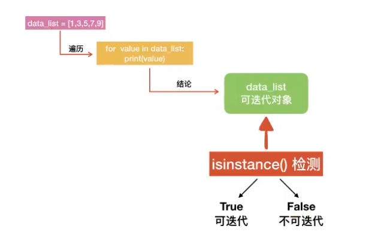
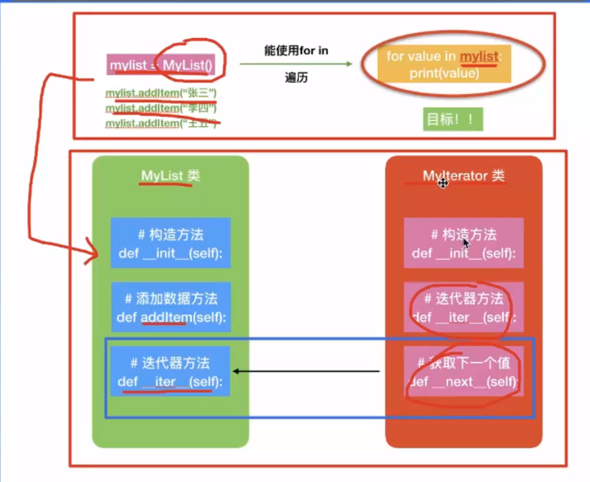

# 可迭代对象

迭代器——>生成器——>协程

> 送代是访问集合元素的一种方式。迭代器是一个可以记住遍历的位置的对象·迭代器对象从集合的第一个元素开始访问·直到所有的元素被访问完结束。选代器只能往前不会后退

for…in…循环进行遍历，也叫迭代

## 可迭代对象



1.可遍历对象就    是可迭代对象
2.列表、元组、字典、字符串都是可迭代对象
3.数值和自定义的类默认都是不可迭代的
4.一个对象myclass所属的类MyClass如果包含了__iter__()方法，此时myclass就是一个可迭代对象
5.==可迭代对象的本质：对象所属的类包含了__iter__()方法==
6.检测一个对象是否可以迭代，用 isinstance() 函数检测


## 迭代器 

​		我们分析对可选代对象进行选代使用的过程，发现每迭代一次（即在for..in.…中每循环一次）都会返回对象中的下一条数据，一直向后读取数据直到迭代了所有数据后结束。那么，在这个过程中就应该有一个“人”去记录每次访问到了第几条数据，以便每次迭代都可以返回下一条数据·我们把这个能帮助我们进行数据迭代的“入”称为迭代器（lterator)

​		可迭代对象通过`__iter__`方法向我们提供一个迭代器，我们在燃代一个可送代对象的时候，实际上然是先获取该对象提供的一个送代器，然后通过这个迭代器来依次获取对象中的每一个数据。


**iter()函数获取迭代器**

**next()函数获取迭代器下一个元素**


迭代器作用/特点：0

1. 记录遍历的位置
2. 提供下一个元素的值（配合next()函数）

for循环的本质：

1. 获取iter(可迭代对象)获取要遍历的对象的迭代器
2. next(迭代器)获取下一个元素
3. 帮我们捕获了 StopIteration 异常

自定义迭代器,满足两点

1. 必须含有``__iter__()``
2. 必须含有``__next__()``

```python
class MyIterator(object):
    def __iter__(self):
        pass
    # 当next(迭代器)的时候，会自动调用该方法
    def __next__(self):
        pass
```


自定义迭代对象



## 案例：斐波那契数列

```python
"""
    自定义迭代器：
    2）定义送代器类
    2）类中必须__iter__（）方法
    3）类中必须__next__（）方法
目标：
fib = Fibnacci(5)  # 指定生成５列斐波那契数列
    value = next(fib)
    print(1)
"""

class Fibnacci(object):

    def __init__(self, num):
        # 定义实例属性
        self.num = num
        # 定义变量保存斐波那契数列第一列和第二列
        self.a = 1
        self.b = 1
        # 记录下标位置的实例属性
        self.current_index = 0
        
    # __iter__()
    def __iter__(self):
        # 返回自己
        return self  # 便于输出时迭代的关键之处,只要能对外提供迭代器即可
    # __next__()

    def __next__(self):
        # 判断列数是否超过生成的总列数
        if self.current_index < self.num:
        #   定义变量，保存a的值
            data = self.a
        #   a = b, b = a+b
            self.a, self.b = self.b, self.a + self.b
        #   当前列数　＋１
            self.current_index += 1
        #   返回a的值
            return data
        # 如果超出范围，报错
        else:
            raise StopIteration


if __name__ == '__main__':
    # 创建迭代器对象
    num = int(input())
    fib_iterator = Fibnacci(num)

    # 迭代器本身又是一个迭代器
    for value in fib_iterator:
        print(value)

    # while True:
    #     if num >= 1 :
    #         # next(迭代器)得到下一个值
    #         value = next(fib_iterator)
    #         num -= 1
    #         print(value)
    #     else:
    #         break

    # next(迭代器)得到下一个值
    # value = next(fib_iterator)
    # print(value)
    #
    # # next(迭代器)得到下一个值
    # value = next(fib_iterator)
    # print(value)
    #
    # # next(迭代器)得到下一个值
    # value = next(fib_iterator)
    # print(value)
    #
    # # next(迭代器)得到下一个值
    # value = next(fib_iterator)
    # print(value)
    #
    # # next(迭代器)得到下一个值
    # value = next(fib_iterator)
    # print(value)


```

核心思想

a保存第一列值，b保存第二列值，a=b，b=a+b，取a值得到斐波那契数列

