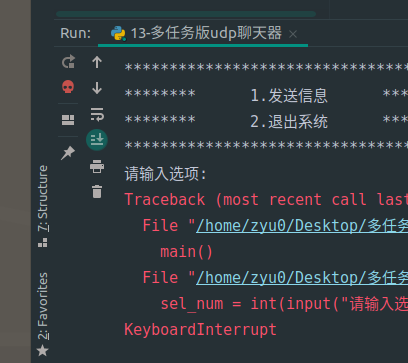
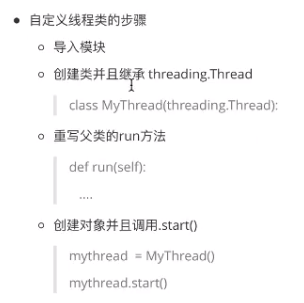

# 多任务/多线程
[python](python.md)

## 含义

同一时间有多个任务在执行

==python程序默认单任务==

## 线程

### 含义

- 程序执行的一个分支
- 程序执行流的最小单元
- 是被系统独立调度和分派的基本单位

	- 线程顺序：线程的执行顺序是无序的（线程有CPU调度执行，CPU会根据系统运行状态按照自己的调度算法去调度执行）

### 特点

- 不拥有系统资源，只拥有运行时必不可少的资源，但可与同属一个进程的其他线程共享进程拥有的全部资源
- 从代码和执行结果我们可以看出，多线程程序的执行顺序是不确定的。当执行到sleep语句时，线程被阻塞（Blocked)，到sleep结束后，线程进入就绪（Runnable)状态，等待调度。而线程调度将自行选择一个线程执行。

### 主线程和子线程

- 主线程

	- 当一个程序后动时，就有一个进程被操作系统（OS）创建，与此同时一个线程也立刻运行，该线程通常叫做程序的主线程，简而言之：程序后动就会创建一个主线程。
	- 重要性

		- 是产生其他子线程的线程
		- 通常它必须最后完成执行，例如关闭动作

- 子线程

	- 启动后会和主线程一起同时执行
	

	

骷髅头表示子线程还未结束，只关闭了主线程

- 这种情况下要添加线程守护
	- 使用threading模块创建

	  - 对象.start()启动
	  - ==获取正在活跃的线程列表 threading.enumerate()==，获取长度len(threading.enumerate())
	  - 当前的线程对象 threading.current_thread()
	  -  threading.Thread 的 target 参数能够指定线程执行的任务
### 线程参数
- 在线程中传递参数有三种方法

	- 使用元组传递 threading.Thread(target=xxx, args=(参数１，参数２，...))
	- 使用字典传递 threading.Thread(target=xxx, kwargs=("参数名": 参数值，...))
	- 混合使用元组和字典 threading.Thread(target=xxx, args=("参数名": 参数值，...), kwargs=("参数名": 参数值，...))  ==先传元组，再传字典==

### 线程守护

- 守拒线程：如果在程序中将子线程设置为守护线程，则该子线程会在主线程结束时自动退出，设置方式为 ==thread.setDaemon(True)==，要在thread.start0之前设置，默认是false的，也就是主线程结束时，子线程依然在执行。
- 默认子线程不随着主线程退出而退出

### 自定义线程类

- 作用

	- 多线程下载
	- 多线程爬虫

- 通过继承 threading.Thread

	- 重写父类run方法，创建对象并调用.start方法，且可以重写init方法，修改属性

		- 别忘记先调用父类init方法，在父类基础上增加新内容

	- 底层原理

		- Thread类

			- run方法
			- start方法
			- start()中调用run方法

### 多线程共享全局变量
==多进程不能共享==
- 资源竞争的问题

  - 结沦：当多个线程修改同一个资源的时候，会出现资源竞争，导致计算结果有误
  - 解决方法

    1. 优先让某个线程先执行 .join()，缺点是多线程转为了单线程，会影响整体性能

    2. 使用锁机制，同步锁

## 并行和并发

### 并发处理

- 任务数量大于CPU核数，通过操作系统的各种任务调度算法，实现用多个任务“一起”执行

	- 真正的并行执行多任务只能在多核CPU上实现，但是，由于任务数量远远多于CPU的核心数量，所以，操作系统也会自动把很多任务轮流调度到每个核心上执行。

### 并行

- 任务数小于等于CPU核数，任务一起执行

## 同步和异步 #？

### 同步

- 多任务，多个任务之间执行便时候要求有先后顺序，必须一个先执行完成之后，另一个才能继续执行，只有一个主线
- 线程锁机制

	- 当线程获取资源后，立刻进行锁定，资源使用完后解锁，保证同一时间只有一个进程可以有效访问
	- 互斥锁

		- 当多个线程几乎同时修改某一个共享数据的时候，需要进行同步控制
		- 锁定/非锁定状态
		- 使用规则，尽可能减少锁定竞争资源
		- threading.Lock()类

			- 创建
			- 锁定

				- .lock

			- 释放

				- .release

	- 避免死锁

		- 在线程间共享多个资源的时候，如果两个线程分别占有一部分资源并且同时等待对方的资源，就会造成死锁

			- 等待环

		- 会造成程序失去响应
		- 在多线程中，两个线程都占用一些资源，而且同一时间都在等待对方释放资源，所以使用完毕后要及时释放

- 使用更多？？？

### 异步

- 多个任务之间执行没有先后顺序，可以同时运行，执行的先后顺序不会有什么影响，存在的多条运行主线

