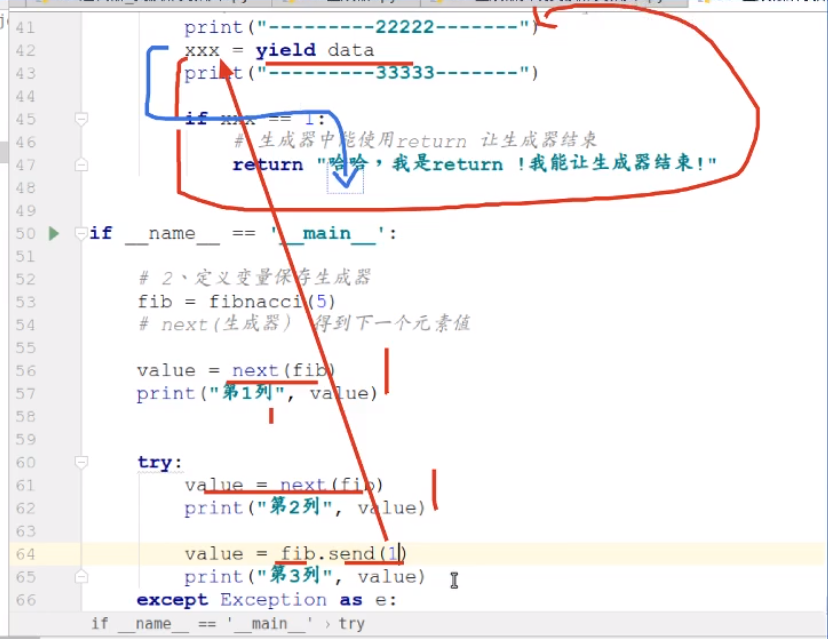

# 生成器

generator

为了达到记录当前状态，并配合nextl函数进行迭代使用，采用的更简便的语法


## 概念

一类特殊的迭代器（按照一定规律生成数列）

**廖雪峰大神的解释：**

> 通过列表生成式，我们可以直接创建一个列表。
> 但是，受到内存限制，列表容量肯定是有限的。
> 而且，创建一个包含100万个元素的列表，不仅占用很大的存储空间，如果我们仅仅需要访问前面几个元素，那后面绝大多数元素占用的空间都白白浪费了。
> 所以，如果列表元素可以按照某种算法推算出来，那我们是否可以在循环的过程中不断推算出后续的元素呢？
> 这样就不必创建完整的list，从而节省大量的空间。在Python中，这种一边循环一边计算的机制，称为生成器（Generator）。


创建方式两种·：

1. 列表推导式

```python
# 列表推导式
data_list1= [x*2 for x in range(10)]
for value in data_list1:
	print(value,end=" ")   # end=" " 可以使打印对象不换行
	
# 通过next获取下一个值
value = next(data_list2)
print("----->", value)            
```

2. 函数中使用yield返回值

```python
# 使用yield创建了一个生成器
def test1():
    yield 10
    
    
# n是一个生成器对象
n = test1()
print(n)

value = next(n)
print("--->", value)
```

## 案例

斐波那契数列

**yield**:

1. 充当return，
2. 能够保存程序的状态并且暂停程序执行，
3. 下一次从yield位置继续向下执行


可迭代对象|迭代器|生成器关系


个人理解

区别于迭代器，可迭代对象

迭代器会生成一个可迭代对象？，对象本身又是一个迭代器，而生成器是不断地运行计算的，不生成可迭代对象。真的如上图。



send() 

send的作用 

> 生成器.send(传递给生成器的值） 

> fib.send(1) 

> xxx=yield data    #xxx=1