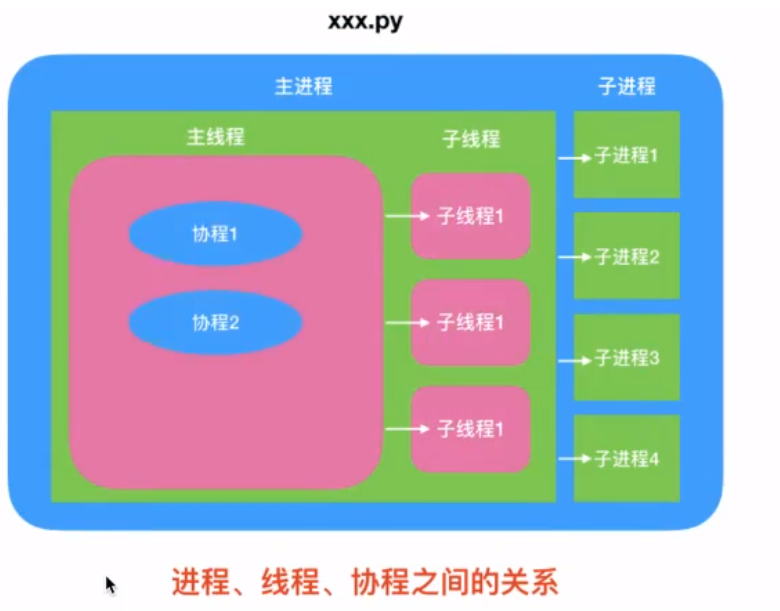
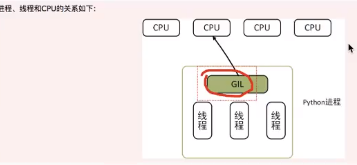

# 线程|进程|协程对比‘

## 应用场景

- 多进程：密集CPU任务，需要充分使用多核CPU瓷源（服务器，太量的并行计算）的时候，用多进程。

  > 缺陷：多个进程之间通信成本高，切换开销大。

- 多线程：密集/O任务（网络/O，磁盘/O，数据库/O）使用多线程合适。

  > 缺陷：同一个时间切片只能运行一个线程，不能做到高并行，但是可以做到高并发。

- 协程：当程中存在太量不需要CPU的操作时（10），适用干协程；

  > 多线程请求返回是无序的，那个线程有数据返回就处理那个线程，而协程返回的数据是有序的。
  >
  > 缺陷：单线程执行，处理密集CPU和本地磁盘IO的时候，性能较低。处理网络1/O性能还是比较高。

cpython下GIL锁，只能使用一个CPU

高效率方式：进程+协程