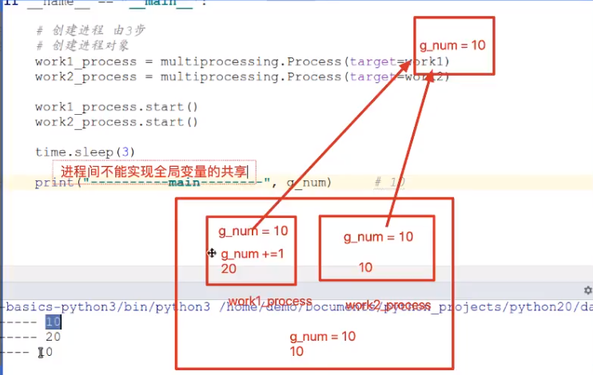
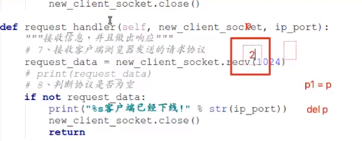

# 进程

Process

多进程也是实现多任务的一种方式

## 概念

资源分配的最小单位，线程的容器

任务管理器的进程界面

> 程序是固定不变的，而进程会根据运行需要，让操作系统动态分配各种资源的

> CPU的时间片轮转，在不同的时间段切换执行不同的进程，但是切换进程是比较耗时的；就引来了轻量级进程，也就是所谓的线程，==一个进程中包括多个线程==(代码流，其实也就是进程中同时跑的多个方法体)

- 程序：例如xxx.py这是程序，是一个静态的

- 进程：一个程序运行起来后，代码+用到的资源 称之为进程，它是操作系统分配资源的基本单元

## 进程的状态


操作系统原理中对此讲解详细

## 进程的创建

**`mutilprocessing`**

使用`multiprocessing.Process`类能够创建 进程对象

`multiprocessing.Process`的 target 参数能够指定进程 执行的任务函数

## 进程名称和PID

1. 名称

   - 获取名称`multiprocessing.current_process()`
   - 设置名称 ``multiprocessing.current_process(target=xxx,name="进程名称")`

2. 获取编号

   使用`getpid`和`getppid`获取进程id和进程父id

   - 进程id获取`multiprocessing.current_process().pid` 

   - 使用os模块`os.getpid()`

   获取进程父id：getppid()    ppid----> parent process id

**注意：**

- [ ] ```python
  process_obj = multiprocessing.Process(target=work1)
  process_obj.start()
  ```

target传递参数是传递函数名，而不是函数调用，下方需要start()才能执行

- [ ] ```python
  process_obj = multiprocessing.Process(target=work1())
  process_obj.start()
  ```

此处传递了函数名，则会直接开始调用函数，下方不需要写start()也会执行


## 杀死进程

`kill -9 进程编号 `   # -9 强制结束

## 进程参数

多进程之间不能共享全局变量

给子进程指定的函数传递参数

### 子进程参数传递

在线程中传递参数有三种方法

- 使用元组传递 threading.Thread(target=xxx, args=(参数１，参数２，...))
- 使用字典传递 threading.Thread(target=xxx, kwargs=("参数名": 参数值，...))
- 混合使用元组和字典 threading.Thread(target=xxx, args=("参数名": 参数值，...), kwargs=("参数名": 参数值，...))  ==先传元组，再传字典==

```python
def work1(a, b, c):

process_obj = multiprocessing.Process(target=work1, args=(10, ), kwargs={"c": 100, "b": 10})
```

**==参数传递顺序要注意，先 args 传递给 a ，再传递后续的 kwargs，传递顺序遵循着 (a, b, c) 的排列==


## 全局变量问题

**进程间不能实现全局变量的共享**

****

### 原因

**底层执行原理**：子进程运行时会将主进程一部分资源（例如全局变量）复制到子进程内部去使用，不同子进程之间互相隔离

**==引用计数==**



所以子进程若使用了外部的对象，在子进程运行完释放一次这个对象后，在子进程外部再释放一次这个对象，__del__，以便彻底关闭这个对象


有保护隐私的作用


## 守护进程

子进程和主进程的一种约定，主结束，子跟着结束

方法设置：

- `process_obj.daemon = True`
- `process_obj.terminate()`

