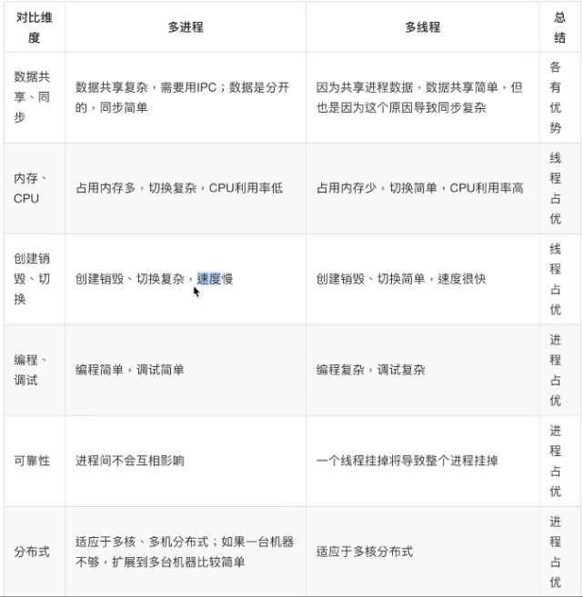

# 进程与线程的对比

- 进程，能够完成多任务，比如在一台电脑上能够同时运行多个QQ
- 线程，能够完成多任务，比如一个QQ中的多个聊天窗口

使用区别

- 进程是==系统==进行资源分配和调度的一个独立单位.
- 线程是进程的一个实体，是==CPU==调度和分派的基本单位，它是比进程更小的能独立运行的基本单位.线程自己基本上不拥有系统资源，只拥有一点在运行中必不可少的资源（如程序计数器，一组寄存器和栈），但是它可与同属一个进程的其他的线程共享进程所拥有的全部资源.
- 一个程序至少有一个进程，一个进程至少有一个线程.
- 线程的划分尺度小于进程（资源比进程少），使得多线程程序的并发性高。
- 进程在执行过程中==拥有独立的内存单元==，而多个线程共享内存，从而极大地提高了程序的运行效率

线程不能独立运行，必须依存于进程，需要一些必不可少的资源（进程提供）

选择原则：

- 需要频繁创建销毁的优先使用线程；（如：Web服务器）
- 线程的切换速度快，所以在需要大量计算，切换频繁时用线程（如图像处理、算法处理）
- 因为对CPU系统的效率使用上线程更占优，所以可能要发展到多机分布的用进程，多核分布用线程
- 需要更稳定安全时，适合选择进程；需要速度时，选择线程更好
- 都满足需求的情况下，用你最熟悉、最拿手的方式
- CPU密集型，进程优先，I/O密集型使用线程

==一般都是“进程+线程”的组合做法==