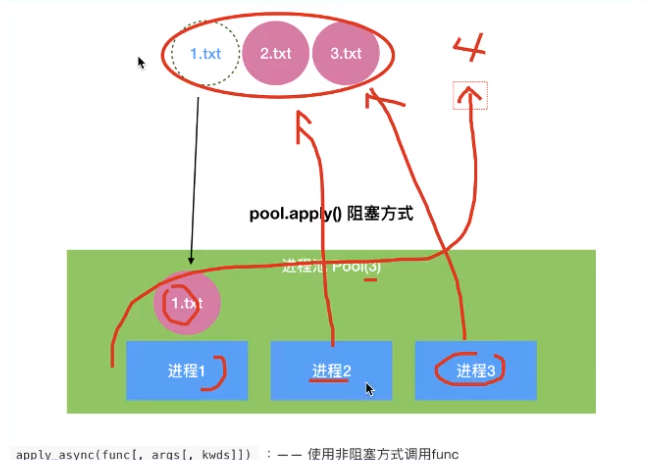
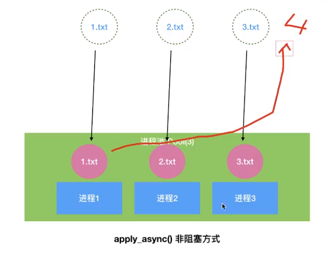
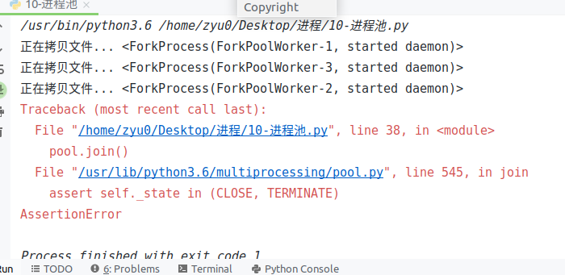
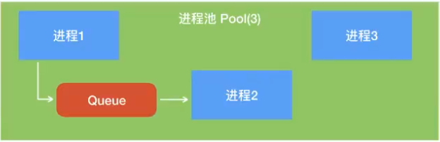

# 进程池

解决创建大量进程的问题

multiprocessing模块提供了Pool方法，用来创建大量的进程

进程的容器，可以自动帮我们创建指定数量的进程，并且管理进程及工作


## 同步工作方式

使用进程池里的单个进程工作，完成后再进行下一个进程

核心方法：

pool.apply()

pool.apply(函数名，(传递给函数的参数1，参数2，...))



## 异步工作方式

python官方推荐异步，apply_async()




pool.apply_async(函数名，(传递给函数的参数1，参数2，...))

- 进程池要close()，表示不再接收新的任务,不表示进程池结束

> pool.close()

> 这是一个声明。表示除了目前做的这个事，不做其他的。应该是因为这种异步执行会导致同时处理多个任务，事多了会混乱

- pool.join() 让主进程等待进程池执行结束后再退出


==join() 主进程阻塞，等待子进程的退出， 必须在close或terminate之后使用==

没有close()，有join()时，进程池会执行一次后结束，主程序结束，销毁变量



**为什么会这样呢？**

因为进程的切换是操作系统来控制的，抢占式的切换模式。
我们首先运行的是主进程，cpu运行很快啊，这短短的几行代码，完全没有给操作系统进程切换的机会，主进程就运行完毕了，整个程序结束。子进程完全没有机会切换到程序就已经结束了。

**apply是阻塞式的。**

首先主进程开始运行，碰到子进程，操作系统切换到子进程，等待子进程运行结束后，在切换到另外一个子进程，直到所有子进程运行完毕。然后在切换到主进程，运行剩余的部分。

**apply_async是异步非阻塞式的。**

首先主进程开始运行，碰到子进程后，主进程说：让我先运行个够，等到操作系统进行进程切换的时候，在交给子进程运行。以为我们的程序太短，然而还没等到操作系统进行进程切换，主进程就运行完毕了。

想要子进程执行，就告诉主进程：你等着所有子进程执行完毕后，在运行剩余部分。


## 进程池中进程的通信

`queue = multiprocessing.Manager().Queue(5)`

==注意Manager()==



```python
 #   3.2 异步方式
    # apply_async() 返回值 ApplyResult对象，该对象有一个wait()方法
    # wait()方法，类似join() 表示先让当前进程执行完毕，后续进程才能启动
    result = pool.apply_async(write_queue, (queue, ))
    result.wait()
    pool.apply_async(read_queue, (queue,))

    pool.close()
    pool.join()
```

==注意  返回值  ApplyResult 对象与其 wait() 方法==，wait()用来使第一个进程先执行完，再执行后续进程

