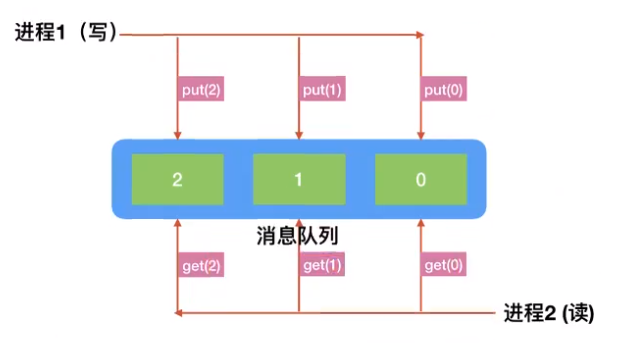

# 进程间通信

思路



利用队列在两个进程间进行传递，进而实现数据共享


1. 准备两个进程
2. 准备一个队列，一个进程向队列写入数据，然后把队列传递到另一个进程
3. 另外一个进程读取数据


```python
"""
思路
1`准备两个进程
2`准备一个队列，一个进程向队列写入数据，然后把队列传递到另一个进程
3`另外一个进程读取数据
"""
import time
import multiprocessing


# 1`写入数据到队列的函数
def write_queue(queue):

    # for循环，向队列写入数据
    for i in range(10):
        # 判断队列是否已满
        # if queue.full:  # 缺（）导致错误
        if queue.full():
            print("队列已满")
            break
        # 向队列中放入值
        queue.put(i)
        print("写入成功，成功写入：",i)
        time.sleep(0.5)


# 2`读取队列数据并显示的函数
def read_queue(queue):

    while True:
        # 判断队列是否为空
        if queue.qsize() == 0:
            print("队列已空")
            break
        # 从队列中读取数据
        value = queue.get()
        print("已经读取：", value)

if __name__ == '__main__':

    # 3`创建一个空的队列
    queue = multiprocessing.Queue(5)

    # 4`创建两个进程，分别写入和读取  # 此处会出现写入读取同时进行，导致读取不完整
    write_queue1 = multiprocessing.Process(target=write_queue, args=(queue, ))
    read_queue1 = multiprocessing.Process(target=read_queue, args=(queue,))

    write_queue1.start()
    # 优先让写数据进程执行结束后，再读取数据,否则会出现读取不完整
    write_queue1.join()
    
    read_queue1.start()   
```

