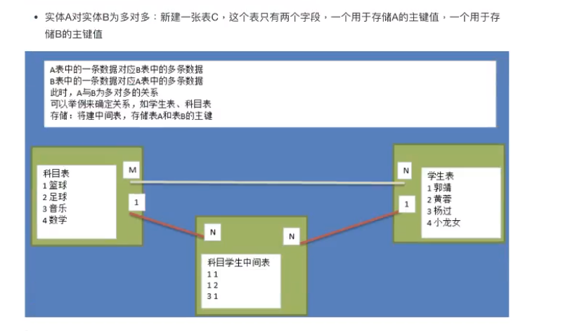

# E-R模型及表间关系

E-R模型即E-R图。

E-R图即实体-联系图（Entity Relationship Diagram),是指提供了表示实体型、属性和联系的方法，用来描述现实世界的概念模型·由美籍华裔计算机科学家陈品山（Peter Chen)发明。

E-R模型的使用场景

- 关系型数据库关系模型的基础上，我们需要根据产品经理的设计策划，抽取出来模型与关系，制定出表结构，这是项目开始的第一步

- 在设计阶段一般使用E-R模型进行建模。有很多设计数据库的软件，常用的如power designer，dbdesinger等，这些软件可以直观的看到实体及实体间的关系

- 设计数据库，可能是由专门的数据库设计人员完成，也可能是由开发组成员完成，一般是项目经理带领组员来完成

- 待设计完成E-R模型会将其转化为关系模型

表间关系：

- 一对一：一个表中的一条数据，能够和另外一个表的唯一一条数据对应

  > ​	人和常住地址

  

- 一对多：一个表中的一条数据，能够和另外一个表的多条数据对应

  > 一个班有多个学生

  

- 多对多：一个表中的一条数据，能够和另外一个表的多条数据对应，相反也成立。

  >  学生和选课

  

