# MySQL数据库使用

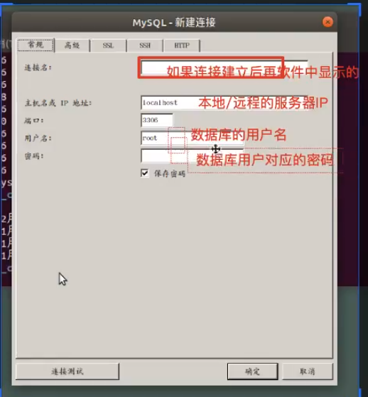


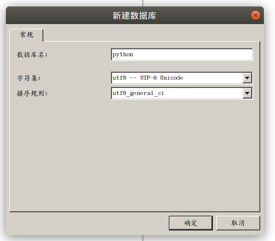


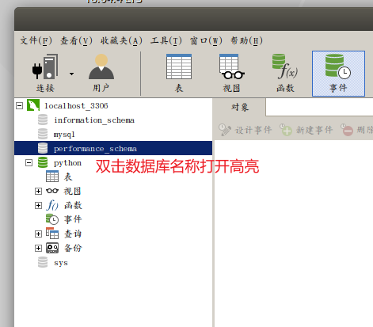


右键表建立新表,字段处不能写中文


客户端Navicat使用

* 建立连接

  连接  ---> MySQL ---> 主机 、用户名、端口、密码 --> 确定

* 创建数据库
  1)连接

  2)右键 --> 创建数据库  --> 名称、字符集utf8、排序规则

* 创建数据表

  1)打开数据库

  2)右键创建表

  3)输入字段 (光标移动)

  4)保存,输入表名

* 修改数据表

  1) 右键表名  ---> 设计表  ---> 保存


## 数据库操作

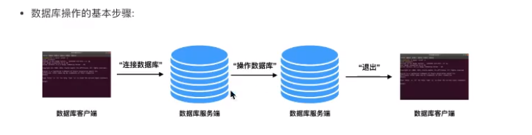

1. 连接数据库
2. 输入用户名和密码
3. 完成对数据库的操作
4. 完成对表结构和表数据的操作
5. 退出数据库


SQL输入命令没输入一行都要以 ； 结束

select version();	查询MySQL版本

select now();	查询当前时间

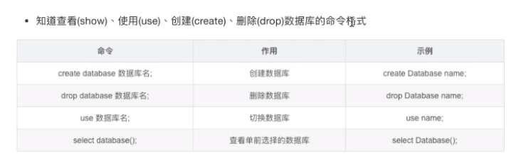

# SQL指令

 [SQL指令.sql](assets/SQL指令.sql) 

 [SQL进阶指令.sql](assets\SQL进阶指令.sql) 

- 查询所有字段
- 查询部分字段
- 查询字段起别名
- 查询，给表起别名
- 去除重复 distinct

## 表结构创建

查看(show)、创建(create)、显示表字段(desc)命令

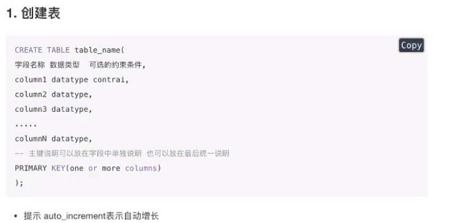

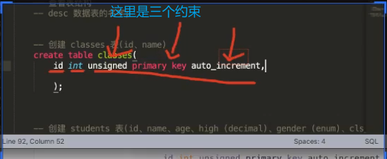


## 表结构修改

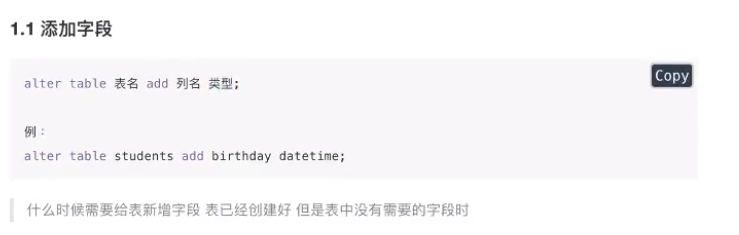

`alter table students add birthday datetime;`

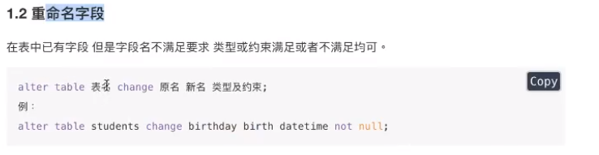

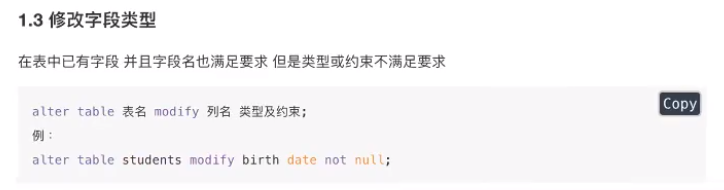

## 表数据操作

增删改查(curd):

- 创建(Create) 
- 更新(Update) 
- 读取(Retrieve/Read) ·
- 删除(Delete)

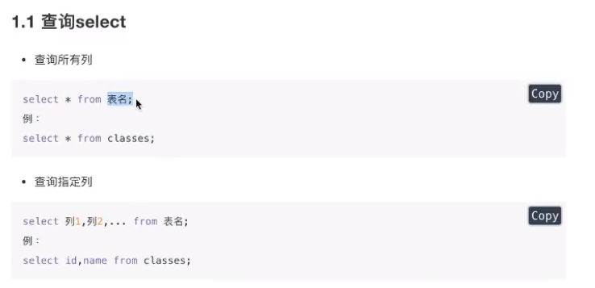

插入insert

```sql
-- 部分插入
-- insert into 表名(列1,...) values(值1,...)
insert into students values(null, '司马二狗', 18, 1.78, '妖', 1);
insert into students(id, name) values(null, '司马狗剩');

-- 多行插入
insert into students values(null, '欧阳铁娃', 18, 1.78, '妖', 1),(null, '诸葛铁锤', 18, 1.78, '妖', 1);
```

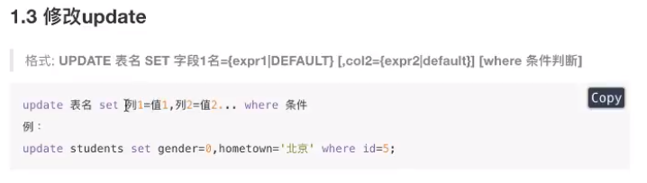


```sql
create table students(
	id int unsigned primary key auto_increment not null,
    name varchar(20) default '', 
    age tinyint unsigned default 0, 
    height decimal(5,2), 
    gender enum('男','女','中性','保密') default '保密', 
    cls_id int unsigned default 0,
    is_delete bit default 0
);


create table classes( 
    id int unsigned auto_increment primary key not null,
    name varchar(30) not null 
);

insert into students values
(0,'小明',18,180.80,2,1,0),
(0,'小月月',18,180.00,2,2,1),
(0,'彭于晏',29,185.00,1,1,0),
(0,'刘德华',59,175.00,1,2,1),
(0,'黄善',38,160.00,2,1,0),
(0,'凤姐',28,150.80,4,2,1),
(0,'王祖贾',18,172.00,2,1,1),
(0,'周杰伦',36,NULL,1,1,0),
(0,'程坤',27,181.00,1,2,0),
(0,'刘亦菲',25,166.00,2,2,0),
(0,'金星',33,162.00,3,3,1),
(0,'静香',12,180.00,2,4,0),
(0,'郭娟',12,170.80,1,4,0),
(0,'周杰',34,176.80,2,5,0),
(0,'液小',28,180.00,2,1,0),
(0,'司马二狗',28,120.00,1,1,0);

insert into classes values (0,"python_01期"),(0,"python_02期"),(0,"Python_03期");
```


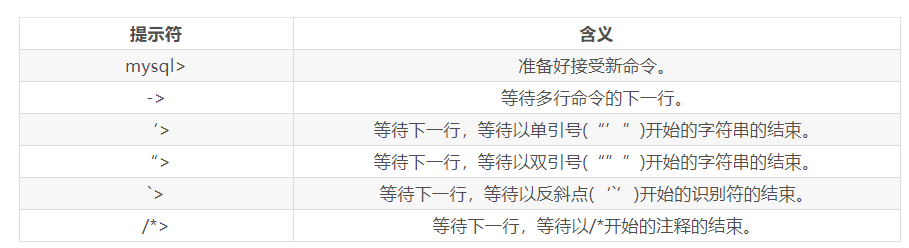

\c退出当前输入回到命令行

# order排序

升序

降序

**语法：**

order by …	

- asc升序
- desc降序

后不加asc或desc，则默认asc

```sql
select'from 表名 order by 列1 asc|desc[,列2asc|desc..…]

-- 查询年龄在18到34岁之间的女性，身高从高到矮排序
select * from students where age between 18 and 34 and gender='女' order by height desc;
```

1. 将行数据按照列1进行排序，如果某些行列1的值相同时，则按照列2排序，以此类推
2. asc从小到大排列，即升序
3. desc从大到小排序，即降序
4. 默认按照列值从小到大排列（即asc关键字）

# where条件

where语句的作用：使用where子句对表中的数据筛选，结果为true的行会出现在结果集中。

- 比较运算符
- 逻辑运算符
- 模糊查询
- 范围查询
- 空判断

==尽在 [SQL进阶指令.sql](assets\SQL进阶指令.sql)==

语法

```sql
select *from 表名 where 条件；
例：
select * from students where id=1;
```


## 比较运算符

- 等于：=
- 大于：>
- 大于等于：>=
- 小于：<
- 小于等于：<=
- 不等于：=或<>

## 逻辑运算符

- and，表示有多个条件时，多个条件必须同时成立（值为True)
- or，表示有多个条件时，满足任意一个条件时成立
- not，表示取反操作

`select * from students where age > 18 and age <=28;`

## 模糊查询

1. like

2. %表示任意多个任意字符

3. _表示一个任意字符

特殊用法，可以攻击数据库和查询许多莫名的内容

`select * from students where name like '小%';`

## 范围查询

范围查询分为连续范围查询和非连续范围查询

- in表示在一个非连续的范围内

```sql
-- 查询编号是1或3或8的学生 
select * from students where id in(1,3,8);
-- 查询编号不是1或3或8的学生 
select name from students where age not in (18,34);
```

- between 起始值 and 终值	表示在一个连续的范围内 

```sql
-- 查询 年龄在18到34之间的的信息
select * from students where age between 18 and 34;

-- 查询 年龄不在在18到34之间的的信息
elect * from students where age not between 18 and 34;
```

## 空值判断

null与 “ ”是不同的，特殊类型。非字符串、非0、非空格

- is null	判断为空

```sql
-- 查询身高为空的信息
select * from students where height is null;
```

- is not null	判断非空

```sql
select * from students where height is not null;
```

# 聚合函数

聚合函数aggregation function又称为组函数。
默认情况下聚合函数会对当前所在表当做一个组进行统计

聚合函数有以下几个特点：

- 每个组函数接收一个参数（级名或者表达式）
- 统计结果中默认忽略字段为NULL的记录要想列值为NULL的行也参与组函数的计算，必须使用IFNULL函数对NULL值做转
- 不允许出现嵌套  比如 sum(max(xx)）

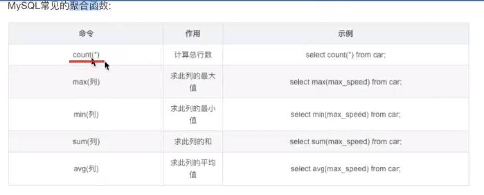

# 四舍五入函数

round() 不是聚合函数

# group分组

什么是分组：

是将一个“数据集”划分成若干个小区域”，然后针对若干个“小区城“进行数据处理。算是一层过滤

- group by

1.group by的含义：将查询结果按照1个或多个字段进行分组，字段值相同的为一组2.group by可用于单个字段分组也可用于多个字段分组，

> 在现在MySQL默认情况下，select后的字段只能出现在以下两种情况：
>
> - 在group by后出现过·
> - 在聚合函数中出现

- group by+ group_concat()

group_concat(字段名）根据分组结果，使用group concat() 来放置每一个分组中某字段的集合，拼合字符串

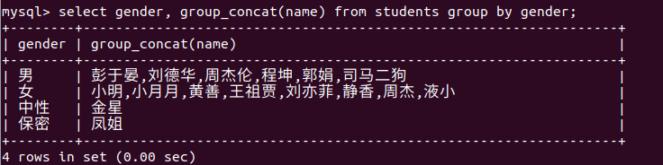

- group by + having

having 条件表达式：用来过滤分组结果，在分组后的再一次过滤

> having作用和where类似，但having只能用于group by 而where是用来过滤表数据

# limit

可以使用limit限制取出记录的数量，但limt要写在sql语句的最后

limit 数据有很多，只取指定数量的数据。表中的数据，位置默认从0开始

- 语法：`limit 起始记录，记录数`

说明：

1. 起始记录是指从第几条记录开始取，第一条记录的下标是0

2. 记录数是指从起始记录开始向后依次取的记录数。

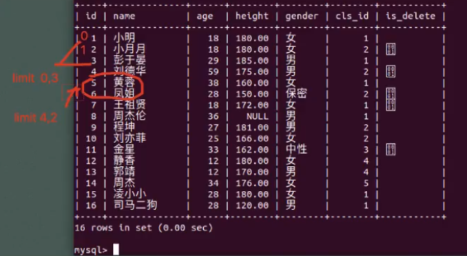


- 分页查询

当排序经过数据分析之后，根据关联度和点击量等属性排序后，所有的数据的大小对于用户来讲是个天文数字并且用户也不一定需要这么大量的数据，所以这个时候就有一个想法能不能把这么多数据分成一页一页的数据，而根据用户的需要将数据分为一页一页地传输给用户的技本就是分页

分页查询语法 `select * from 表名 limit start=0,count`

> 1. 从start开始·获取count条数据
> 2. start默认值为0
> 3. 也就是当用户需要获取数据的前n条的时候可以直接写上 xxx limit n；

start 值计算公式如下

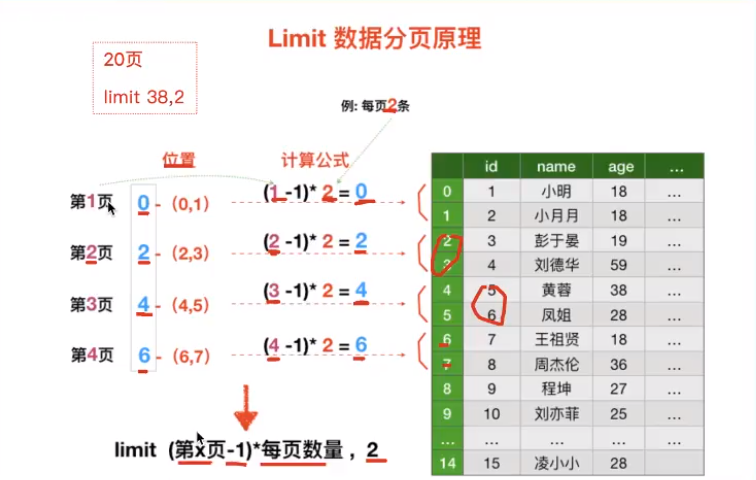

 # 连接查询

## 内连接

- inner join	关键字完成对多张表的内连接查询（重点）

```sql
语法：
select 字段 from 表1 inner join 表2 where/on 表1.字段 = 表2.字段
```


笛卡尔积

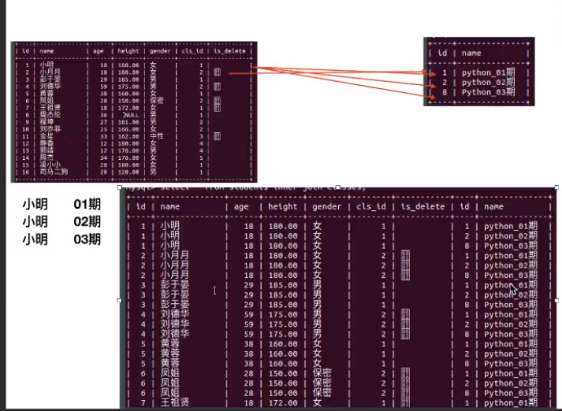


## 左外连接

- left join	关键字完成对多张表的左连接查询

左外连接主表left join从表，左外连接另外一个表，在从表中没有找到匹配，右侧补NULL

## 右外连接

- right join	关键字完成对多张表的右连接查询

右外连接从表right join主表，右外连接一个表，在从表中没有找到匹配，左侧补NULL

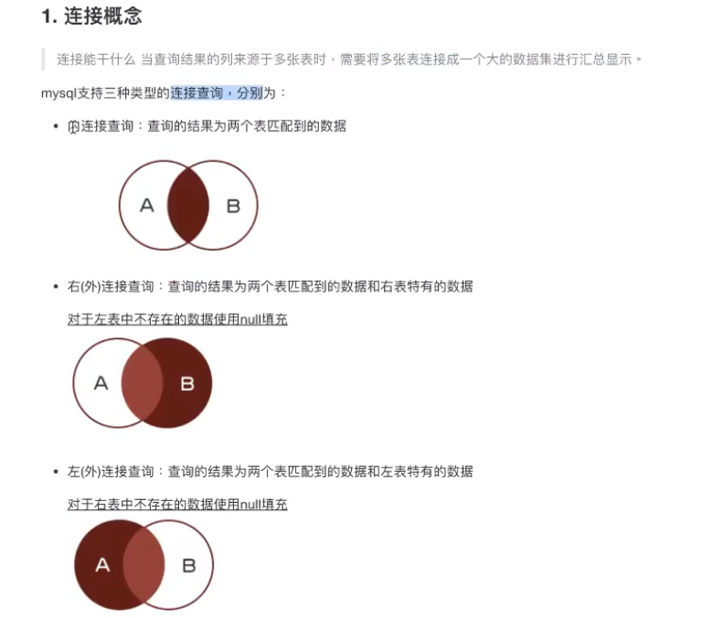

## 自连接

特殊的内连接

```sql
create table areas( 
	aid int primary key, 
    atitle varchar(20), 
    pid int
);
```

# 子查询

在一个select 语句中，嵌入了另外一个select 语句，那么被嵌入的select 语句称之为子查询语句，外部那个select语句则称为主查询

主查询和子查询的关系

- 子查询是嵌入到主查询中

- 子查询是辅助主查询的，要么充当条件，要么充当数据源

- 子查询是可以独立存在的语句，是一条完整的select 语句

## 分类

标量子查询：子查询返回的结果是一个数据（一行一列）

列子查询：返回的结果是一列（一列多行）

行字查询：返回的结果是一行（一行多列）

表子查询：子查询返回多行多列

```sql
select * from students where id in (select id from classes);
```


# 标准SQL书写格式

```sql
select 字段1,字段2,…
from 表名
[where 条件]
[group by 字段名]
[order by 字段名 排序规则]
[having 条件]
[limit 起始位置,数量]
```

Lexaria   https://minionsart.github.io/tutorials/#shaders


实践：

```sql
create table goods( 
    id int unsigned primary key auto_increment not null, 
    name varchar(158)not null, 
    cate_name varchar(40)not null, 
    brand_name varchar(40)not null, 
    price decimal(10,3)not null default 0, 
    is_show bit not null default 1, 
    is_saleoff bit not null default 0 
);

insert into goods value(0,'r510vc 15.6英寸笔记本','笔记本','华硕','3399',default,default);
insert into goods value(0,'y400n 14.0英寸笔记本电脑','笔记本','联想','4999',default,default);
insert into goods value(0,'g150th 15.6英寸游戏本','游戏本','雷神','8499',default,default);
insert into goods value(0,'x550cc 15.6英寸笔记本','笔记本','华硕','2799',default,default);
insert into goods value(0,'x240 超极本','超极本','联想','4880',default,default);
insert into goods value(0,'u330p 13.3英寸超极本','超极本','联想','4299',default,default);
insert into goods value(0,'svp13226scb 触控超极本','超极本','索尼','7999',default,default);
insert into goods value(0,'ipad mini 7.9英寸平板电脑','平板电脑','苹果','1998',default,default);
insert into goods value(0,'ipad air 9.7英寸平板电脑','平板电脑','苹果','3388',default,default);
insert into goods value(0,'ipad mini 配备 retina 显示器','平板电脑','苹果','2788',default,default);
insert into goods value(0,'ideacenter c340 20英寸一体电脑','台式机','联想','3499',default,default);
insert into goods value(0,'vostro 3800-r1206 台式电脑','台式机','戴尔','2899',default,default);
insert into goods value(0,'imac me086ch/a 21.5英寸一体电脑','台式机','苹果','9188',default,default);
insert into goods value(0,'at7-7414lp 台式电脑 linux','台式机','宏基','3699',default,default);
insert into goods value(0,'z220sff f4f06pa工作站','服务器/工作站','惠普','4288',default,default);
insert into goods value(0,'poweredge ii服务器','服务器/工作站','戴尔','5388',default,default);
insert into goods value(0,'mac pro 专业级台式电脑','服务器/工作站','苹果','28888',default,default);
insert into goods value(0,'hmz-t3w 头戴显示设备','笔记本配件','索尼','6999',default,default);
insert into goods value(0,'商务双肩背包','笔记本配件','索尼','99',default,default);
insert into goods value(0,'x3250 m4机架式服务器','服务器/工作站','ibm','6888',default,default);
insert into goods value(0,'商务双肩背包','笔记本配件','索尼','99',default,default);


```

```sql
create table if not exists goods_cates( 
    id int unsigned primary key auto_increment, 
    name varchar(48)not null
);
```

# 表格健壮修改

将主表格关键内容抽象代替（建立索引），建新表保存关键内容增删查改，用索引来映射

举例： [产品信息表.xlsx](assets\产品信息表.xlsx) 

代码： [SQL实践.sql](assets\SQL实践.sql) 

```sql
-- 创建 商品品牌表 goods_brands
	-- #第一步 创建 "商品品牌表" 表
	-- 第一种方式 先创建表
	create table goods_brands (
	    id int unsigned primary key auto_increment,
	    name varchar(40) not null);

-- 插入数据 brand_name(分组)
-- 按照 分组 的方式查询 goods 表中的所有 种类(brand_name)
select brand_name from goods group by brand_name;


--(注意) 把查询出来的 结果 写入 goods_brands 表里去 ( insert into ) 只插入 name
-- 第二种方式 创建表的同时插入数据(了解,不建议使用)
insert into goods_brands(name) (select brand_name from goods group by brand_name);

		
			
-- # 第二步 同步数据
-- 通过goods_brands数据表来更新goods数据表 g.brand_name=b.id
update goods inner join goods_brands on goods.brand_name = goods_brands.name set goods.brand_name = goods_brands.id;


-- # 第三步 修改表结构
-- 通过alter table语句修改表结构 brand_id int unsigned not null
alter table goods change brand_name brand_id int unsigned not null;
```

# 外键使用

> 做表和表之间的约束

是一种特殊的索引

`show index from 表名；`可查到外键的索引

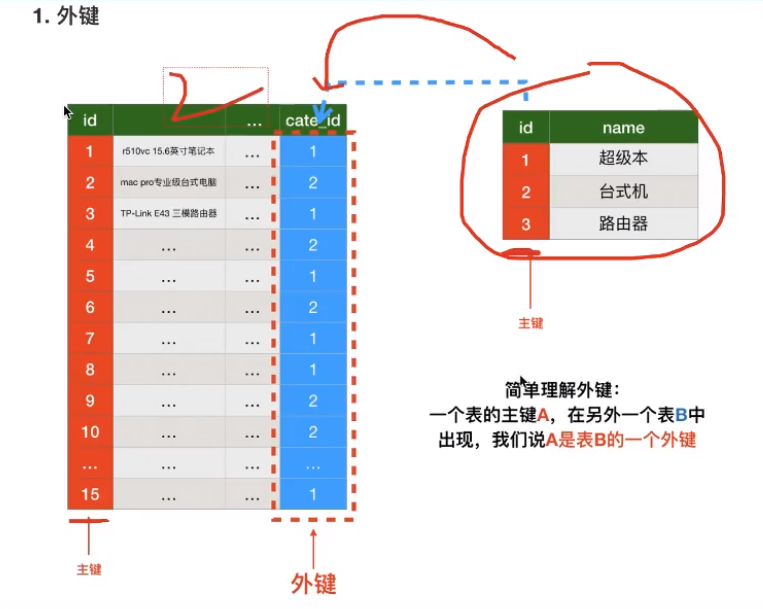

如何防止无效信息的插入，就是可以在插人前判断类型或者品牌名称是否存在哦?可以使用之前讲过的外键来解决

- 外键约束：对外键字段的值在更新和插入时进行和引用的表中字段数据进行对比

- 关键字：foreign key,只有innodb数据库引擎支持外键约束


数据库表外键约束

为已经出存在的表添加外键约束

> alter table 表名add foreign key(当前表的字段）references表名（字段）

创建表时增加外键约束

> ```sql
> create table goods test(
>     id int primary key auto increment,
>     name varchar(150)not null,
>     cate id int unsigned not null,
>     brand_id int unsigned not null, 
>     foreign key (cate_id)references goods_cates(id)，
> 	foreign key (brand_id)references goods_brands(id)
> ）；  
> ```


- 删除外键：

查看外键名称：show create table表名； 

Alter table 表名 drop foreign key  外键名；

# 视图

## 概念

==视图就是一个能够把复杂SOL语句的功能封装起来的一个虚表。==所以我们在创建视图的时候，主要的工作就落在创建这条SQL查询语句上。

视图是对若干张基本表的引用，一张虚表，只查询语句执行结果的字段类型和约束，不存储具体的数据（基本表数据发生了改变，视图也会跟着改变）；

## 使用


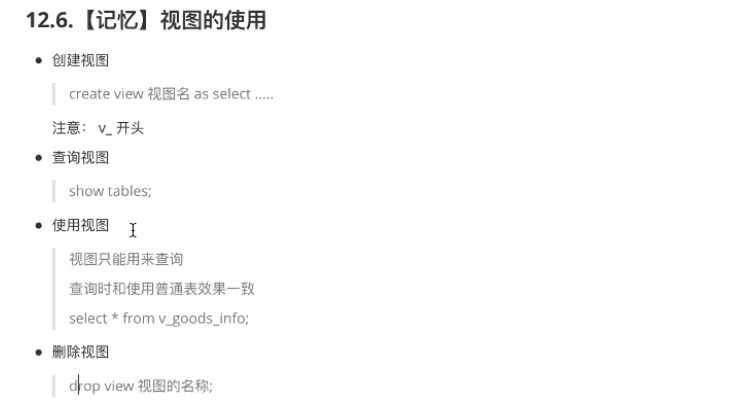

# 事务

数据操作失误可以恢复的操作

**事务Transaction，是指作为一个基本工作单元执行的一系列SQL语句的操作，要么完全地执行，要么完全地都不执行。**

事务四大特性ACID ：

- 原子性（Atomicity) 

> 一个事务必须被视为一个==不可分割==的最小工作单元，整个事务中的所有操作要么全部提交成功，要么全部失败回滚，对于一个事务来说，不可能只执行其中的一部分操作，这就是事务的原子性

- 一致性（Consistency) 

> 数据库总是从一个一致性的状态转换到另一个一致性的状态。（在前面的例子中，一致性确保了，即使在执行第三、四条语句之间时系统崩溃，支票账户中也不会损失200美元，因为事务最终没有提交，所以事务中所做的修改也不会保存到数据库中。）
>
> ==前后结果要一致==

- 隔离性（solation) 

> 通常来说一个事务所做的修改在最终提交以前，对其他事务是不可见的。（在前面的例子中，当执行完第三条语句、第四条语句还未开始时，此时有另外的一个账户汇总程序开始运行，则其看到支票帐户的余额并没有被减去200美元。）
>
> ==类似线程锁，这边流程没完成，其他流程不能参与==

- 持久性（Durability)

> 一旦事务提交，则其所做的修改会永久保存到数据库。（此时即使系统崩溃，修改的数据也不会丢失。）
>
> ==操作完成结果持久不变==
>
> 抛出问题事务有哪四个特性分别表示什么？？？


- 开启事务 begin
- 操作数据库 insert

- 确认修改 commit
- 回滚 rollback


**表引擎，数据存储方式**

数据库存储引擎是数据库底层软件组织，不同的存储引擎提供不同的存储机制、索引技巧、锁定水平等功能，使用不同的存储引擎，还可以获得特定的功能。

` show engines;`

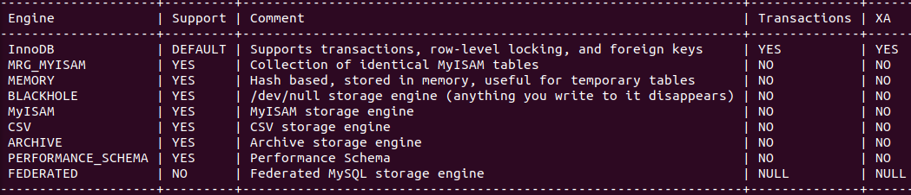

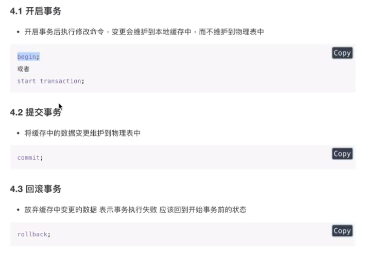

begin打开事务，确认无问题后commit缓存的数据，发现有错误rollback

查询不需要commit，增删改需要

# 索引

作用：数据量大时提升查询效率，优化前面学习的操作效率

创建

查看

删除


> 思考：如何在一个图书馆中找到一本书的在图书馆中如果其他辅助手段只能一条道走到黑，一本书->一本书的扫，终于经过1个小时的连续扫描发现你需要看的那本书在一分钟之前被人借走了。这种就是顺序查找。图书馆管理员发现这个问题，于是决定减少这样的（><）悲剧故事。为同学们购置了一套图书馆管理系统，大家要找书籍先在系统上查找到书籍所在的房屋编号和货架编号，然后就可以直接大摇大摆的去取书了。我们把这种能够帮助我们快速查询数据的线索就称之为索引。

一般的应用系统对比数据库的读写比例在10:1左右（即有10次查询操作时有1次写的操作），而且插入操作和更新操作很少出现性能问题，遇到最多、最容易出问题还是一些复杂的查询操作，所以查询语句的优化显然是重中之重。当数据库中数据量很大时，查找数据会变得很慢，我们就可以使用索引来提高数据库的查询效率。


索引是什么

索引是一种特殊的文件（lnnoDB数据表上的索引是表空间的一个组成部分），它们包含着对数据表里所有记录的位置信息。

更通俗的说，数据库索引好比是一本书前面的目录，能加快数据库的查询速度。


 [MySQL索引-B+树.md](MySQL索引-B+树.md) 

详解二叉查找树，平衡二叉树，B 树——>B+ 树

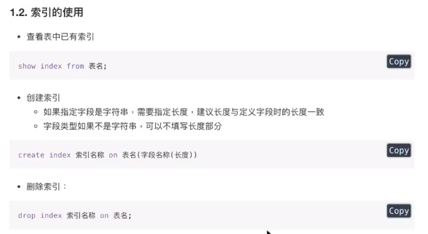

查询对资源和时间的消耗

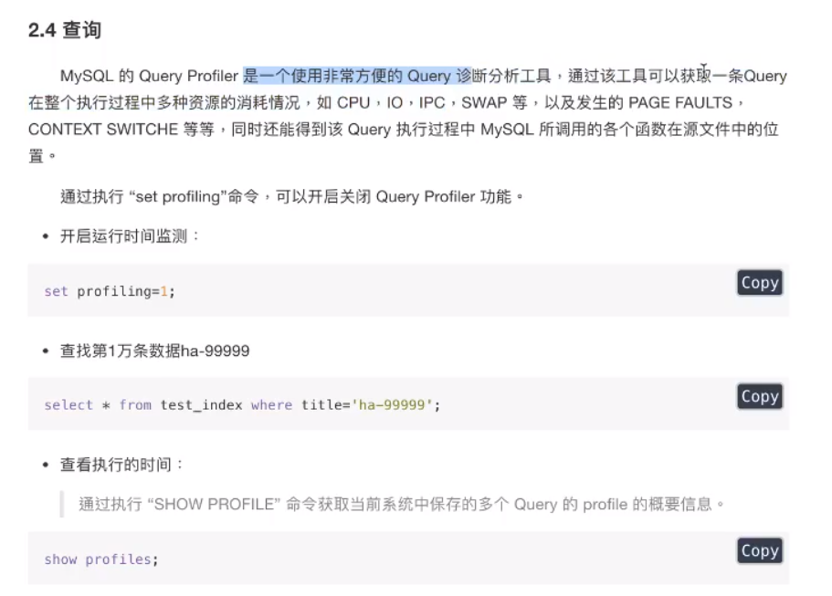


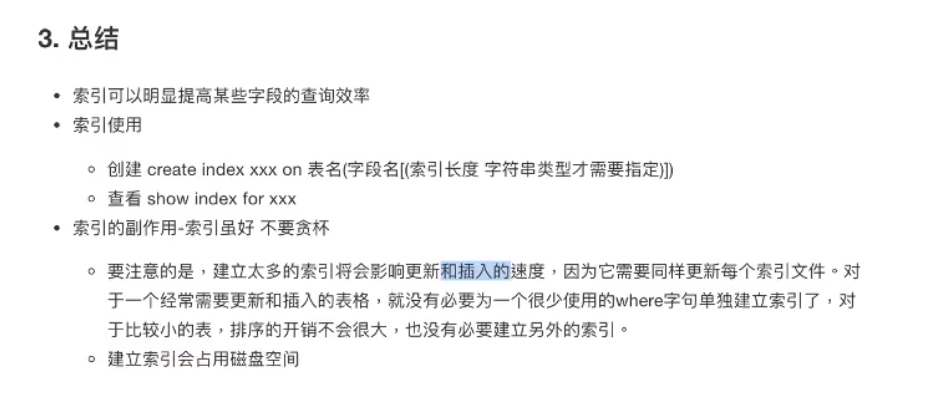

# 用户管理

grant

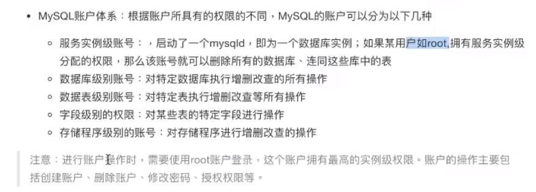

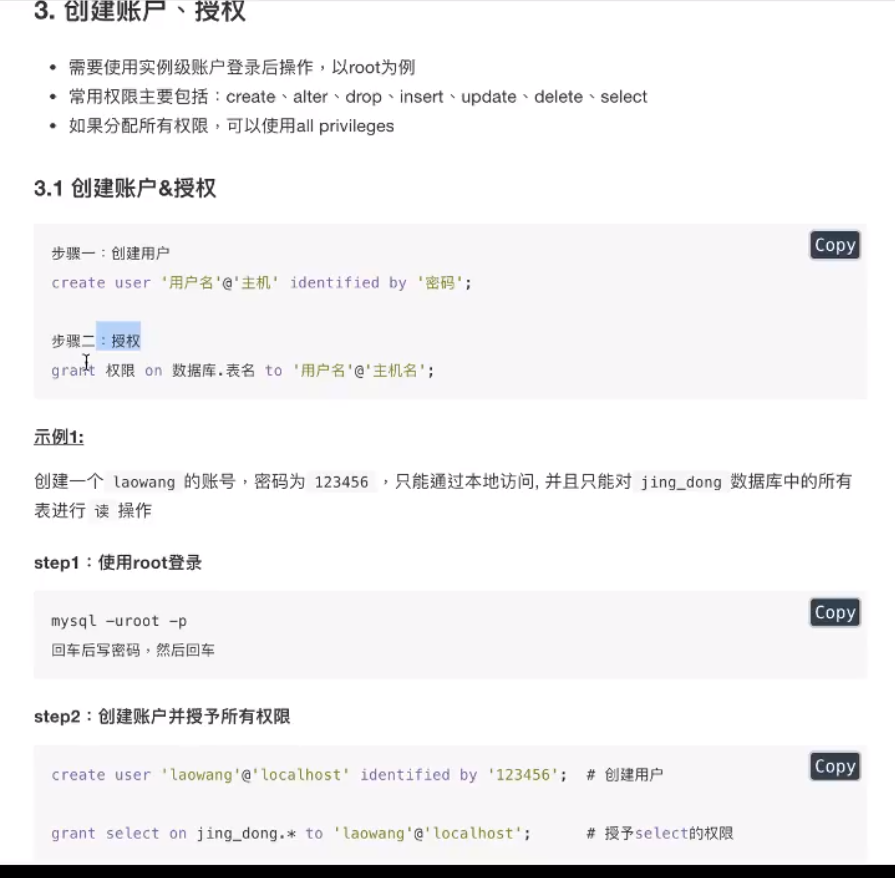

在给完新用户数据库权限后需要刷新权限

```sql
mysql> flush privileges; sql
Query oK,e rows affected (0.00 sec)
```


## 修改权限

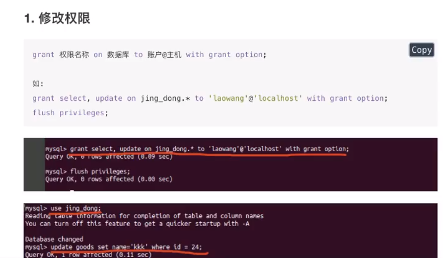


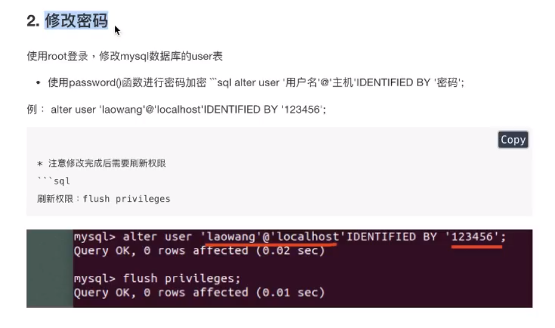

忘记密码修改过程：十步：

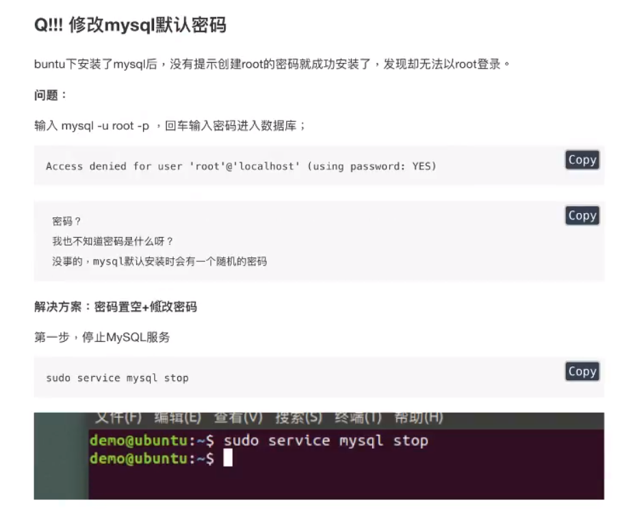


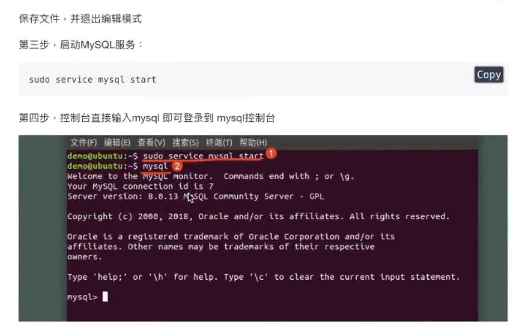

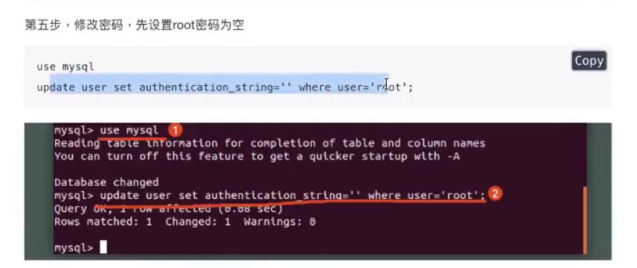

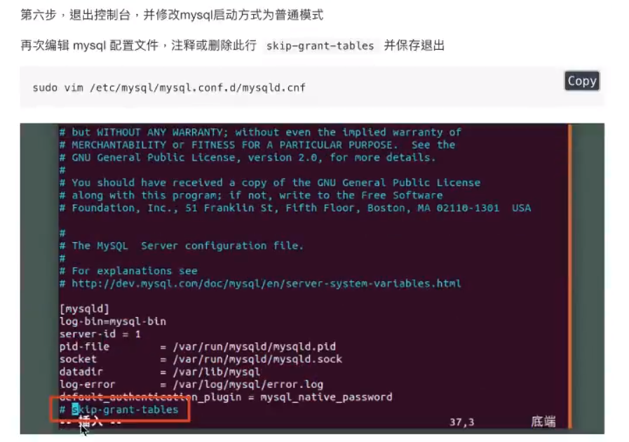

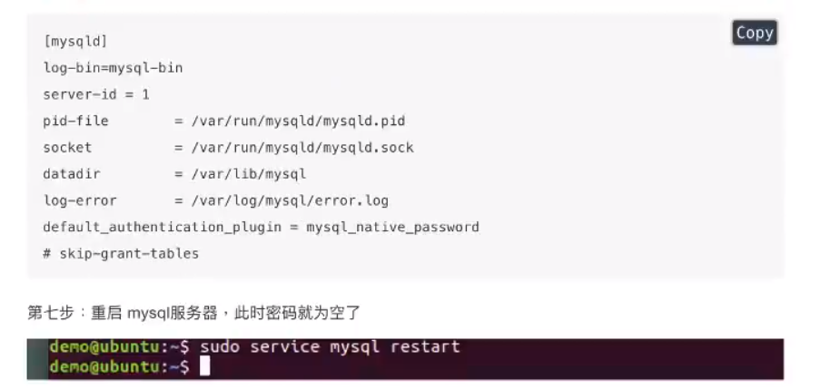

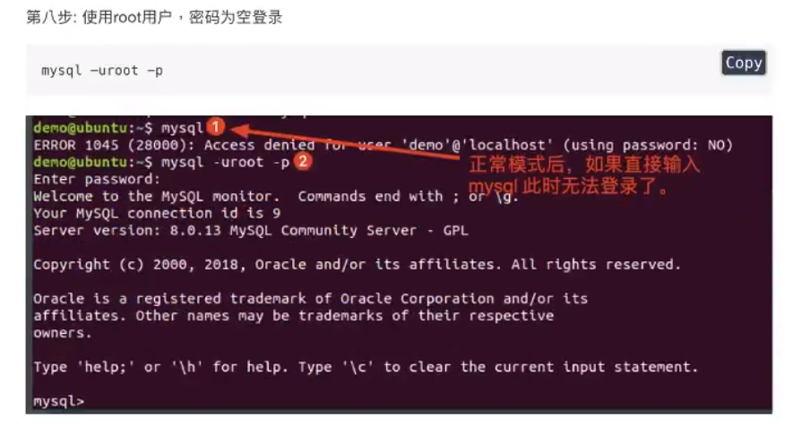

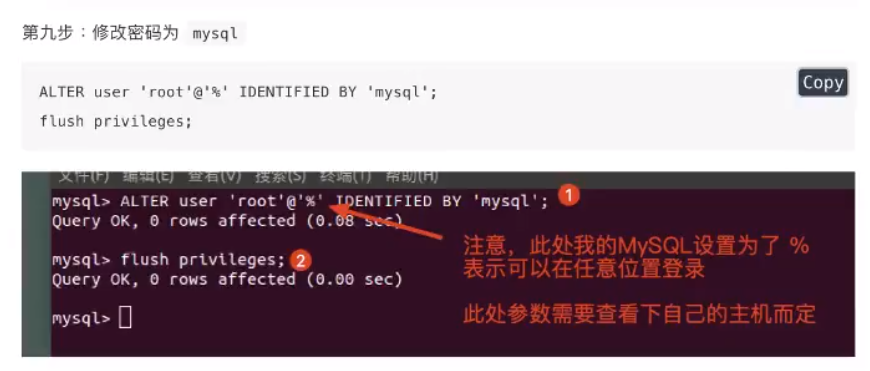

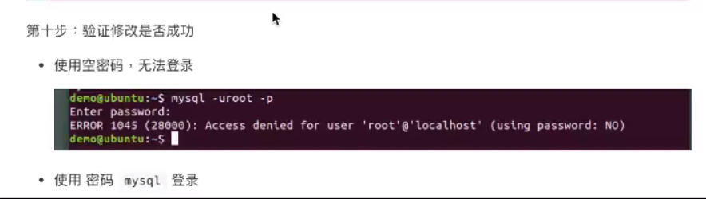


## 远程登录

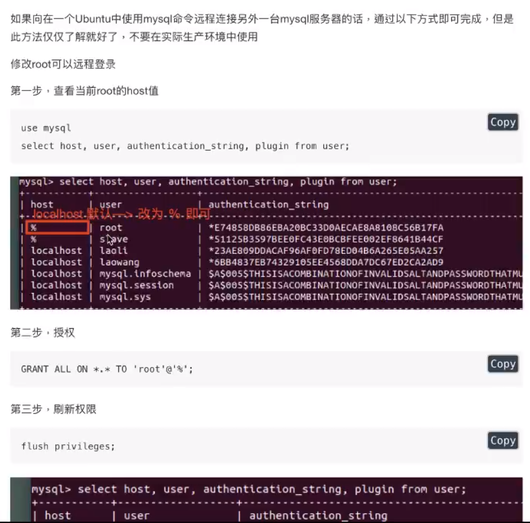


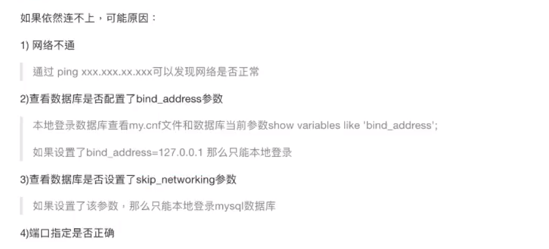

## 总结

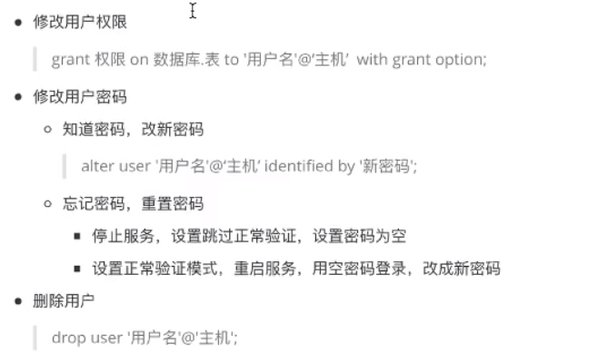


