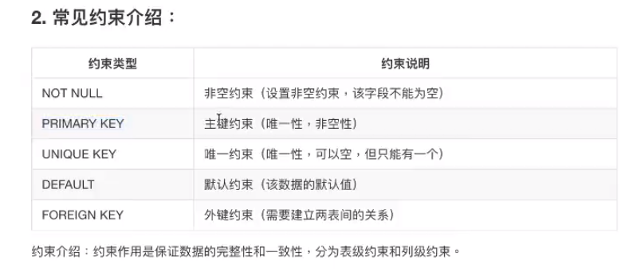
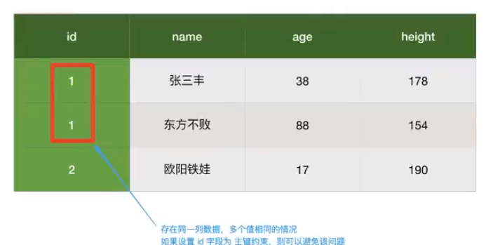
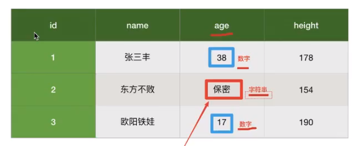
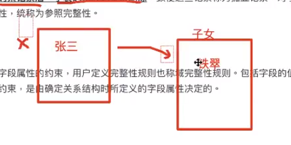

# 数据库完整性和约束

数据库完整性

**实体完整性**

实体完整性指表中行的完整性。主要用于==保证操作的数据（记录）非空、唯一且不重复==。即实体完整性要求每个关系表有且仅有一个主键，每个主键值必须唯一，而且不允许为“空”或重复。

- 主键索引（约束），不重复不可以为空：primary key

- 唯一索引（约束），不重复可以为空： unique key

**域完整性**

域完整性是指数据库表中的列==必须满足某种特定的数据类型或约束==·其中约束又包括取值范围、精度等。表中的check、foreign key约束和**default、not null**定义都属于域完整性的范畴。

保证数据属于同一类型

**参照完整性**

参照完整性属于表间规则。对于永久关系的相关表，在更新、插入或者删除记录时，如果只改其一，就会影响数据的完整性。如删除父表的某记录后，子表的相应记最未删除，致使这些记录称为孤立记录。对于更新、插入、删除表间数据的完整性，统称为参照完整性。

外键约束：建立表和表主键的关系：foreign key

**用户定义完整性**

用户定义完整性是对数据表中字段属性的约束，用户定义完整性规则也称域完整性规则。包括字段的值域、字段类型和字段的有效规则等约束，是由确定关系结构时所定义的字段属性决定的。

> 即字典的值必须在设定的范围之内

update mysql.user set authentication_string=PASSWORD('582659'), plugin='mysql_native_password' where user='root';