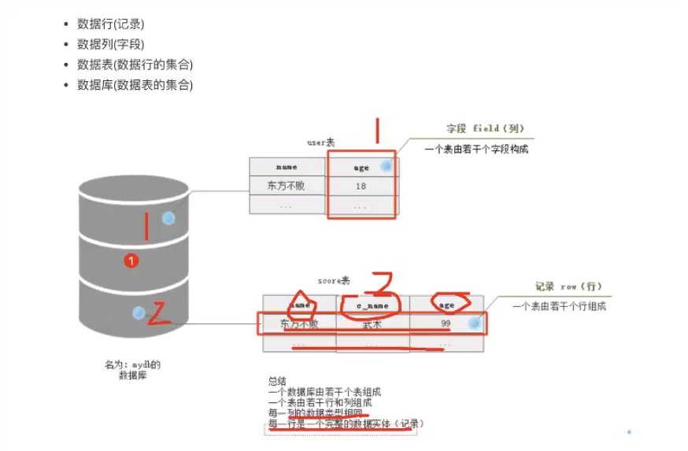
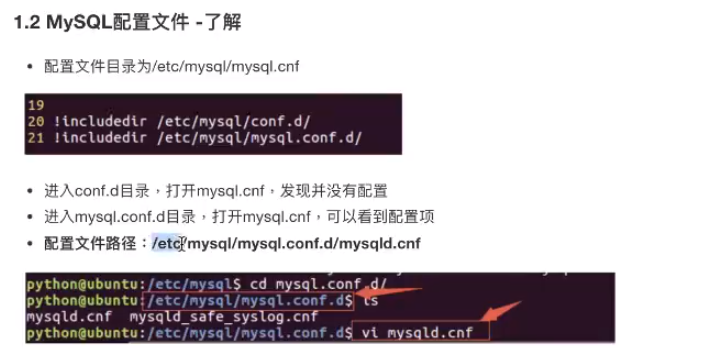
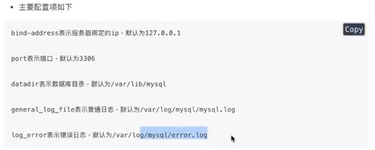
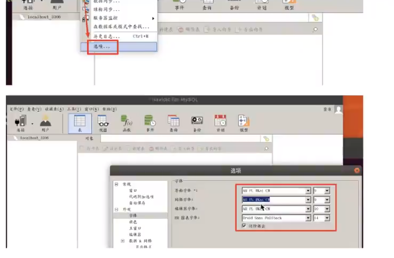
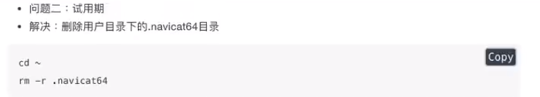
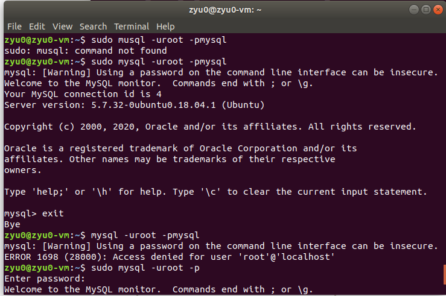

# 数据库管理系统

数据库管理系统（英语：Database Management System，简称DBMS)是为管理数据库而设计的软件系统，包括三大部分构成：

    数据库文件集合，主要是一系列的数据文件，作用是存储数据.
    数据库服务端.主要负责对数据文件以及文件中的数据进行管理。
    数据库客户端，主要负责和服务端通信，向服务端传输数据或者从服务端获取数据。


SQL(Structured Query Language)是结构化查询语言，是一种用来操作RDBMS的数据库语言。当前几乎所有关系型数据库都支持使用SQL语言进行操作，也就是说可通过SQL操作oracle.sql server.mysql,sqlite等等所有的关系型的数据库。


客户端和服务端通信的语言


SQL语句主要分为：

- DQL：数据查询语言，用于对数据进行查询，如select。
- DML：数据操作语言，对数据进行增加、修改、删除，如insert、udpate、delete。
- TPL：事务处理语言，对事务进行处理，包括begin transaction、commit、rolback。
- DCL：数据控制语言，进行授权与权限回收，如grant、revoke。
- DDL：数据定义语言，进行数据库、表的管理等，如create、drop

对于web程序员来讲，重点是数据的crud（增删改查），必须熟练编写DQL、DML，能够编写DDL完成数据库、表的操作，其它语言如TPL、DCL、CCL了解即可

注意：不区分大小写

## 关系型数据库管理系统

Relational Database Management System



## 核心元素

数据库：数据库系统

数据表：二维表（行、列）

记录：二维表的一行，数据实体，数据要完整

字段：二维表的列，一列的数据类型一致。属性


## 数据保存流程

- 创建数据库—>创建数据表—>字段—>记录

## MySQL环境搭建

1. 安装
2. 使用navicat管理工具连接MySQL数据库

**安装服务器端**：在终端中输入如下命令，回车后，然后按照提示输入

`sudo apt-get install mysql-server`

**安装客户端**：`sudo apt-get install mysql-client`

服务器用于接收客户端的请求、执行sql语句、管理数据库

服务器端一般以服务方式管理，名称为mysql

**启动服务**：`sudo service mysql start`

**查看进程中是否存在mysql服务**：`ps -ajx|grep mysql`，打开数据库客户端前检查服务端是否正常

`ps 查看当前系统进程  -a 显示所有用户进程  -j 任务格式显示进程  -x 显示无控制终端进程`

停止服务 ` sudo service mysql stop` 

重启服务 ` sudo service mysql restart`





使用navicat若字体乱码，则将工具/选项/字体都改为：AP PL Ukai CN

软件使用到期后破解



进入终端MySQL客户端，

```
sudo mysql -u root -pmysql  # 这里sudo是在权限被拒绝时使用，不知为何
				# 此处mysql是数据库密码
或 mysql -u root -p
Enter password:xxx  # 隐藏密码
```




退出客户端

```
quit 或 exit

Ctrl+d
```


