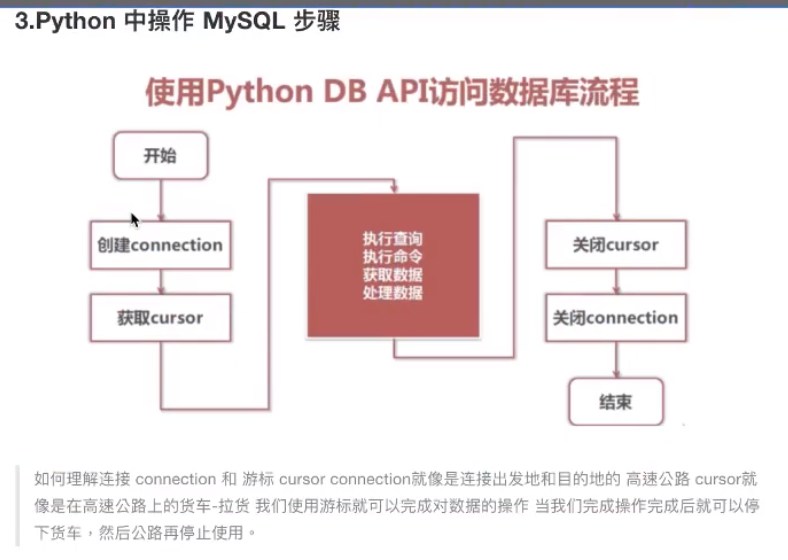
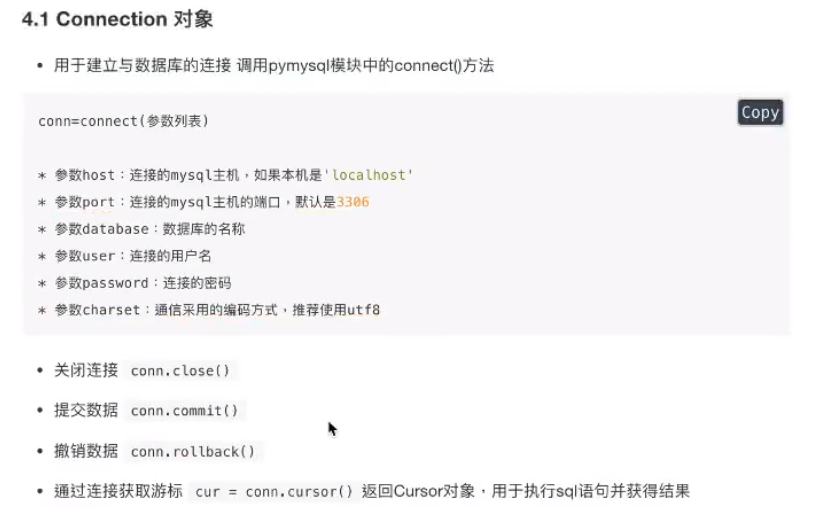
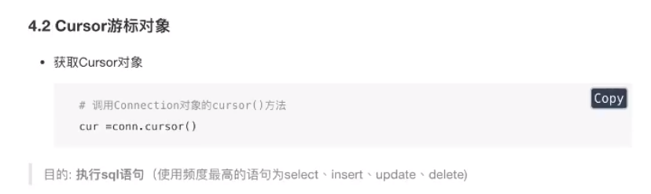
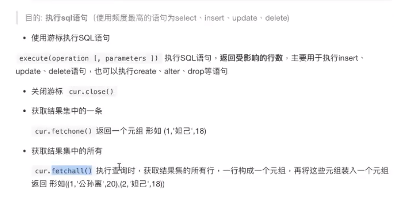

# 数据库编程

从前面我们知道数据库概念包含数据库文件、服务器和数据库客户端客户端我们之前已经用过的有navicat/mysql-client等程序。

大家会发现如果用之前客户端几乎是不可能完全这个任务的，因为我们不可能去构造出那个插入10w行数据的SQL·可是，如果我们有一个功能能够插入一行数据，借助程序强大的特点-重复，就可以轻而易举的就将10w行数据收入磨下。这种通过使用程序代码的方式去连接数据库服务器，==通过和服务器进行交互完成对数据库的增删改查的方式，就称为数据库编程。==
而此刻学习的pymysql就是一种客户端。


使用python代码充当客户端，连接数据库进行操作

步骤：

- 导入模块 pymysql
- 建立连接对象 pymysql.connect()
- 创建游标对象
- 使用游标对象执行SQL语句

> cur.execute("sql语句”）
>
> execute()有返回值
>
> 1)增删改，影响的行数
>
> 2)查询，总记录数

- 获取执行的结果

> 1）取1条cur.fetchone（）#元组 
>
> 2）取所有cur.fetchall（）#（(），(），(））

- 打印输出获取的内容

> for line in result_list:
> 		print(line)

- 关闭游标对象

> cur.close()

- 关闭连接对象

> conn.close()












## Python操作数据库CURD

操作步骤：

- 导入模块
- 创建连接对象
- 创建游标对象。
- 使用游标对象执行SQL

> execute()

- 提交

> conn.commit()

- 获取执行的结果（影响的行数）并打印执行的结果
- 关闭游标
- 关闭连接


# SQL防注入

什么是SOL注入

产生原因：后台用户提交的带有恶意的数据和SQL进行字符串方式的拼接，从而影响了SQL语句的语义，最终产生数据泄露的现象·如果防止：sql语句的参数化，将SQL语句的所有数据参数存在一个列表中传递给execute函数的二个参数

```sql
input_name = input("请输入要查询的名称:\n")
# 4、使用游标对象执行SQL语句
# 被注入过程分析
# input_name = ' or 1 or '
# "select * from goods where name = '%s' order by id desc" % input_name
# "select * from goods where name = '' or 1 or '' order by id desc" % input_name
# 防止注入：
# 1)　构建参数列表params = input_name
# 2) 把列表传递给 excute(sql, params)
params = [input_name]
sql = "select * from goods where name = '' or 1 or '' order by id desc"  # 这里不知为何参数可以自行替代
# cur.execute(SQL语句)　返回值是影响的行数，如果是查询语句，此处返回总记录数
result = cur.execute(sql)
print("查询到%s" % result)
# 5、获取执行的结果
# cur.fetchone()从查询结果中取出一条数据。数据库默认升序，此函数会取出第一条数据
# result_list = cur.fetchone()
result_list = cur.fetchall()

# 6、打印输出获取的内容
# print(result_list)
for line in result_list:
    # line即一行数据，是一个元组
    print(line)

# 7、关闭游标对象
cur.close()
# 8、关闭连接对象
conn.close()

```

防注入的思路：

sql中需要变化的地方，可以占位符%s %d…

把参数封装到列表中

把列表传递给 execute(sql，列表）

