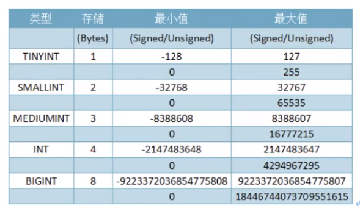
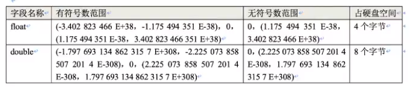
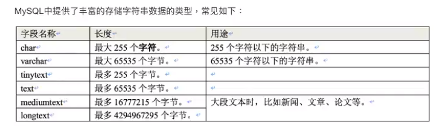
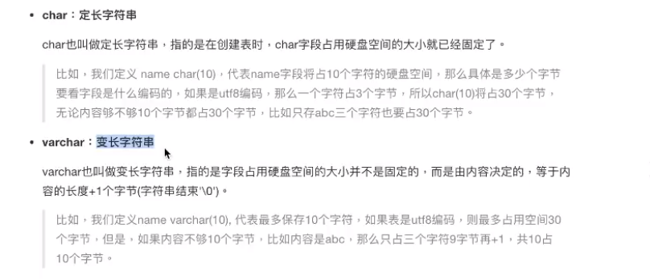
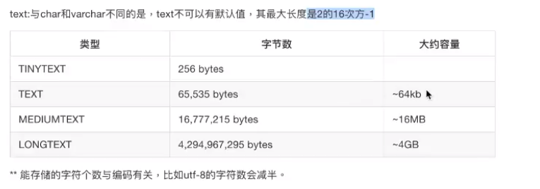
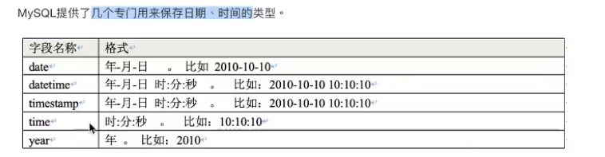
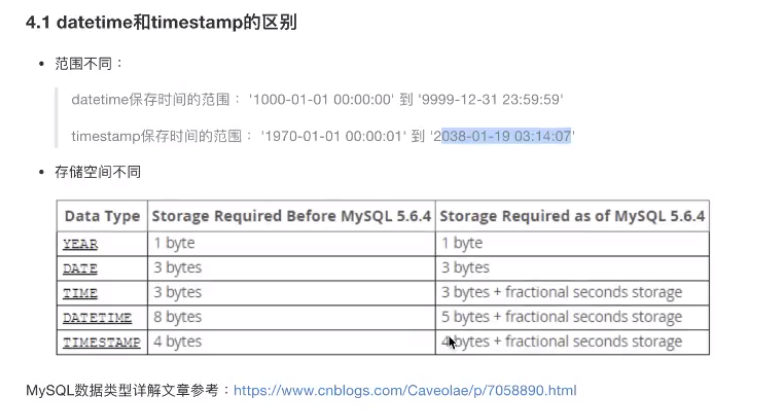

# 数据类型

int

decimal

varchar

time

现实生活的数据不同类，节省保存时间，查询迅速

MySQL中定义数据字段的类型对数据库的优化是非常重要的，大致分为三类：

- 数值
- 日期/时间
- 字符串（字符）

## 数值

整数 int

浮点型 

- float 单精度型   小数点后6位保证准确性
- double 双精度型  小数点后16位保证准确性

float(M,D)		float(5,2)  :   000.00——999.99

double(M,D)

- 定点数，decimal，保存精确的小数

> decimal（M.D)，M代表总的数字位数【最大为65】D代表其中的小数位。
> 比如：decimal(5.2）代表共5位数字其中2位是小数，比如：888.88

## 字符串

char(5)	he>5

varchar(5)	he>2	动态缩减占据空间

text，

选择字符串类型的原则

- 经常变化的字段用varchar
- 知道固定长度的用char
- 尽量用varchar
- 超过255字符的只能用varchar或者text
- 能用varchar的地方不用text

## 枚举类型

枚举类型 ==enum()==，在定义字段时就预告规定好固定的几个值，然后插入记录时值只能这几个固定好的值中选择一个·*·语法定义：
`gender enum('男','女','妖'）`

## 时间类型

选择一种合适的类型保存数据，节省存储空间，提升查询效率