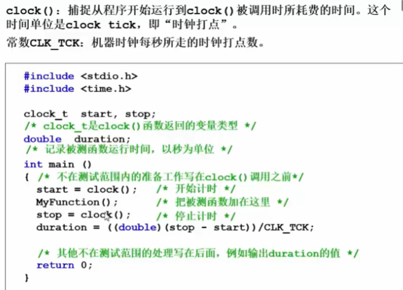

# 什么是数据结构

如何在书架上摆放图书？

问题不科学，没有定义书架和图书规模

1. 随便放

2. 按照书名的拼音字母顺序排放
  
- 找书，二分查找
  
3. 分类，分区域，再按书名的拼音字母顺序排放

   

空间如何分配？类别应该分多细？

==解决问题方法的效率，跟数据的组织方式有关==

递归在N=100000时就失败了，递归对空间占用很厉害

==解决问题方法的效率，跟空间的利用效率有关==

==解决问题方法的效率，跟算法的巧妙程度有关==

## 什么是数据结构

数据对象在计算机中的组织方式

- 逻辑结构
  - 线性结构，编号1对1
  - 树结构，分类，编号给类，1对多
  - 图，多对多
- 物理存储结构，在内存中怎么放，数组、链表

数据对象必定与一系列加在其上的操作相关联

完成这些操作所用的方法就是算法

### 抽象数据类型

用来描述数据结构，Abstract Data Type

**数据类型：**

- 数据对象集

- 数据集合相关联的操作集

  >C语言中分开来操作，面向对象语言合并操作，用一个类封装数据集和操作集

**抽象**：描述数据类型的方法，不依赖于具体实现

- 与存放数据的机器无关
- 与数据存储的物理结构无关
- 与实现操作的算法和编程语言均无关

去除了int double等类型，在程序前面进行自定义来抽象数据类型

## 扩展资料

数据结构是指同一数据元素类中各数据元素之间存在的关系。数据结构分别为逻辑结构、存储结构（物理结构）和数据的运算。数据的逻辑结构是从具体问题抽象出来的数学模型，是描述数据元素及其关系的数学特性的，有时就把逻辑结构简称为数据结构。

逻辑结构是在计算机存储中的映像，形式地定义为（K，R）（或（D，S）），其中，K是数据元素的有限集，R是K上的关系的有限集。

根据数据元素间关系的不同特性，通常有下列四类基本的结构：集合结构。该结构的数据元素间的关系是“属于同一个集合”。

线性结构。该结构的数据元素之间存在着一对一的关系。

树型结构。该结构的数据元素之间存在着一对多的关系。

图形结构。该结构的数据元素之间存在着多对多的关系，也称网状结构。 

从上面所介绍的数据结构的概念中可以知道，一个数据结构有两个要素。一个是数据元素的集合，另一个是关系的集合。在形式上，数据结构通常可以采用一个二元组来表示。