# 什么是算法

Algorithm

- 一个有限的指令集
- 接受一些输入（有些情况下不需要输入）
- 产生输出
- 一定在有限步骤之后终止
- 每一条指令必须
  - 有充分明确的目标，不可以有歧义
  - 计算机能处理的范围之内
  - 描述应不依赖于任何一种计算机语言以及具体的实现手段

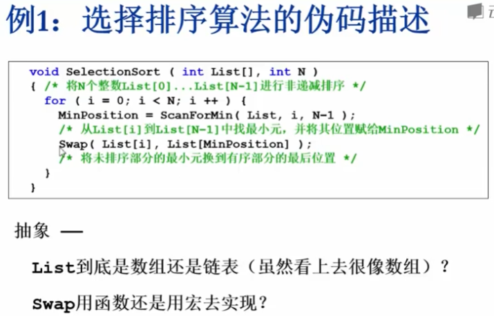

描述算法不关心具体实现细节

## 什么是好的算法

- **空间复杂度S(n)**——根据算法写成的程序在执行时**占用存储单元的长度**。这个长度往往与输入数据的规模有关。空间复杂度过高的算法可能导致使用的内存超限，造成程序非正常中断。
  $$
  S(N)=C·N
  $$
  

  > 线性增长，与n成正比
  >
  > 是实例化的问题吗？每次调用函数都需要做一次存储
  >
  > 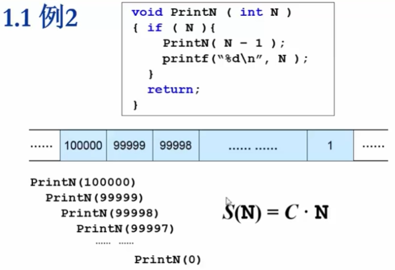

- **时间复杂度T(n)**——根据算法写成的程序在执行时**耗费时间的长度**。这个长度往往也与输入数据的规模有关。时间复杂度过高的低效算法可能导致我们在有生之年都等不到运行结果。

  > C1，C2，C看机器，n^2^肯定比n大很多，所以第二个程序比第一个快很多
  >
  > 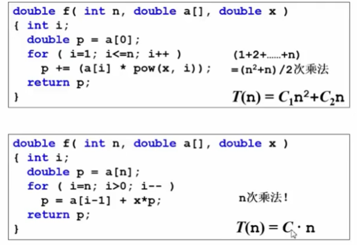

写成n的函数，因为相关与处理数据的规模 变量n

机器运算，加减法比乘除法快很多，看时间就是看函数做了多少次乘除法，加减法可忽略不计

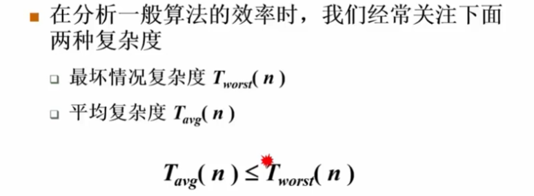平均复杂度很难判断，喜欢分析最坏复杂度，

## 复杂度渐进表示法

关心随着数据规模增大，复杂度增长的性质，看哪一块其主要作用，不会对算法做精细的分析，只粗略的表示其增长趋势即可——>复杂度渐进表示法

T(n)=O(f(n))，上界下界

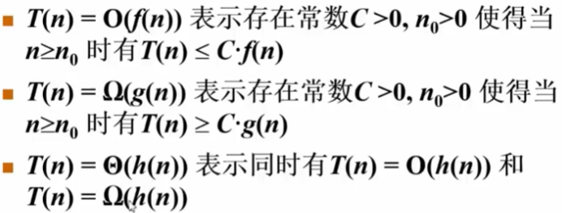

上界下界也需要有一个范围，尽可能贴近真实情况，寻求最小上界，最大下界

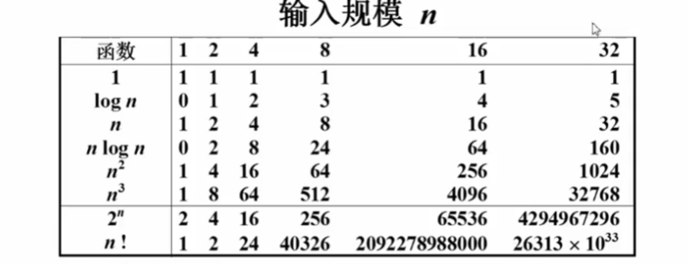

设计算法尽量可以降级

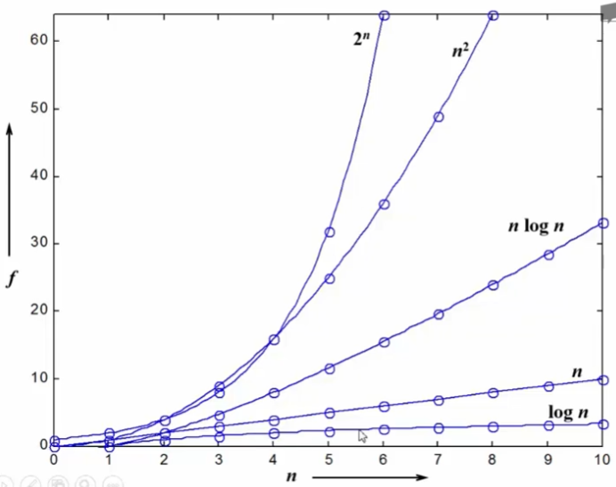

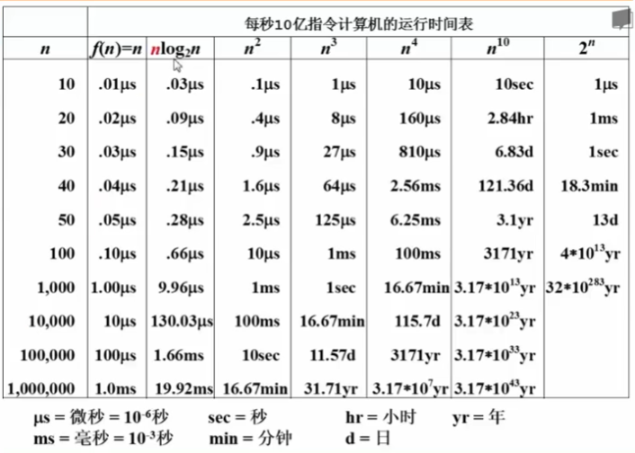

## 复杂度分析小窍门

算法拼接和算法嵌套

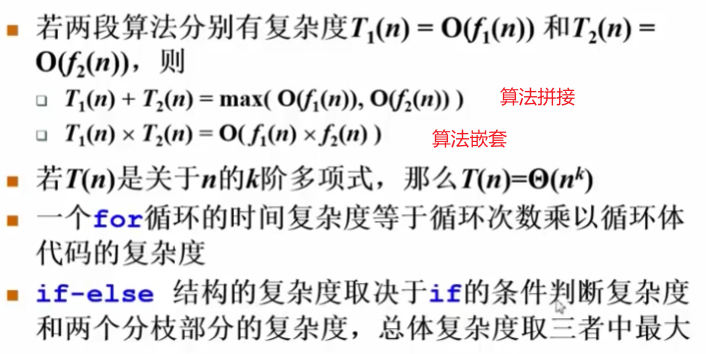

## 应用

最大子列和问题

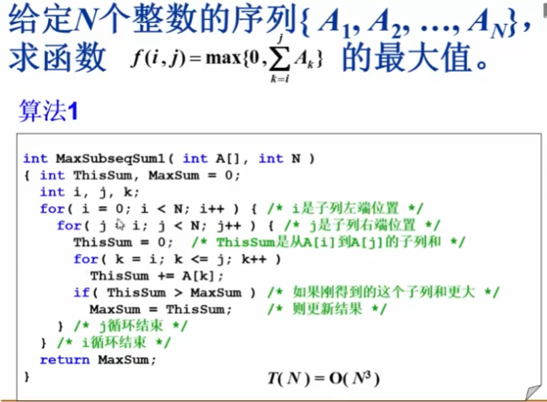

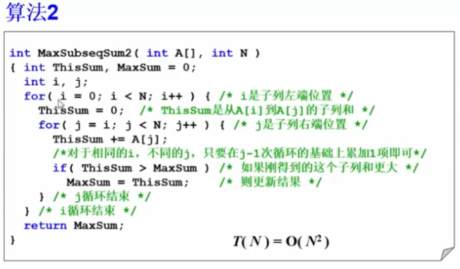

当算法是O(N^2^)时要第一时间想到改为O(NlogN)

分而治之

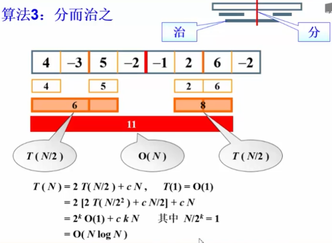

速度最快，但正确性不明显，即不好理解

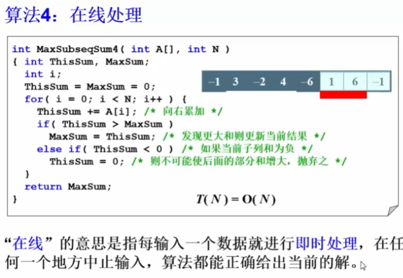

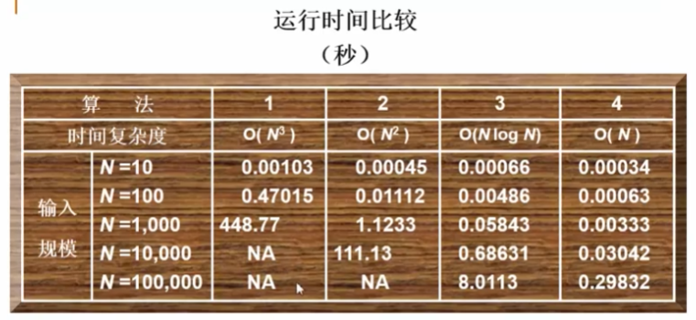

这些算法里没有算输入输出的时间