# 图

六度空间理论（Six Degrees of Separation)


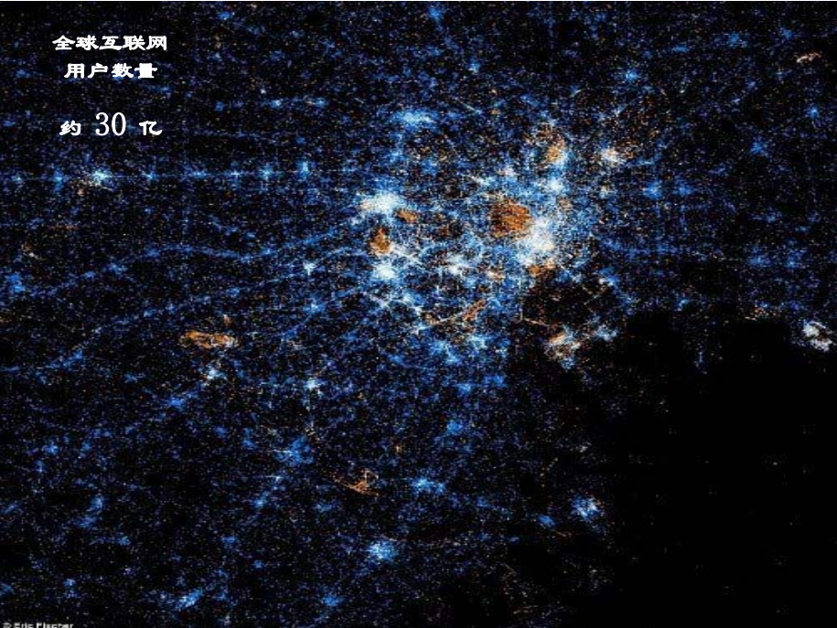

最短路径问题

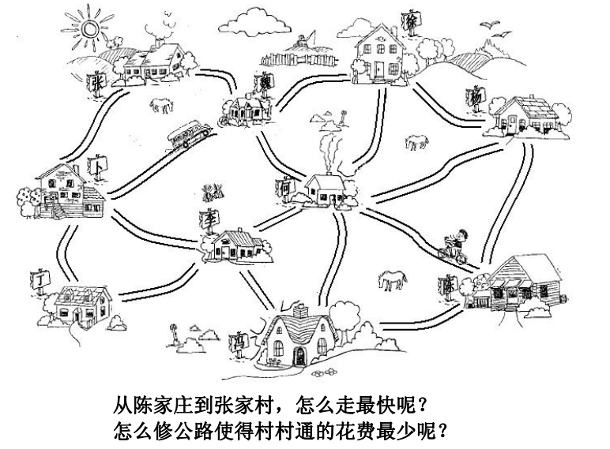

最小生成树

线性表，一对一

树，一对多

图，多对多

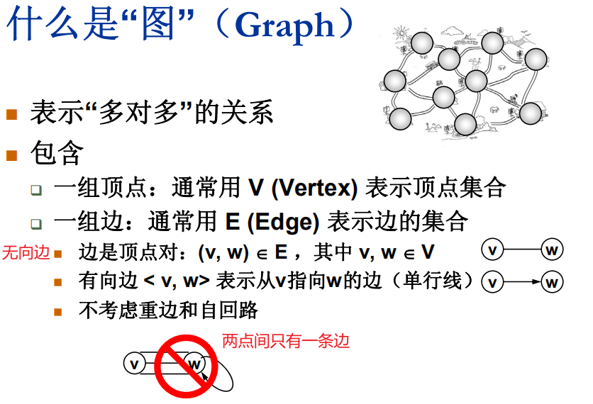

## 抽象数据类型定义

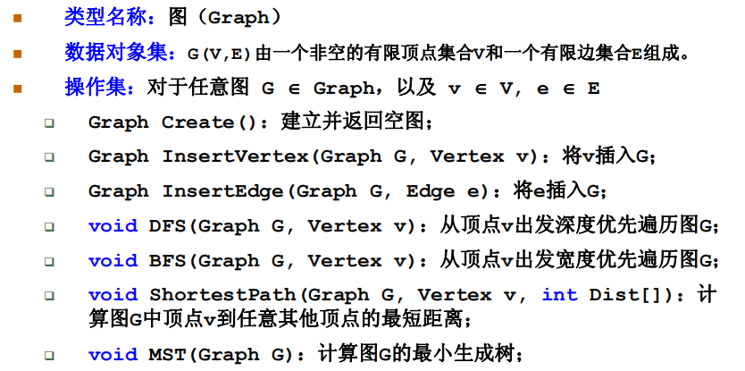

## 常见术语

无向图

有向图

网络

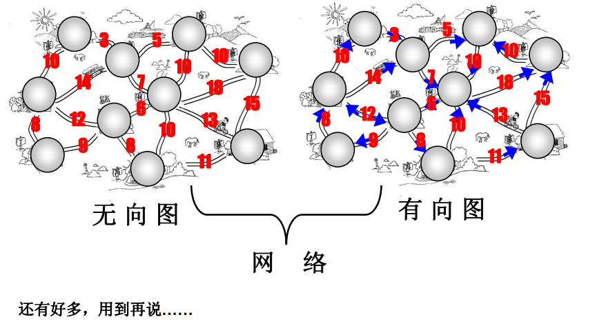

==数据结构中对于稀疏图的定义为：有很少条边或弧（边的条数IE|远小于|V|^2^）的图称为稀疏图（sparse graph)，反之边的条数|接近|V|^2^，称为稠密图（densegraph)。==

用n 表示图中顶点数目，用e 表示图中边或弧的数目
稀疏图： e < nlogn，O(|V|log|V|)
稠密图   e >nlogn，O(|V|^2^+E)
若图中边或弧上有权，则该图称为网

## 怎么在程序中表示一个图

### 邻接矩阵

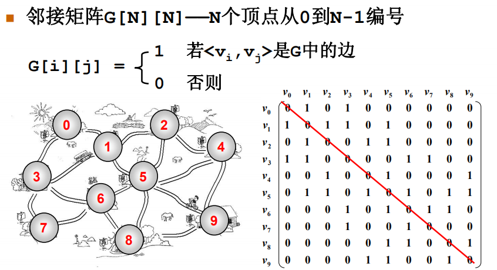


```C
/* 图的邻接矩阵表示法（C语言实现） */
#define  MaxVertexNum  100      /* 最大顶点数设为100 */
#define  INFINITY  65535     /* ∞设为双字节无符号整数的最大值65535*/
typedef  char  VertexType;      /* 顶点类型设为字符型 */
typedef  int  EdgeType;         /* 边的权值设为整型 */
enum GraphType { DG, UG, DN, UN };  
/* 有向图,无向图,有向网图,无向网图*/
  
typedef  struct {
    VertexType  Vertices[ MaxVertexNum ];  /* 顶点表 */
    EdgeType  Edges[ MaxVertexNum ][ MaxVertexNum ]; 
/* 邻接矩阵，即边表  */
    int  n, e;   /* 顶点数n和边数e */
    enum GraphType GType;   /* 图的类型分4种：UG、DG、UN、DN */
} MGraph;    /* MGragh是以邻接矩阵存储的图类型 */
  
void  CreateMGraph ( MGraph *G )
{  
    int  i, j, k, w;
    G-> GType = UN;    /* Undirected Network  无向网图  */
    printf( "请输入顶点数和边数(输入格式为:顶点数, 边数):\n" );
    scanf( "%d, %d",&(G->n), &(G->e) ); /* 输入顶点数和边数 */
    printf("请输入顶点信息(输入格式为:顶点号<CR>):\n");
    for ( i = 0; i < G->n; i++ ) 
       scanf( "%c",&(G-> Vertices[i]) ); /*  输入顶点信息，建立顶点表  */
    for ( i = 0; i < G->n; i++ )
       for ( j = 0; j < G->n; j++ )  
           G->Edges[i][j] = INFINITY; /* 初始化邻接矩阵 */
    printf( "请输入每条边对应的两个顶点的序号和权值，输入格式为:i, j, w:\n" );
    for ( k = 0; k < G->e; k++ ) {
       scanf("%d,%d,%d ",&i, &j, &w); /* 输入e条边上的权，建立邻接矩阵 */
       G->Edges[i][j] = w; 
       G->Edges[j][i] = w; /* 因为无向网图的邻接矩阵是对称的 */
    }
}
```


### 邻接表

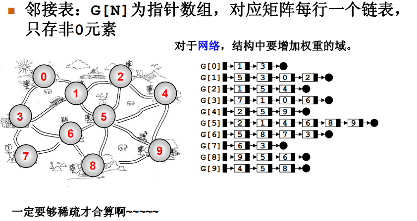


```c
/* 图的邻接表表示法（C语言实现） */
#define  MaxVertexNum  100     /* 最大顶点数为100 */
enum GraphType { DG, UG, DN, UN }; 
/* 有向图,无向图,有向网图,无向网图*/
typedef  struct  node{   /* 边表结点 */
    int AdjV;            /* 邻接点域 */
    struct  node  *Next;  /* 指向下一个邻接点的指针域 */
    /* 若要表示边上的权值信息，则应增加一个数据域Weight */
} EdgeNode;
typedef  char  VertexType;   /* 顶点用字符表示 */
typedef  struct  Vnode{      /* 顶点表结点 */
    VertexType  Vertex;      /* 顶点域 */
    EdgeNode  *FirstEdge; /* 边表头指针 */
} VertexNode; 
typedef VertexNode AdjList[ MaxVertexNum ]; /* AdjList是邻接表类型 */
typedef  struct{  
    AdjList  adjlist;    /* 邻接表 */
    int  n, e;               /* 顶点数和边数 */
    enum GraphType GType;    /* 图的类型分4种：UG、DG、UN、DN */
} ALGraph;  /*ALGraph是以邻接表方式存储的图类型 */
  
void CreateALGraph( ALGraph *G )
{
    int i, j, k;
    EdgeNode *edge;
    G-> GType = DG;  /* Directed Graph  有向图  */
    printf( "请输入顶点数和边数(输入格式为:顶点数,边数)：\n" );
    scanf( "%d,%d", &(G->n), &(G->e) ); /* 读入顶点数和边数 */ 
    printf( "请输入顶点信息(输入格式为:顶点号<CR>)：\n" );
    for ( i=0; i < G->n; i++ ) {   /* 建立有n个顶点的顶点表 */
        scanf( " %c", &(G->adjlist[i].Vertex) );  /* 读入顶点信息 */
       G->adjlist[i].FirstEdge = NULL; /* 顶点的边表头指针设为空 */
    }
    printf( "请输入边的信息(输入格式为: i, j <CR>)：\n" );
    for ( k=0; k < G->e; k++ ){   /* 建立边表 */
       scanf( "\n%d,%d", &i, &j); /* 读入边<vi,vj>的顶点对应序号*/
       edge = (EdgeNode*)malloc(sizeof(EdgeNode)); /* 生成新边结点edge */
       edge->AdjV = j; /* 邻接点序号为j */
       edge->Next = G->adjlist[i].FirstEdge;
       /* 将新边表结点edge插入到顶点vi的边表头部 */
       G->adjlist[i].FirstEdge = edge;
       /* 若是无向图，还要生成一个结点，用来表示边< vj, vi>  */
    }
}
```

## 遍历

每个顶点访问一遍，且不重复访问

### 深度优先搜索

（Depth First Search,DFS)

类似树的先序遍历

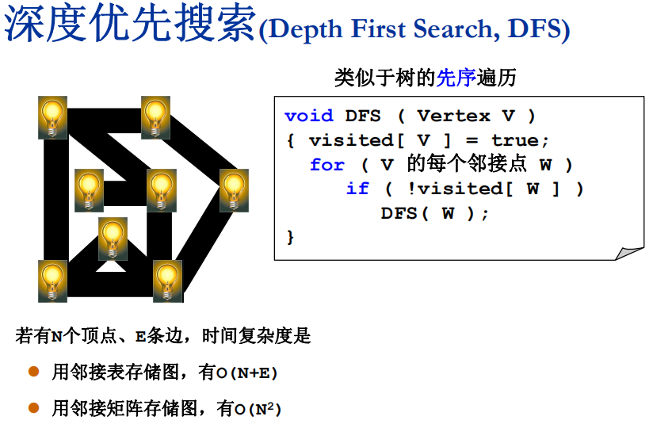

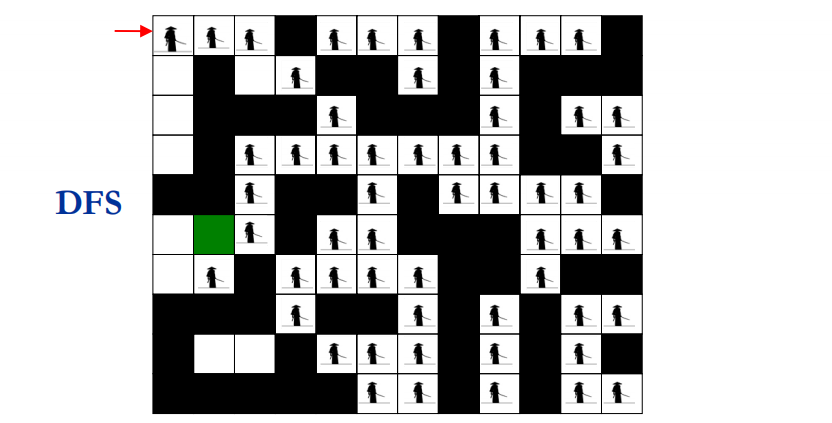

### 广度优先搜索

（Breadth First Search,BFS)

类似树的层序遍历，使用了队列，先进先出

访问一个节点并压入队列时，把连接的所有节点都压入队列，再弹出一个节点后，把这个节点连接的节点都压入队列，以此循环

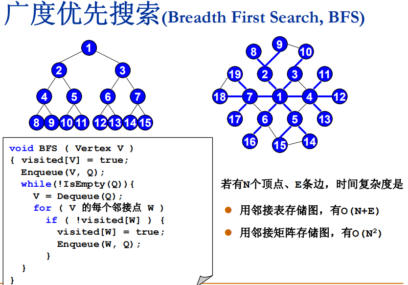

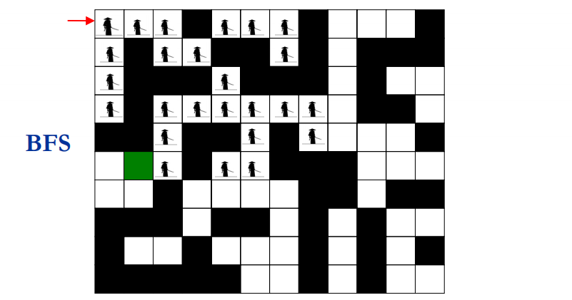

迷宫使用BFS更快与迷宫出口位置有关

## 术语/图不连通怎么办?

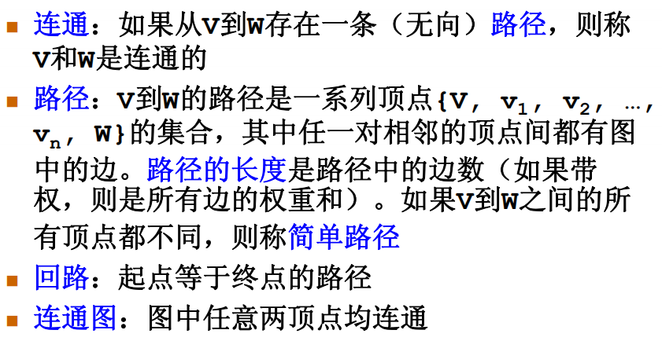

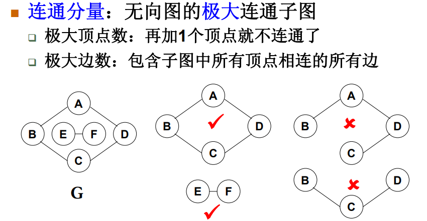

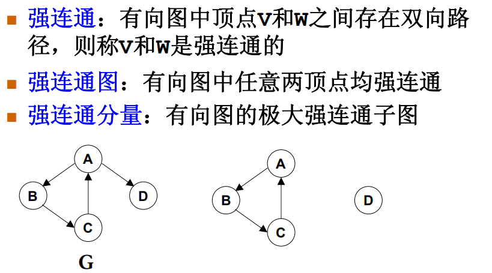

弱连通：

- 不是强连通

- 把图的边的所有方向去掉变成无向图是连通的

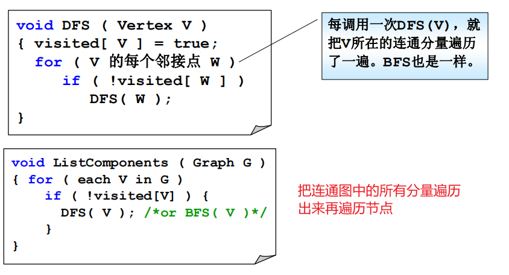

## 案例

### 007逃脱鳄鱼岛

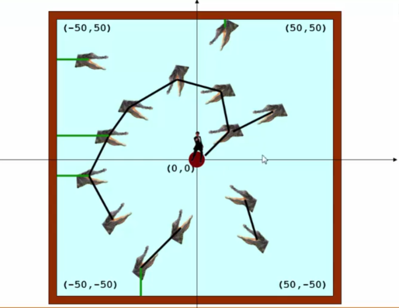

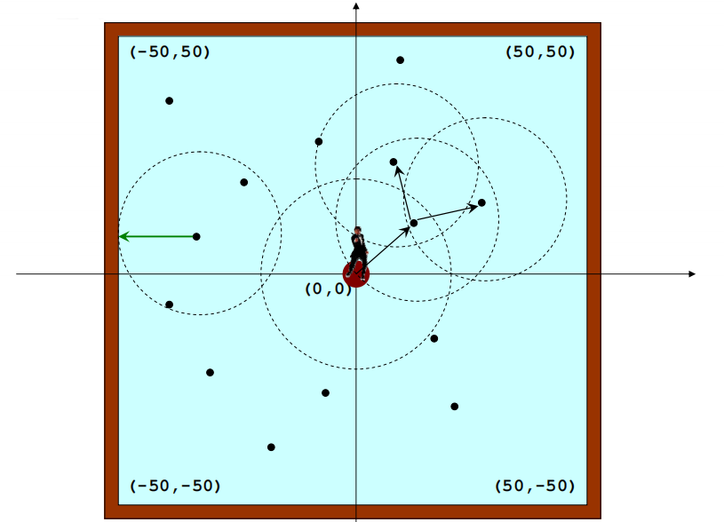

第一个跳跃半径因为小岛和其他不同，需要单独处理，且假设第一个跳跃半径中有多个节点，则每个节点形成一个连通集

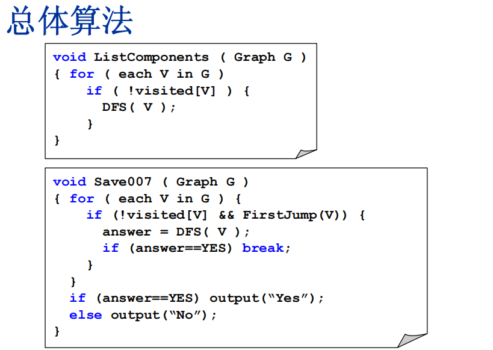

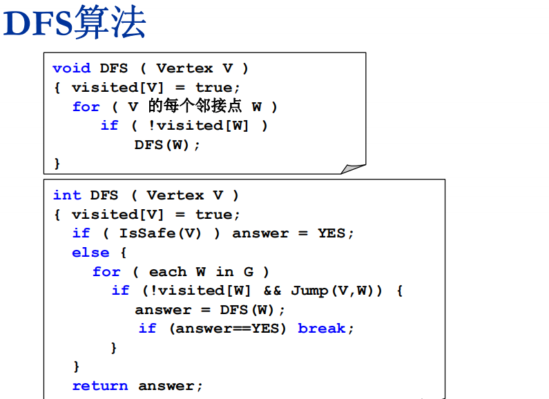

==一个图不一定要用邻接表或邻接矩阵来表示，图只是一个抽象概念，用来辅助解决问题的工具==

## 最短路径问题


### 六度空间

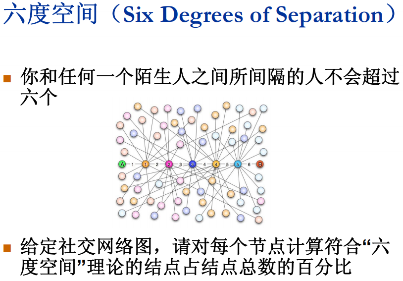

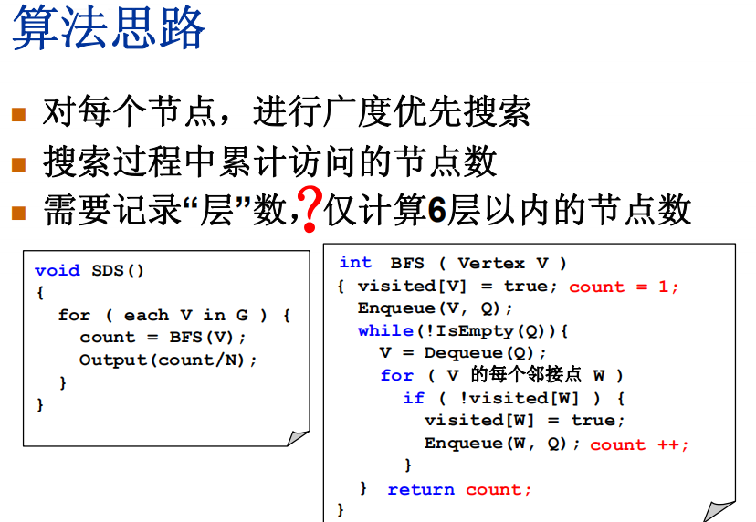

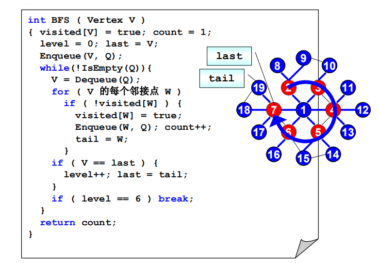


