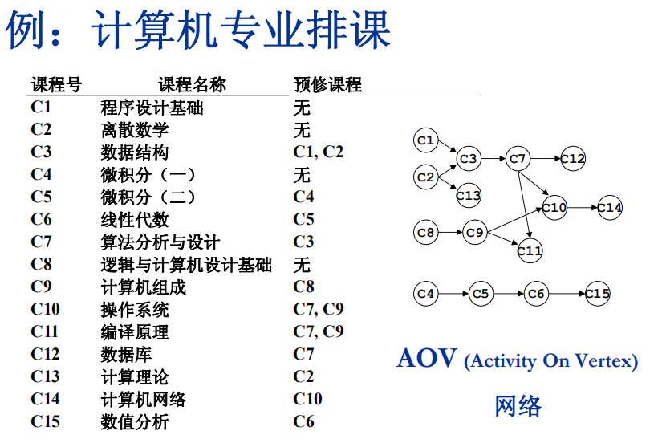
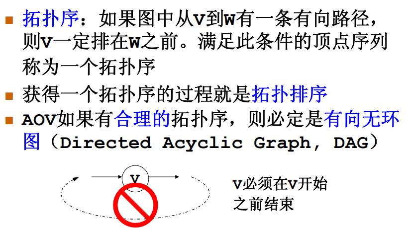
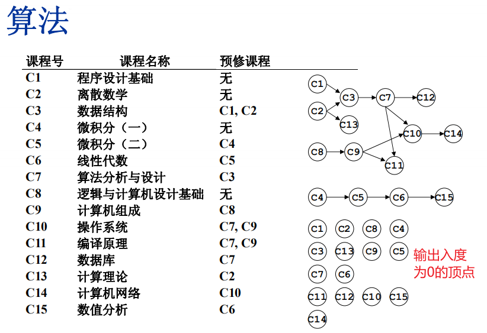
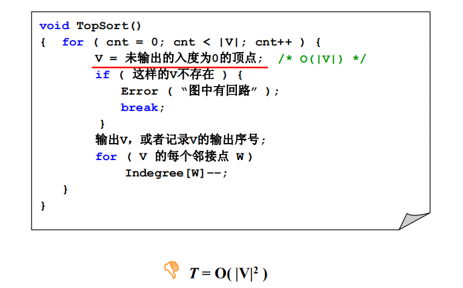
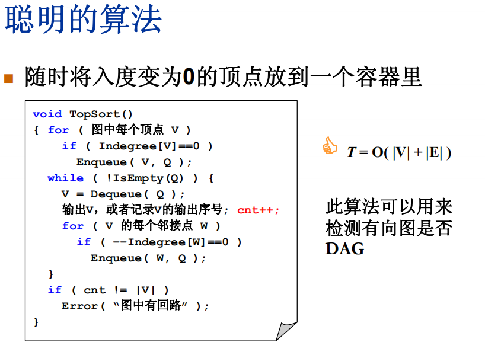
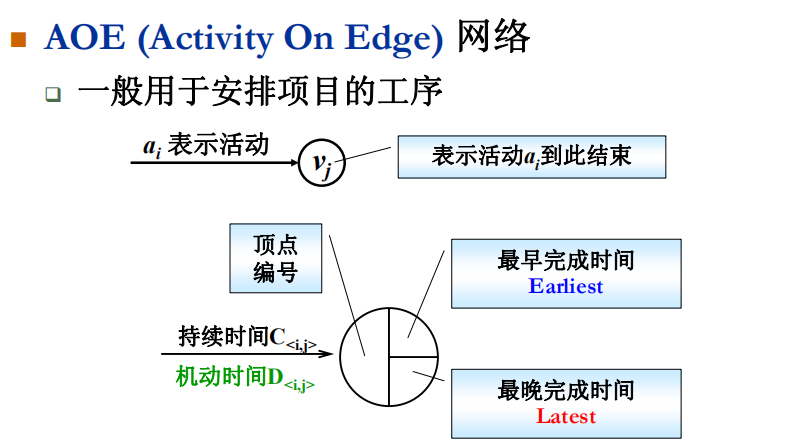
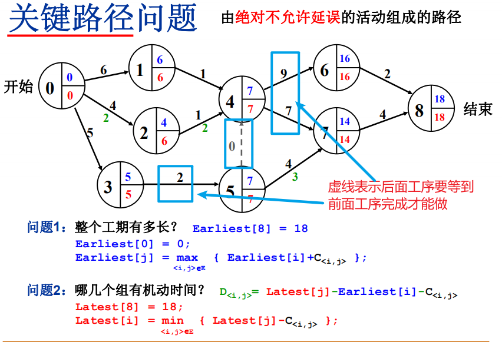

# 拓扑排序



真实活动表现在顶点上，有向边表示的是先后顺序

## AOV








## 关键路径问题

### AOE





没有机动时间的路径就是绝对不允许延误的关键路径

```C
/* 邻接表存储 - 拓扑排序算法 */

bool TopSort( LGraph Graph, Vertex TopOrder[] )
{ /* 对Graph进行拓扑排序,  TopOrder[]顺序存储排序后的顶点下标 */
    int Indegree[MaxVertexNum], cnt;
    Vertex V;
    PtrToAdjVNode W;
       Queue Q = CreateQueue( Graph->Nv );
 
    /* 初始化Indegree[] */
    for (V=0; V<Graph->Nv; V++)
        Indegree[V] = 0;
        
    /* 遍历图，得到Indegree[] */
    for (V=0; V<Graph->Nv; V++)
        for (W=Graph->G[V].FirstEdge; W; W=W->Next)
            Indegree[W->AdjV]++; /* 对有向边<V, W->AdjV>累计终点的入度 */
            
    /* 将所有入度为0的顶点入列 */
    for (V=0; V<Graph->Nv; V++)
        if ( Indegree[V]==0 )
            AddQ(Q, V);
            
    /* 下面进入拓扑排序 */ 
    cnt = 0; 
    while( !IsEmpty(Q) ){
        V = DeleteQ(Q); /* 弹出一个入度为0的顶点 */
        TopOrder[cnt++] = V; /* 将之存为结果序列的下一个元素 */
        /* 对V的每个邻接点W->AdjV */
        for ( W=Graph->G[V].FirstEdge; W; W=W->Next )
            if ( --Indegree[W->AdjV] == 0 )/* 若删除V使得W->AdjV入度为0 */
                AddQ(Q, W->AdjV); /* 则该顶点入列 */ 
    } /* while结束*/
    
    if ( cnt != Graph->Nv )
        return false; /* 说明图中有回路, 返回不成功标志 */ 
    else
        return true;
}
```


