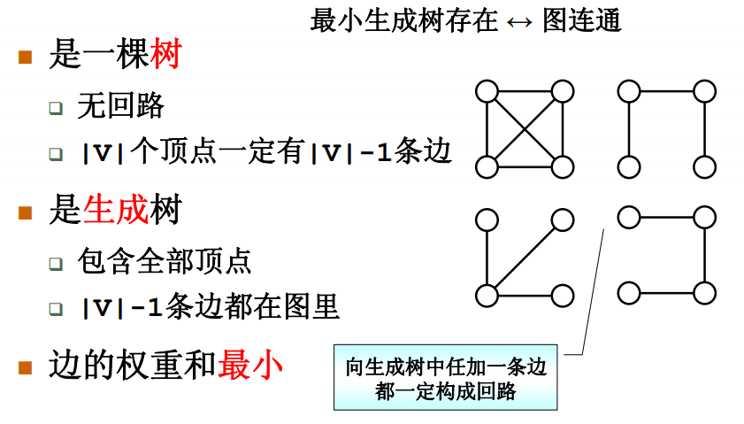
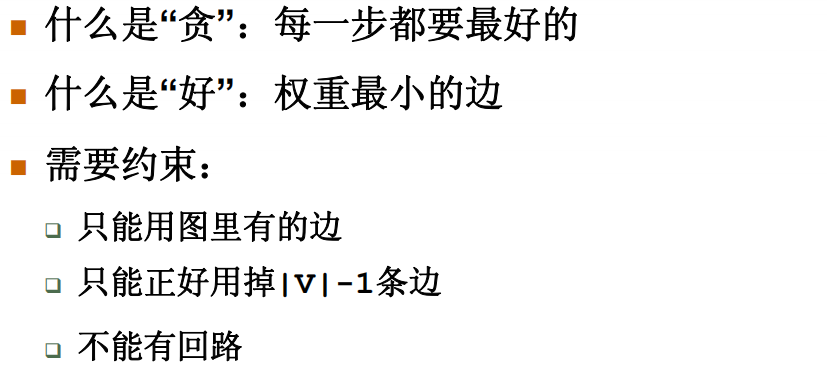
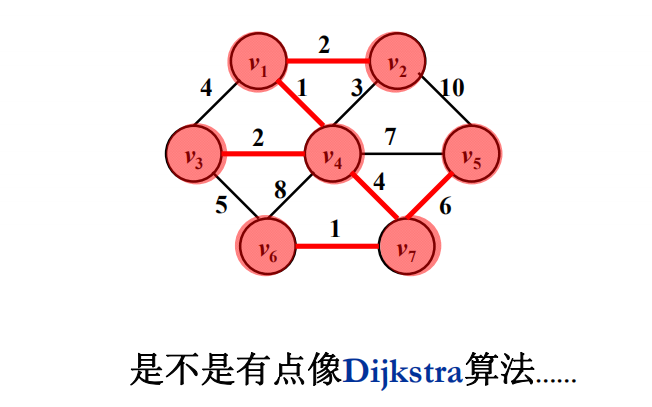
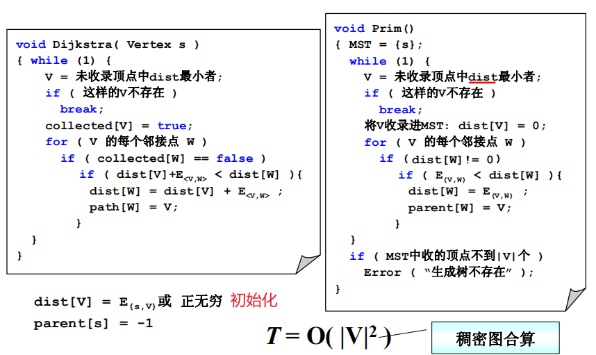
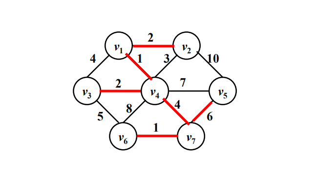
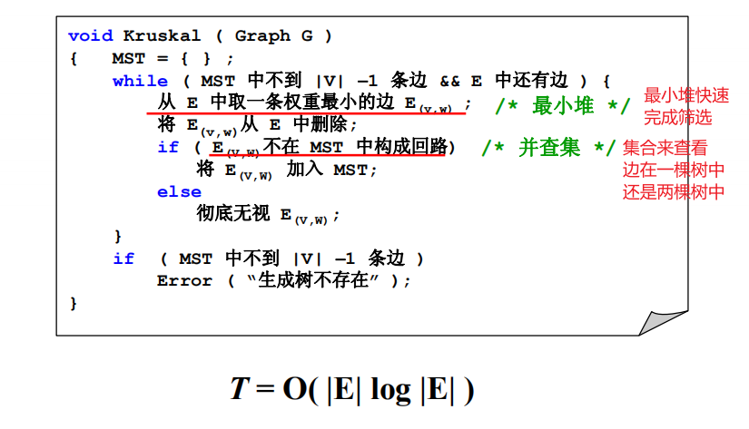

# 最小生成树

(Minimum Spanning Tree)

## 什么是最小生成树

## 贪心算法

### Prim算法

让一棵小树长大，不断收集顶点

Dijkstra算法比较

dist[v]指未收录的节点到树的距离，=0就代表被树收录

生成树不存在代表图不连通

### Kruskal算法

将森林合并成树，初始状态下认为每个顶点都是一棵树，不断地把边收进来把两棵树变成一棵树

区别于Prim算法是不断收集边

