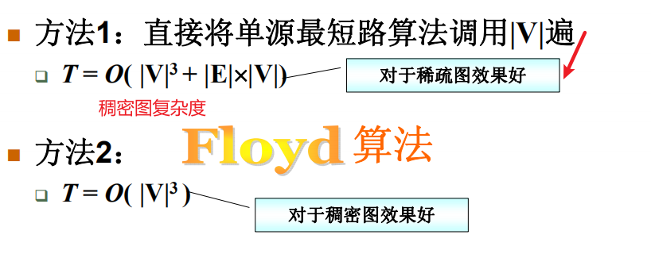

# 最短路径问题


## 无权图的单源最短路算法

是经过顶点数最少的路径

类似广度优先搜索算法


for循环中 v的每个邻接点w就是计算了边

```c
/* 邻接表存储 - 无权图的单源最短路算法 */

/* dist[]和path[]全部初始化为-1 */
void Unweighted ( LGraph Graph, int dist[], int path[], Vertex S )
{
    Queue Q;
    Vertex V;
    PtrToAdjVNode W;
    
    Q = CreateQueue( Graph->Nv ); /* 创建空队列, MaxSize为外部定义的常数 */
    dist[S] = 0; /* 初始化源点 */
    AddQ (Q, S);

    while( !IsEmpty(Q) ){
        V = DeleteQ(Q);
        for ( W=Graph->G[V].FirstEdge; W; W=W->Next ) /* 对V的每个邻接点W->AdjV */
            if ( dist[W->AdjV]==-1 ) { /* 若W->AdjV未被访问过 */
                dist[W->AdjV] = dist[V]+1; /* W->AdjV到S的距离更新 */
                path[W->AdjV] = V; /* 将V记录在S到W->AdjV的路径上 */
                AddQ(Q, W->AdjV);
            }
    } /* while结束*/
}
```


## 有权图的单源最短路算法

不一定是经过顶点数最少的路径


v加入s能影响的只有其邻接点，v和w之间不可能有其他点，因为递增情况下s到w之间，不可能再有一个点


```C
/* 邻接矩阵存储 - 有权图的单源最短路算法 */

Vertex FindMinDist( MGraph Graph, int dist[], int collected[] )
{ /* 返回未被收录顶点中dist最小者 */
    Vertex MinV, V;
    int MinDist = INFINITY;

    for (V=0; V<Graph->Nv; V++) {
        if ( collected[V]==false && dist[V]<MinDist) {
            /* 若V未被收录，且dist[V]更小 */
            MinDist = dist[V]; /* 更新最小距离 */
            MinV = V; /* 更新对应顶点 */
        }
    }
    if (MinDist < INFINITY) /* 若找到最小dist */
        return MinV; /* 返回对应的顶点下标 */
    else return ERROR;  /* 若这样的顶点不存在，返回错误标记 */
}

bool Dijkstra( MGraph Graph, int dist[], int path[], Vertex S )
{
    int collected[MaxVertexNum];
    Vertex V, W;

    /* 初始化：此处默认邻接矩阵中不存在的边用INFINITY表示 */
    for ( V=0; V<Graph->Nv; V++ ) {
        dist[V] = Graph->G[S][V];
        if ( dist[V]<INFINITY )
            path[V] = S;
        else
            path[V] = -1;
        collected[V] = false;
    }
    /* 先将起点收入集合 */
    dist[S] = 0;
    collected[S] = true;

    while (1) {
        /* V = 未被收录顶点中dist最小者 */
        V = FindMinDist( Graph, dist, collected );
        if ( V==ERROR ) /* 若这样的V不存在 */
            break;      /* 算法结束 */
        collected[V] = true;  /* 收录V */
        for( W=0; W<Graph->Nv; W++ ) /* 对图中的每个顶点W */
            /* 若W是V的邻接点并且未被收录 */
            if ( collected[W]==false && Graph->G[V][W]<INFINITY ) {
                if ( Graph->G[V][W]<0 ) /* 若有负边 */
                    return false; /* 不能正确解决，返回错误标记 */
                /* 若收录V使得dist[W]变小 */
                if ( dist[V]+Graph->G[V][W] < dist[W] ) {
                    dist[W] = dist[V]+Graph->G[V][W]; /* 更新dist[W] */
                    path[W] = V; /* 更新S到W的路径 */
                }
            }
    } /* while结束*/
    return true; /* 算法执行完毕，返回正确标记 */
}
```


## 多源最短路算法




### 讨论7.4 Floyd算法与负值圈

如果图中有负值圈，Floyd算法还能用吗？如何知道图中是否存在负值圈？

Floyd算法的三重循环中的D[i][j]表示的是i到j的某种距离——不到最后一步，不一定是最短距离；但是只要D[i][j]小于正无穷，就表示i到j存在至少一条路径，而这条路径的长度就是当前的D[i][j]。

负值圈意味着从某个顶点i出发，兜了一圈回到i的时候，路径长度是负数。于是很显然有：当我们发现某个D[i][i]变成负数的时候，就意味着出现了负值圈。这里的D[i][i]在计算前应被初始化为0，表示原始图中没有从i到i的自回路。

当存在负值圈的时候，圈内顶点之间的最短路实际上是不存在的（长度为负无穷）。而Floyd算法一定在有限多步后停止，所以不可能得到正确的结论。除非在算法中增加一步判断 —— 即在更新了D[i][j]之后，增加判断

if ( i==j && D[i][j]<0 ) return ERROR;

（当然Floyd函数也需要改成返回一个计算成功或不成功的标记。）


```c
/* 邻接矩阵存储 - 多源最短路算法 */

bool Floyd( MGraph Graph, WeightType D[][MaxVertexNum], Vertex path[][MaxVertexNum] )
{
    Vertex i, j, k;

    /* 初始化 */
    for ( i=0; i<Graph->Nv; i++ )
        for( j=0; j<Graph->Nv; j++ ) {
            D[i][j] = Graph->G[i][j];
            path[i][j] = -1;
        }

    for( k=0; k<Graph->Nv; k++ )
        for( i=0; i<Graph->Nv; i++ )
            for( j=0; j<Graph->Nv; j++ )
                if( D[i][k] + D[k][j] < D[i][j] ) {
                    D[i][j] = D[i][k] + D[k][j];
                    if ( i==j && D[i][j]<0 ) /* 若发现负值圈 */
                        return false; /* 不能正确解决，返回错误标记 */
                    path[i][j] = k;
                }
    return true; /* 算法执行完毕，返回正确标记 */
}
```

