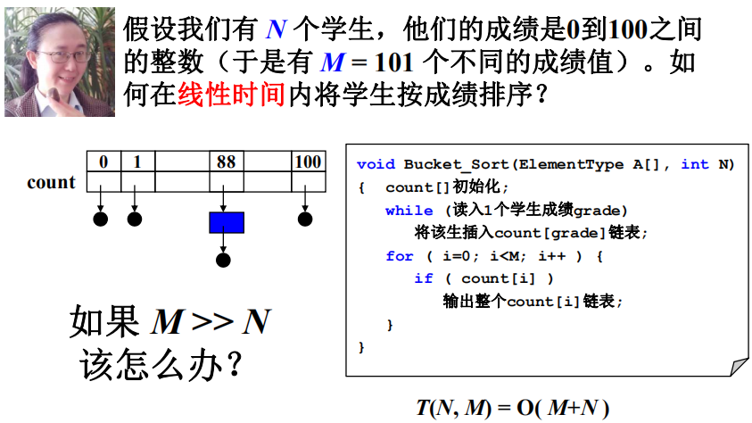
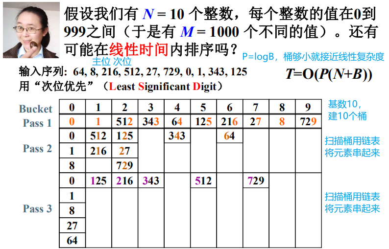
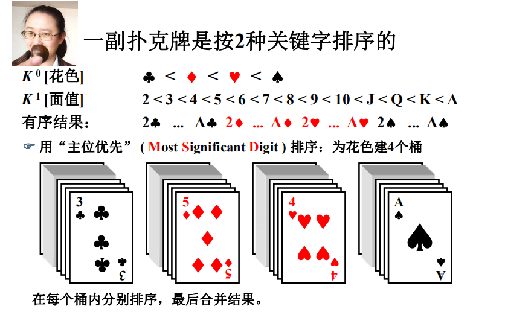
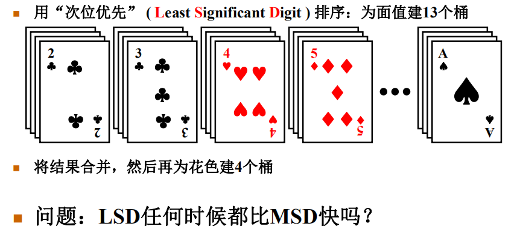

# 基数排序

前面都是比较大小排序，最坏时间复杂度下界为  O(N logN)

基数是进制数，二进制基数是2，十进制基数是10

==基数排序是稳定的算法。==

## 桶排序



上图适合M<N的情况，M>>N看下图



## 多关键字排序



上图不够聪明，每个桶里还需要调用排序算法

上图不能再建13个桶吗？



不需要再排序，相当于人为的排好了序，不需要计算机再去算，但量太大就不行了

```c
/* 基数排序 - 次位优先 */

/* 假设元素最多有MaxDigit个关键字，基数全是同样的Radix */
#define MaxDigit 4
#define Radix 10

/* 桶元素结点 */
typedef struct Node *PtrToNode;
struct Node {
    int key;
    PtrToNode next;
};

/* 桶头结点 */
struct HeadNode {
    PtrToNode head, tail;
};
typedef struct HeadNode Bucket[Radix];
 
int GetDigit ( int X, int D )
{ /* 默认次位D=1, 主位D<=MaxDigit */
    int d, i;
    
    for (i=1; i<=D; i++) {
        d = X % Radix;
        X /= Radix;
    }
    return d;
}

void LSDRadixSort( ElementType A[], int N )
{ /* 基数排序 - 次位优先 */
     int D, Di, i;
     Bucket B;
     PtrToNode tmp, p, List = NULL; 
     
     for (i=0; i<Radix; i++) /* 初始化每个桶为空链表 */
         B[i].head = B[i].tail = NULL;
     for (i=0; i<N; i++) { /* 将原始序列逆序存入初始链表List */
         tmp = (PtrToNode)malloc(sizeof(struct Node));
         tmp->key = A[i];
         tmp->next = List;
         List = tmp;
     }
     /* 下面开始排序 */ 
     for (D=1; D<=MaxDigit; D++) { /* 对数据的每一位循环处理 */
         /* 下面是分配的过程 */
         p = List;
         while (p) {
             Di = GetDigit(p->key, D); /* 获得当前元素的当前位数字 */
             /* 从List中摘除 */
             tmp = p; p = p->next;
             /* 插入B[Di]号桶尾 */
             tmp->next = NULL;
             if (B[Di].head == NULL)
                 B[Di].head = B[Di].tail = tmp;
             else {
                 B[Di].tail->next = tmp;
                 B[Di].tail = tmp;
             }
         }
         /* 下面是收集的过程 */
         List = NULL; 
         for (Di=Radix-1; Di>=0; Di--) { /* 将每个桶的元素顺序收集入List */
             if (B[Di].head) { /* 如果桶不为空 */
                 /* 整桶插入List表头 */
                 B[Di].tail->next = List;
                 List = B[Di].head;
                 B[Di].head = B[Di].tail = NULL; /* 清空桶 */
             }
         }
     }
     /* 将List倒入A[]并释放空间 */
     for (i=0; i<N; i++) {
        tmp = List;
        List = List->next;
        A[i] = tmp->key;
        free(tmp);
     } 
}
```


```c
/* 基数排序 - 主位优先 */

/* 假设元素最多有MaxDigit个关键字，基数全是同样的Radix */

#define MaxDigit 4
#define Radix 10

/* 桶元素结点 */
typedef struct Node *PtrToNode;
struct Node{
    int key;
    PtrToNode next;
};

/* 桶头结点 */
struct HeadNode {
    PtrToNode head, tail;
};
typedef struct HeadNode Bucket[Radix];
 
int GetDigit ( int X, int D )
{ /* 默认次位D=1, 主位D<=MaxDigit */
    int d, i;
    
    for (i=1; i<=D; i++) {
        d = X%Radix;
        X /= Radix;
    }
    return d;
}

void MSD( ElementType A[], int L, int R, int D )
{ /* 核心递归函数: 对A[L]...A[R]的第D位数进行排序 */
     int Di, i, j;
     Bucket B;
     PtrToNode tmp, p, List = NULL; 
     if (D==0) return; /* 递归终止条件 */
     
     for (i=0; i<Radix; i++) /* 初始化每个桶为空链表 */
         B[i].head = B[i].tail = NULL;
     for (i=L; i<=R; i++) { /* 将原始序列逆序存入初始链表List */
         tmp = (PtrToNode)malloc(sizeof(struct Node));
         tmp->key = A[i];
         tmp->next = List;
         List = tmp;
     }
     /* 下面是分配的过程 */
     p = List;
     while (p) {
         Di = GetDigit(p->key, D); /* 获得当前元素的当前位数字 */
         /* 从List中摘除 */
         tmp = p; p = p->next;
         /* 插入B[Di]号桶 */
         if (B[Di].head == NULL) B[Di].tail = tmp;
         tmp->next = B[Di].head;
         B[Di].head = tmp;
     }
     /* 下面是收集的过程 */
     i = j = L; /* i, j记录当前要处理的A[]的左右端下标 */
     for (Di=0; Di<Radix; Di++) { /* 对于每个桶 */
         if (B[Di].head) { /* 将非空的桶整桶倒入A[], 递归排序 */
             p = B[Di].head;
             while (p) {
                 tmp = p;
                 p = p->next;
                 A[j++] = tmp->key;
                 free(tmp);
             }
             /* 递归对该桶数据排序, 位数减1 */
             MSD(A, i, j-1, D-1);
             i = j; /* 为下一个桶对应的A[]左端 */
         } 
     } 
}

void MSDRadixSort( ElementType A[], int N )
{ /* 统一接口 */
    MSD(A, 0, N-1, MaxDigit); 
}
```


