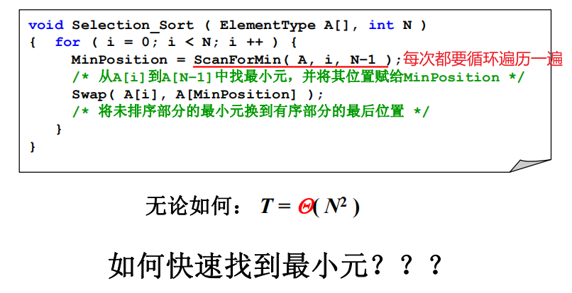
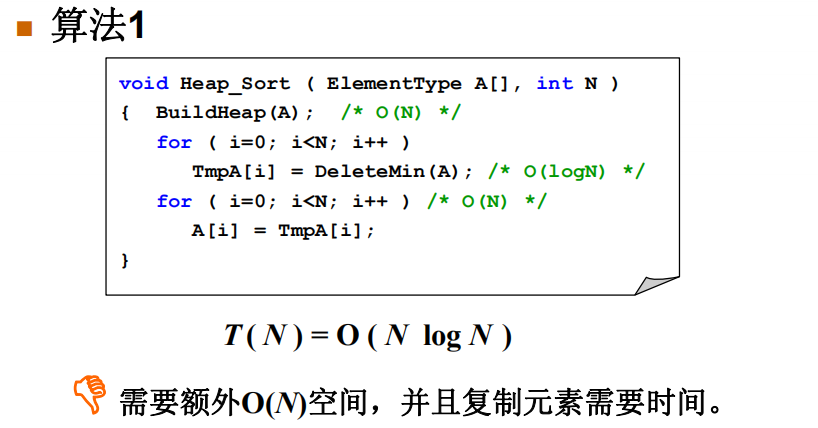
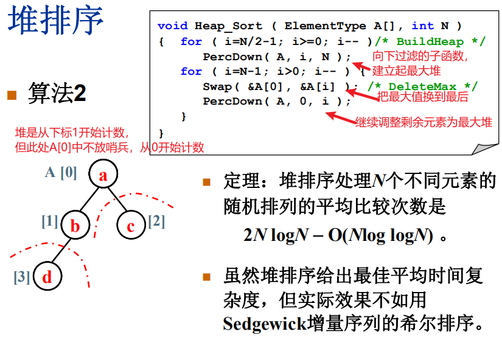

## 堆排序

### 选择排序



瓶颈在查找最小元

==利用最小堆来整理数据再排序==

deleteMin是把堆中最小值弹出来



一次循环交换9次


```c
#include<stdlib.h>
#include<stdio.h>

int main()
{
    int a[10] = { 1,2,3,4,5,6,7,8,9,0 };
	int max = 0;
	// 按住一个位置不动，直到循环出一个最大值
	// 好比打擂台，一个打全部
    // 10-1是因为此处比较到最后只剩一个肯定是最小的，不用再比较，但不适合所有情况
	for (int i = 0; i < 10-1; i++)
	{
		max = i;
		for (int j = i + 1; j < 10; j++)
		{
			if (a[max] < a[j])
			{
				int temp = a[j];
				a[j] = a[max];
				a[max] = temp;
			}
		}
		for (int i = 0; i < 10; i++)
		{
			printf("%4d", a[i]);
		}
		printf("\n");
	}

	system("pause");
}
```

考虑时间复杂度，只比较不交换不耗时间，==交换内存很耗时间==，出栈进栈


```c
#include<stdlib.h>
#include<stdio.h>

int main()
{
	// 选择排序法求最大值
	int a[10] = { 1,2,3,4,5,6,7,8,9,0 };
	int max = 0;
	// 按住一个位置不动，直到循环出一个最大值
    //假设我想当老大我只需要和你们里面最厉害的人打就可以了
    //只要你比我大我就和你交换
    //只比较，比较选出其中最大值存储它的下标再去和i比较交换
	for (int i = 0; i < 10-1; i++)
	{
		max = i;
		for (int j = i + 1; j < 10; j++)
		{
			if (a[max] < a[j])
			{				
				// 存储下标，不直接交换
				max = j;
			}
		}
		if (max != i)
		{
			int temp = a[i];
			a[i] = a[max];
			a[max] = temp;
		}


		for (int i = 0; i < 10; i++)
		{
			printf("%4d", a[i]);
		}
		printf("\n");
	}

	system("pause");
}
```

 先调整出一个最大堆，再把最大值移到最后进行隔离，再循环这一过程将元素按顺序排好

最小堆无法进行这一过程，因为每次都需要隔离掉极值



堆排序不稳定