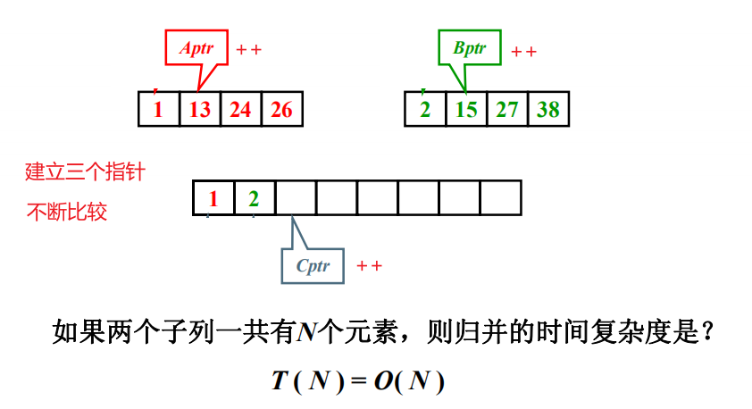
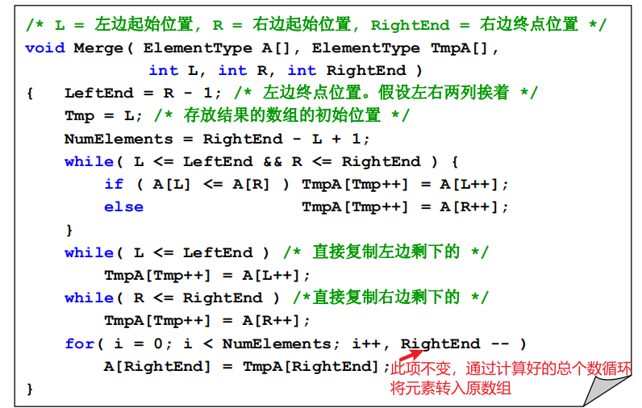
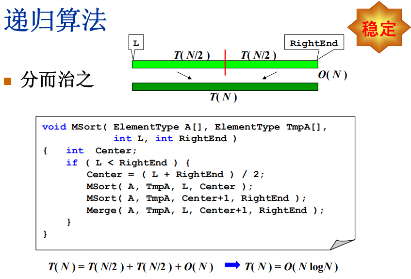
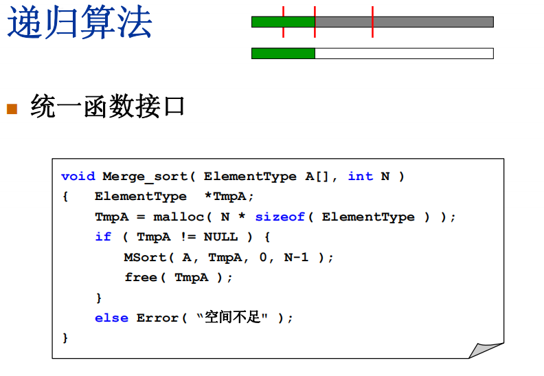
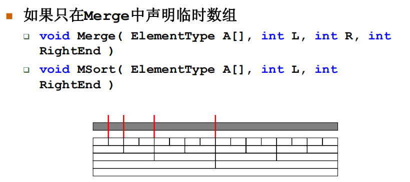
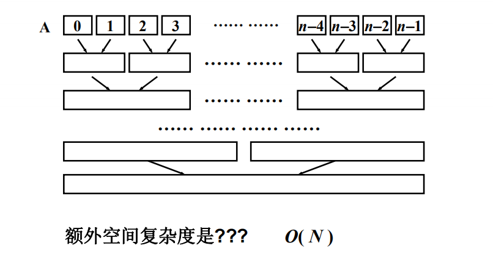
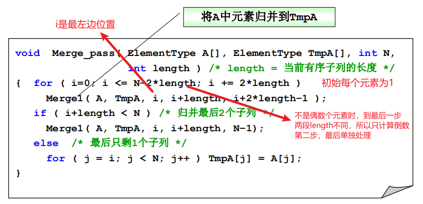
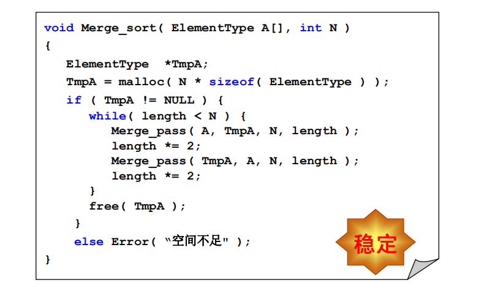

# 归并排序

核心：有序子列的归并





## 递归算法

分而治之



任何排序算法都有一个统一的接口xxxSort，（）中只允许ElementType A[]，int N，不友好？



MSort中声明的TmpA，是为了不重复的申请空间释放空间，只在前面申请一个后传入指针即可重复使用



```c
/* 归并排序 - 递归实现 */

/* L = 左边起始位置, R = 右边起始位置, RightEnd = 右边终点位置*/
void Merge( ElementType A[], ElementType TmpA[], int L, int R, int RightEnd )
{ /* 将有序的A[L]~A[R-1]和A[R]~A[RightEnd]归并成一个有序序列 */
     int LeftEnd, NumElements, Tmp;
     int i;
     
     LeftEnd = R - 1; /* 左边终点位置 */
     Tmp = L;         /* 有序序列的起始位置 */
     NumElements = RightEnd - L + 1;
     
     while( L <= LeftEnd && R <= RightEnd ) {
         if ( A[L] <= A[R] )
             TmpA[Tmp++] = A[L++]; /* 将左边元素复制到TmpA */
         else
             TmpA[Tmp++] = A[R++]; /* 将右边元素复制到TmpA */
     }

     while( L <= LeftEnd )
         TmpA[Tmp++] = A[L++]; /* 直接复制左边剩下的 */
     while( R <= RightEnd )
         TmpA[Tmp++] = A[R++]; /* 直接复制右边剩下的 */
         
     for( i = 0; i < NumElements; i++, RightEnd -- )
         A[RightEnd] = TmpA[RightEnd]; /* 将有序的TmpA[]复制回A[] */
}

void Msort( ElementType A[], ElementType TmpA[], int L, int RightEnd )
{ /* 核心递归排序函数 */ 
     int Center;
     
     if ( L < RightEnd ) {
          Center = (L+RightEnd) / 2;
          Msort( A, TmpA, L, Center );              /* 递归解决左边 */ 
          Msort( A, TmpA, Center+1, RightEnd );     /* 递归解决右边 */  
          Merge( A, TmpA, L, Center+1, RightEnd );  /* 合并两段有序序列 */ 
     }
}

void MergeSort( ElementType A[], int N )
{ /* 归并排序 */
     ElementType *TmpA;
     TmpA = (ElementType *)malloc(N*sizeof(ElementType));
     
     if ( TmpA != NULL ) {
          Msort( A, TmpA, 0, N-1 );
          free( TmpA );
     }
     else printf( "空间不足" );
}
```


## 非递归算法







时间复杂度O(N logN) 好

需要额外空间，需要来回导元素

实际应用中不被用于做内排序，即所有工作都能在内存中完成

用于外排序

```c
/* 归并排序 - 循环实现 */
/* 这里Merge函数在递归版本中给出 */

/* length = 当前有序子列的长度*/
void Merge_pass( ElementType A[], ElementType TmpA[], int N, int length )
{ /* 两两归并相邻有序子列 */
     int i, j;
      
     for ( i=0; i <= N-2*length; i += 2*length )
         Merge( A, TmpA, i, i+length, i+2*length-1 );
     if ( i+length < N ) /* 归并最后2个子列*/
         Merge( A, TmpA, i, i+length, N-1);
     else /* 最后只剩1个子列*/
         for ( j = i; j < N; j++ ) TmpA[j] = A[j];
}

void Merge_Sort( ElementType A[], int N )
{ 
     int length; 
     ElementType *TmpA;
     
     length = 1; /* 初始化子序列长度*/
     TmpA = malloc( N * sizeof( ElementType ) );
     if ( TmpA != NULL ) {
          while( length < N ) {
              Merge_pass( A, TmpA, N, length );
              length *= 2;
              Merge_pass( TmpA, A, N, length );
              length *= 2;
          }
          free( TmpA );
     }
     else printf( "空间不足" );
}
```

