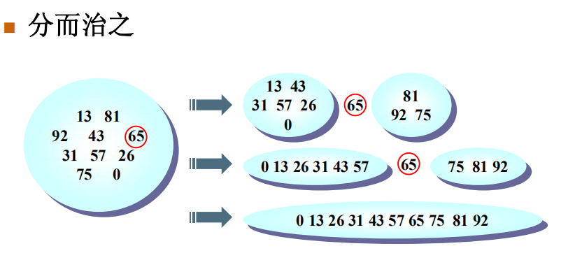
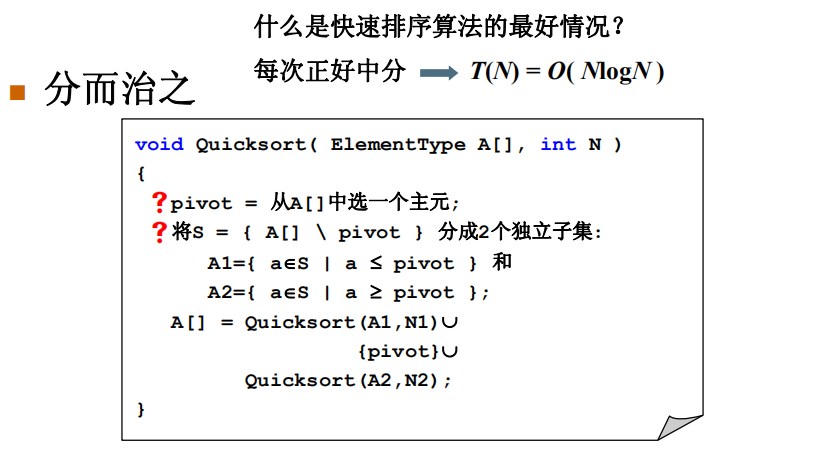
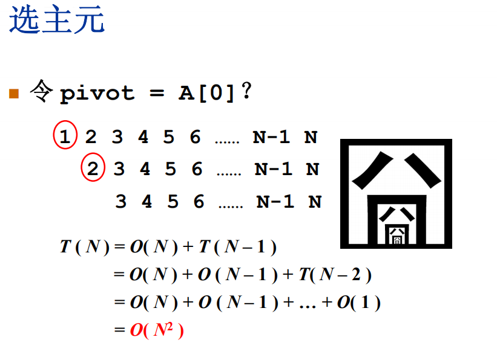
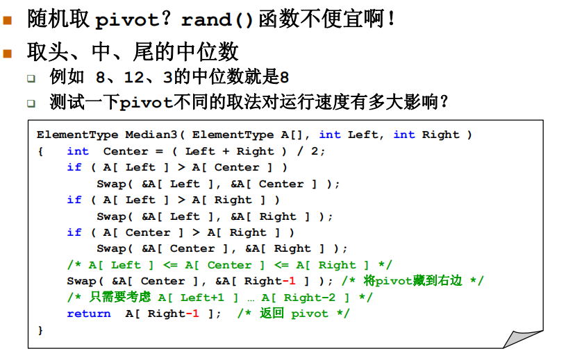
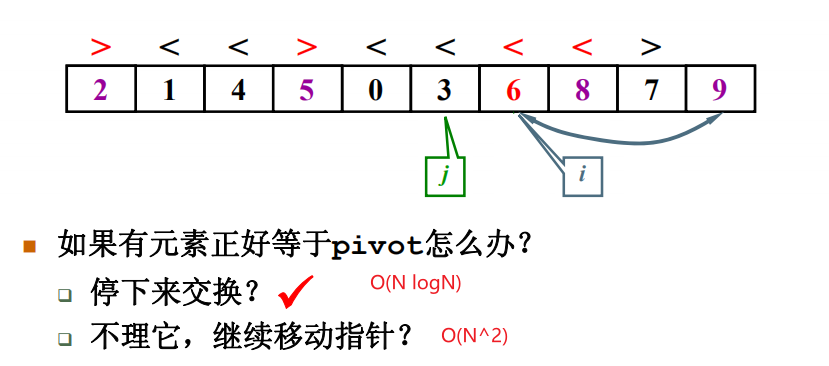
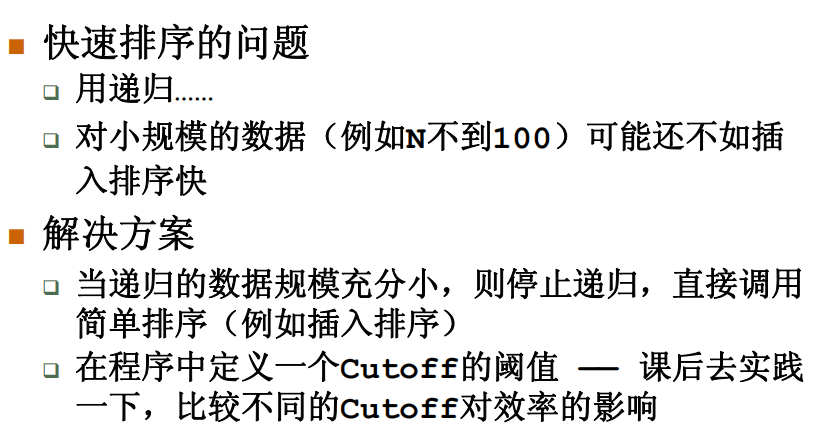
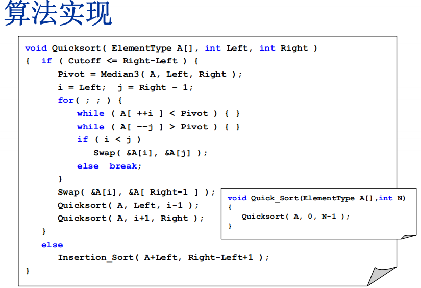

# 快速排序

现实应用中最快的，不一定任何情况最好

算法概述







上图不好



## 子集划分

主元被选中后一次就把元素放在了正确位置



小规模数据的处理





```c
/* 快速排序 - 直接调用库函数 */

#include <stdlib.h>

/*---------------简单整数排序--------------------*/
int compare(const void *a, const void *b)
{ /* 比较两整数。非降序排列 */
    return (*(int*)a - *(int*)b);
}
/* 调用接口 */ 
qsort(A, N, sizeof(int), compare);
/*---------------简单整数排序--------------------*/


/*--------------- 一般情况下，对结构体Node中的某键值key排序 ---------------*/
struct Node {
    int key1, key2;
} A[MAXN];
 
int compare2keys(const void *a, const void *b)
{ /* 比较两种键值：按key1非升序排列；如果key1相等，则按key2非降序排列 */
    int k;
    if ( ((const struct Node*)a)->key1 < ((const struct Node*)b)->key1 )
        k = 1;
    else if ( ((const struct Node*)a)->key1 > ((const struct Node*)b)->key1 )
        k = -1;
    else { /* 如果key1相等 */
        if ( ((const struct Node*)a)->key2 < ((const struct Node*)b)->key2 )
            k = -1;
        else
            k = 1;
    }
    return k;
}
/* 调用接口 */ 
qsort(A, N, sizeof(struct Node), compare2keys);
/*--------------- 一般情况下，对结构体Node中的某键值key排序 ---------------*/
```

```c
/* 快速排序 */

ElementType Median3( ElementType A[], int Left, int Right )
{ 
    int Center = (Left+Right) / 2;
    if ( A[Left] > A[Center] )
        Swap( &A[Left], &A[Center] );
    if ( A[Left] > A[Right] )
        Swap( &A[Left], &A[Right] );
    if ( A[Center] > A[Right] )
        Swap( &A[Center], &A[Right] );
    /* 此时A[Left] <= A[Center] <= A[Right] */
    Swap( &A[Center], &A[Right-1] ); /* 将基准Pivot藏到右边*/
    /* 只需要考虑A[Left+1] … A[Right-2] */
    return  A[Right-1];  /* 返回基准Pivot */
}

void Qsort( ElementType A[], int Left, int Right )
{ /* 核心递归函数 */ 
     int Pivot, Cutoff, Low, High;
      
     if ( Cutoff <= Right-Left ) { /* 如果序列元素充分多，进入快排 */
          Pivot = Median3( A, Left, Right ); /* 选基准 */ 
          Low = Left; High = Right-1;
          while (1) { /*将序列中比基准小的移到基准左边，大的移到右边*/
               while ( A[++Low] < Pivot ) ;
               while ( A[--High] > Pivot ) ;
               if ( Low < High ) Swap( &A[Low], &A[High] );
               else break;
          }
          Swap( &A[Low], &A[Right-1] );   /* 将基准换到正确的位置 */ 
          Qsort( A, Left, Low-1 );    /* 递归解决左边 */ 
          Qsort( A, Low+1, Right );   /* 递归解决右边 */  
     }
     else InsertionSort( A+Left, Right-Left+1 ); /* 元素太少，用简单排序 */ 
}

void QuickSort( ElementType A[], int N )
{ /* 统一接口 */
     Qsort( A, 0, N-1 );
}
```


