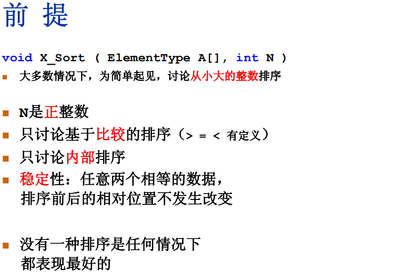
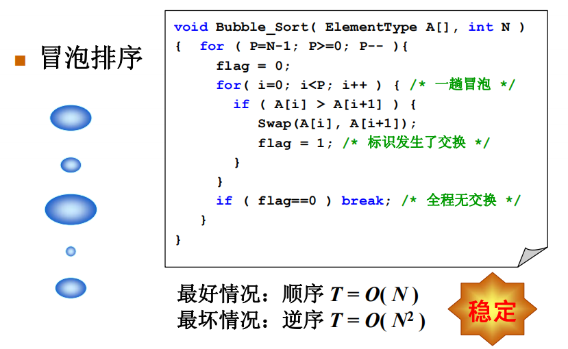
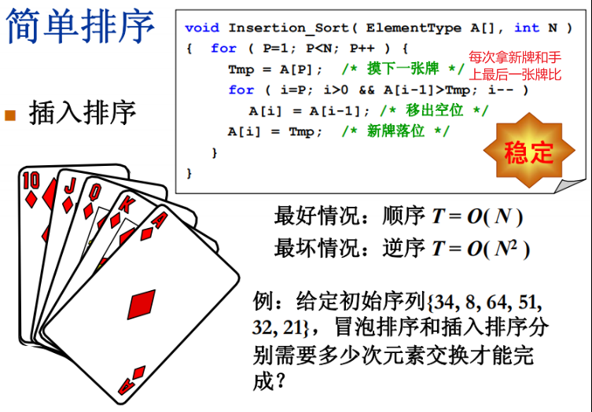
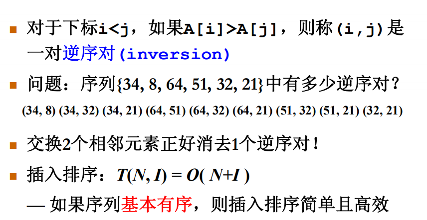
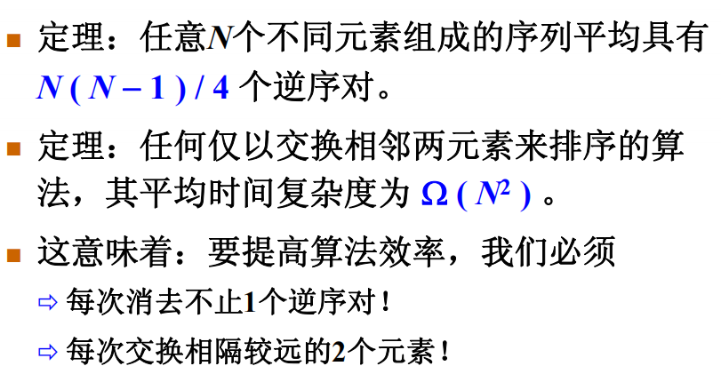

# 简单排序



排序算法都是适用于特定情况的

## 冒泡排序



==两个for循环嵌套加一个if判断==(判断中途是否已经排好了)

第一个for循环，p从N-1开始代表，每次循环都排好了最后一位

swap中

```c
if (a[j] > a[j + 1])
{
    int temp = a[j + 1];
    a[j + 1] = a[j];
    a[j] = temp;
}
```

优点：

- 适用于数组链表

- 只有元素严格大于下一个元素才做交换，相等不动，保证了稳定性

## 插入排序



假设了第0张牌在手里，从1计数，将新牌的与现有比较，大则插在最后面，小则将现有向后移，将新牌插入

```c
void InsertionSort( ElementType A[], int N )
{ /* 插入排序 */
     int P, i;
     ElementType Tmp;
     
     for ( P=1; P<N; P++ ) {
         Tmp = A[P]; /* 取出未排序序列中的第一个元素*/
         for ( i=P; i>0 && A[i-1]>Tmp; i-- )
             A[i] = A[i-1]; /*依次与已排序序列中元素比较并右移*/
         A[i] = Tmp; /* 放进合适的位置 */
     }
}
```


## 时间复杂度下界



所以插入排序和冒泡排序在上上图案例中，都要交换9次，相当于每次都消去一个逆序对




