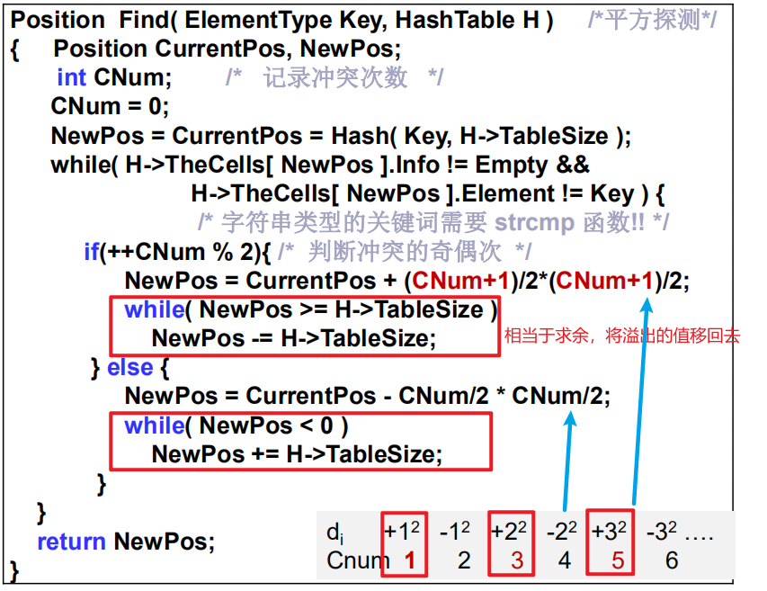

# 冲突处理方法

## 开放定址法

（Open Addressing)

一旦产生了冲突（该地址已有其它元素），就按某种规则去寻找另一空地址

### 线性探测

就是碰到合适的索引值，但发现已经被占了，就向后移一位，若发现还被占了，就再向后移动，若移到最后发现都还被占了，就回到最前面再次查找空地址

在冲突点会形成聚集现象

> 如果按照与刚才例子输入相反的顺序插入各个元素，这些元素在散列表中的位置是不一样的。

成功查找长度因为有9个元素，所以 /9

==散列函数h(key)=key mod 11，因此，分为11类分析==

不成功查找长度ASLu是通过查找每一个索引值（索引值是p个，即此处11个）至确认空地址即关键词不在表中

只要哈希函数是一样的，查找过程就是一样的，查找次数也是一样的

类似上图的不成功查找次数，结果是一样的

### 平方探测法

二次探测

插入时会顺次试探增量序列，一个一个往后试

避免了线性探测的聚集

插入查找，删除不是真的删除，是在原地做一个记号标识这个元素被删除，这样查找时就不会认为这里是空的，会继续向后查找，而插入时会替代这个删除的元素

### 双散列探测法

（Double Hashing)

#### 再散列

散列表元素太多，装填因子比例太高时，为提高效率，再散列，翻倍，需要重新按照新散列表计算元素位置

## 链地址法

### 分离链接法

