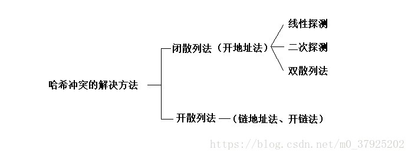
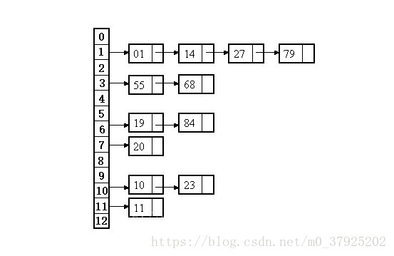

# 散列函数（哈希）

[askunix_hjh](https://hejinhong.blog.csdn.net/) 2018-08-24 12:01:00  13847  收藏 28

分类专栏： [数据结构](https://blog.csdn.net/m0_37925202/category_6796626.html) [数据结构与算法](https://blog.csdn.net/m0_37925202/category_9271067.html) 文章标签： [hash](https://www.csdn.net/tags/MtTaEg0sMzE0MDUtYmxvZwO0O0OO0O0O.html) [哈希](https://www.csdn.net/tags/MtTaEg0sNDkwMjgtYmxvZwO0O0OO0O0O.html) [哈希冲突](https://www.csdn.net/tags/MtTaEg0sMzUyMjQtYmxvZwO0O0OO0O0O.html) [哈希函数](https://www.csdn.net/tags/MtTaEg0sMzUyMjMtYmxvZwO0O0OO0O0O.html)

版权

### 概念

散列的概念属于查找，它不以关键字的比较为基本操作，采用直接寻址技术。在理想情况下，查找的期望时间为O(1)。

hash函数就是把任意长的输入字符串变化成固定长的输出字符串的一种函数。输出字符串的长度称为hash函数的位数。

散列（Hashing）通过散列函数将要检索的项与索引（散列，散列值）关联起来，生成一种便于搜索的数据结构（散列表）。

### 应用

目前应用最为广泛的hash函数是SHA-1和MD5，大多是128位和更长。hash函数在现实生活中应用十分广泛。很多下载网站都提供下载文件的MD5码校验，可以用来判别文件是否完整，在一些BitTorrent下载中，软件将通过计算MD5检验下载到的文件片段的完整性，etc。

#### 性质

（1）确定性：哈希的散列值不同，那么哈希的原始输入也就不同。

（2）不确定性：同一个散列值很有可能对应多个不同的原始输入。称为“哈希碰撞”。

### 哈希冲突

哈希冲突是不可避免的，因为键的数目总是比索引的数目多，不管是多么高明的算法都不可能解决这个问题。就算键的数目比索引的数目少，必有一个输出串对应多个输入串，冲突还是会发生。

### 哈希函数构造准则

hash函数的构造准则：简单、均匀。

（1）散列函数的计算简单，快速；

（2）散列函数能将关键字集合K均匀地分布在地址集{0,1，…，m-1}上，使冲突最小。

### 哈希函数的构造方法

#### （1）直接定址法：

取关键字或关键字的某个线性函数值为哈希地址：`H(key) = key 或 H(key) = a·key + b`
其中a和b为常数，这种哈希函数叫做自身函数。

注意：由于直接定址所得地址集合和关键字集合的大小相同。因此，对于不同的关键字不会发生冲突。但实际中能使用这种哈希函数的情况很少。

#### （2）相乘取整法：

首先用关键字key乘上某个常数A(0 < A < 1)，并抽取出key.A的小数部分；然后用m乘以该小数后取整。

注意：该方法最大的优点是m的选取比除余法要求更低。比如，完全可选择它是2的整数次幂。虽然该方法对任何A的值都适用，但对某些值效果会更好。Knuth建议选取 0.61803……。

#### （3）平方取中法：

取关键字平方后的中间几位为哈希地址。

通过平方扩大差别，另外中间几位与乘数的每一位相关，由此产生的散列地址较为均匀。这是一种较常用的构造哈希函数的方法。

> 将一组关键字(0100，0110，1010，1001，0111)
> 平方后得(0010000，0012100，1020100，1002001，0012321)
> 若取表长为1000，则可取中间的三位数作为散列地址集：(100，121，201，020，123)。

#### （4）除留余数法：

取关键字被数p除后所得余数为哈希地址：`H(key) = key MOD p (p ≤ m)`。

注意：这是一种最简单，也最常用的构造哈希函数的方法。它不仅可以对关键字直接取模(MOD)，也可在折迭、平方取中等运算之后取模。值得注意的是，在使用除留余数法时，对p的选择很重要。一般情况下可以选p为质数或不包含小于20的质因素的合数。

#### （5）随机数法：

选择一个随机函数，取关键字的随机函数值为它的哈希地址，即 `H(key) = random (key)`，其中random为随机函数。通常，当关键字长度不等时采用此法构造哈希函数较恰当。

### 哈希冲突解决方法

#### （1）开放定址法：

就是在发生冲突后，通过某种探测技术，去依次探查其他单元，直到探查到不冲突为止，将元素添加进去。

假如是在index的位置发生哈希冲突，那么通常有一下几种探测方式：

- 线性探测法（线性探测再散列）

  向后依次探测index+1，index+2…位置，看是否冲突，直到不冲突为止，将元素添加进去。

- 平方探测法

  不探测index的后一个位置，而是探测2^i位置，比如探测2^0位置上时发生冲突，接着探测2^1位置，依此类推，直至冲突解决。

注意：

（1）用开放定址法建立散列表时，建表前须将表中所有单元(更严格地说，是指单元中存储的关键字)置空。

（2）两种探测方法的优缺点。

> 线性探测法虽然在哈希表未满的情况下，总能保证找到不冲突的地址，但是容易发生二次哈希冲突的现象。比如在处理若干次次哈希冲突后k,k+1,k+2位置上的都存储了数据，那下一次存储地址在k,k+1,k+2,k+3位置的数据都将存在k+3位置上，这就产生了二次冲突。
>
> 
>
> 这里引入一个新的概念，堆积现象是指用线性探测法处理哈希冲突时，k,k+1,k+2位置已存有数据，下一个数据请求地址如果是k,k+1,k+2,k+3的话，那么这四个数据都会要求填入k+3的位置。
>
> 
>
> 平方探测法可以减少堆积现象的发生，但是前提是哈希表的总容量要是素数4n+3才可以。

#### （2）链地址法（开散列法）

基本思想：

链表法就是在发生冲突的地址处，挂一个单向链表，然后所有在该位置冲突的数据，都插入这个链表中。插入数据的方式有多种，可以从链表的尾部向头部依次插入数据，也可以从头部向尾部依次插入数据，也可以依据某种规则在链表的中间插入数据，总之保证链表中的数据的有序性。Java的HashMap类就是采取链表法的处理方案。

例：已知一组关键字为(19，14，23，01，68，20，84，27，55，11，10，79)，则按哈希函数 H(key) = key MOD13 和链地址法处理冲突构造所得的哈希表为：

#### （3）再哈希法：（双散列法）

在发生哈希冲突后，使用另外一个哈希算法产生一个新的地址，直到不发生冲突为止。这个应该很好理解。

再哈希法可以有效的避免堆积现象，但是缺点是不能增加了计算时间和哈希算法的数量，而且不能保证在哈希表未满的情况下，总能找到不冲突的地址。

#### （4）建立一个公共溢出区：

建立一个基本表，基本表的大小等于哈希表的大小。建立一个溢出表，所有哈希地址的第一个记录都存在基本表中，所有发生冲突的数据，不管哈希算法得到的地址是什么，都放入溢出表中。

但是有一个缺点就是，必须事先知道哈希表的可能大小，而且溢出表里的数据不能太多，否则影响溢出表的查询效率。实际上就是要尽量减少冲突。

### MD5加密算法

MD5是一个安全的散列算法，输入两个不同的明文不会得到相同的输出值，根据输出值，不能得到原始的明文，即其过程不可逆；所以要解密MD5没有现成的算法，只能用穷举法，把可能出现的明文，用MD5算法散列之后，把得到的散列值和原始的数据形成一个一对一的映射表，通过比在表中比破解密码的MD5算法散列值，通过匹配从映射表中找出破解密码所对应的原始明文。

### 结束语

哈希表一旦发生冲突，其性能就会显著下降。因此建立哈希表时必须规避哈希冲突的产生，大多数哈希表的实现都是：第一步，是通过哈希算法将key值转换一个整数以确定数据的存储位置；第二步，检查是否发生哈希冲突，以及确定发生冲突后的处理方案。