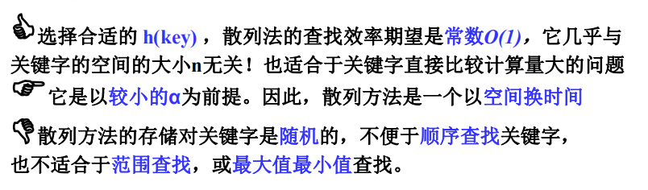
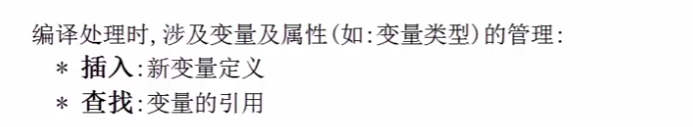
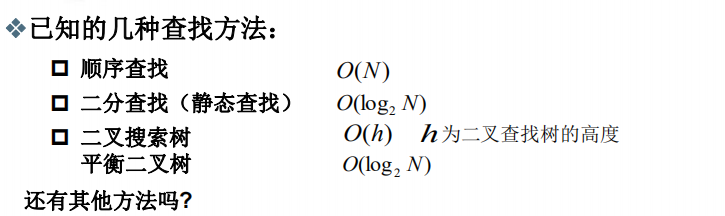
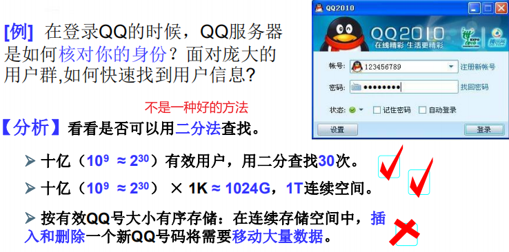
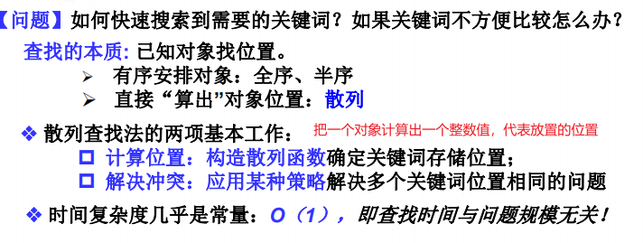
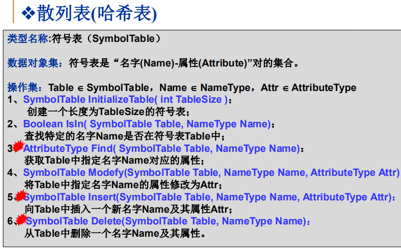
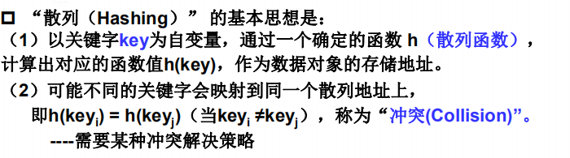
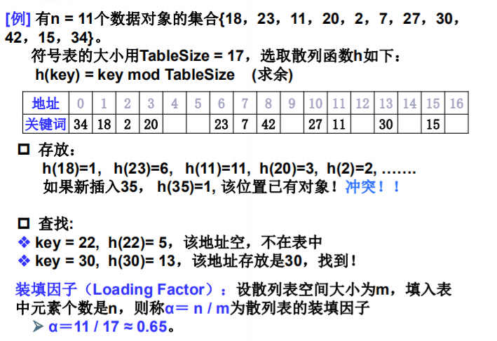
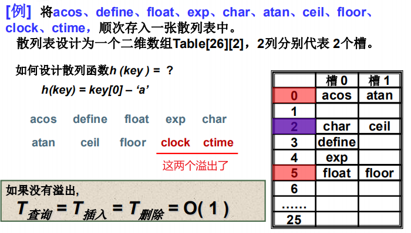
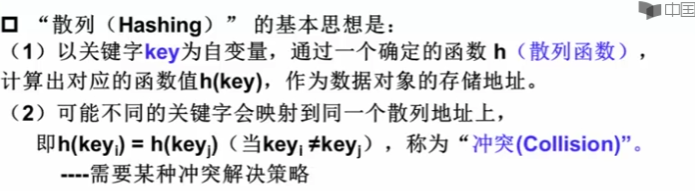

# 散列表

就是哈希表 HASH

特点

- 基本与问题规模无关

- 用于字符串管理：变量名，web搜索关键字等
- 关键字比较因为字符串转换成数字，快

变量和变量属性的管理

编译处理中对变量管理：
动态查找问题

利用查找树（搜索树）进行变量管理？
两个变量名（字符串）比较效率不高

用查找树，AVL树进行变量名查找不方便，因为变量名需要一个个字符去比较

是否可以先把字符串转换为数字，再处理？

搜索树是半序的，不是全序

利用二位数组，设计哈希函数(散列函数)

先来第一列，冲突第二列

