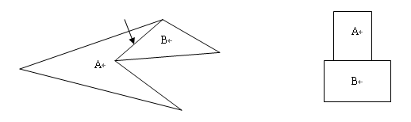
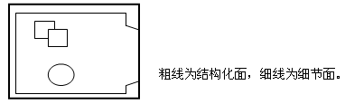
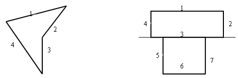
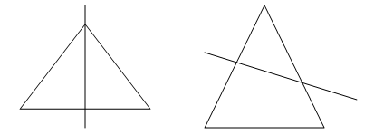
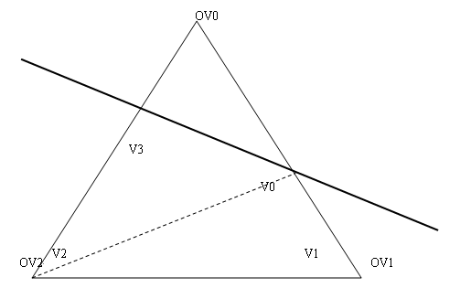

# BSP（二叉空间分割）树

[iduosi](https://blog.csdn.net/iduosi) 2012-08-09 09:45:17  29254  收藏 11

分类专栏： [数据结构与算法分析](https://blog.csdn.net/iduosi/category_1190914.html) 文章标签： [算法](https://www.csdn.net/tags/MtTaEg0sMTE3MjUtYmxvZwO0O0OO0O0O.html) [游戏](https://so.csdn.net/so/search/s.do?q=游戏&t=blog&o=vip&s=&l=&f=&viparticle=) [工作](https://so.csdn.net/so/search/s.do?q=工作&t=blog&o=vip&s=&l=&f=&viparticle=) [引擎](https://so.csdn.net/so/search/s.do?q=引擎&t=blog&o=vip&s=&l=&f=&viparticle=) [文档](https://www.csdn.net/tags/MtTaEg0sNDczMzYtYmxvZwO0O0OO0O0O.html) [object](https://www.csdn.net/tags/MtTaEg0sMTk2NDMtYmxvZwO0O0OO0O0O.html)

***\*BSP（二叉空间分割）树是另一种类型的空间分割技术，其已经在游戏工业上应用了许多年（Doom是第一个使用BSP树的商业游戏）。尽管在今天BSP树已经没像过去那么受欢迎了，但现在仍在广泛地采用这项技术。\****

当你看一下BSP在碰撞检测方面那极度干净漂亮和高速的效率，立刻能让你眼前一亮。不但BSP树在多边形剪切方面表现出色，而且还能让我们有效地自由运用world-object式的碰撞检测。BSP树的遍历是使用BSP的一个基本技术。碰撞检测本质上减少了树的遍历或搜索。这种方法很有用因为它能在早期排除大量的多边形，所以在最后我们仅仅是对少数面进行碰撞检测。正如我前面所说的，用找出两个物体间的分隔面的方法适合于判断两个物体是否相交。如果分隔面存在，就没有发生碰撞。因此我们递归地遍历world树并判断分割面是否和包围球或包围盒相交。我们还可以通过检测每一个物体的多边形来提高精确度。进行这种检测最简单的一个方法是测试看看物体的所有部分是否都在分割面的一侧。这种运算真的很简单，我们用迪卡尔平面等式 ax + by + cz + d = 0 去判断点位于平面的哪一侧。如果满足等式，点在平面上；如果ax + by + cz + d > 0那么点在平面的正面；如果ax + by + cz + d < 0点在平面的背面。

在碰撞没发生的时候有一个重要的事情需要注意，就是一个物体（或它的包围盒）必须在分割面的正面或背面。如果在平面的正面和背面都有顶点，说明物体与这个平面相交了。（以上载选自百度百科）

***\*Bsp分割算法简述\****

***\*Preview\****

BSP分割算法也是有不少文章可以借鉴的，就我目前能掌握的资料来看，泛泛而谈者大有人在，实际去作的时候却总是抓瞎。知道是什么永远不如知道怎么做，BSP分割是BSP分析的基础，虽然它很简单，但是，如果连简单的都不会做，又怎么能胜任复杂的工作呢？

趁这段时间有空，遂埋头钻研BSP，一周之后，分割和自动Portal生成均已解决，遂做此文，希望能对初学者有所帮助，亦希望能抛砖引玉，众位高手能不吝赐教。

本文先就BSP中相对简单的分割部分做一个简单的介绍，自动Portal生成的资料正在整理，希望能尽快放出。

***\*BSP的基本原理 
\****
试想我们生活的空间，肯定是由为数众多的天花板、墙壁和地板组成，对于每一个“板”，都将空间分为“板前”和“板后”两个部分。已知人的位置，就可根据人在“板前”还是在“板后”，知道人所能看到的物体的遮挡顺序（e.g.如果人在板前，则板前的物体遮挡所有板后的物体）。

BSP者，原理很简单：它试图将所有的板（在BSP中叫做平面）组织成一棵树，每个平面均将它所在的空间分割为前后两个部分，这两个部分又分别被另外的平面分割成更小的空间……直到最后，按照前面所说的算法，确定每一个房间（在BSP中叫做叶子）相对于眼睛的遮挡顺序。

这是一个非常标准的二分法，仅按照“前”和“后”两个逻辑上的概念来切分空间，这使得它在以“房间”为单位组成的室内场景里是不二之选。为什么？请接着看：

在判断遮挡顺序的时候，BSP空间的算法极为简单：只需要从树根开始，简单判断人的位置与所有平面的前后关系：前则正子树（在平面“前”方的空间）在前，负子树（在平面“后”方的空间）在后；后则正子树在后，负子树在前。以此递归到叶子（叶子总是一个房间），就可以确定人处于哪一个房间之中、其他房间的遮挡关系如何。

这个其实很简单：因为所有的平面均将其所处的空间分为前后两个部分，所以，每一个房间，均是由若干平面的“前”“后”来决定的，通过人与这些平面前后关系的判断，自然而然就可以直接定位到所需的房间之中了。这就是BSP算法的特别之处。

如图：空间ABC由A、B、C三个独立的房间组成，首先，分割平面1将空间分成了平面正向的A房间和平面负向的BC空间，BC空间被2紧接着分割为平面2正向的C房间和负向的B房间。注意这里平面的方向一般由墙壁面向的方向而定。

如果有一个人处于C房间内，那么如何判断所有房间的遮挡顺序呢？从树根开始，由于人处于平面1的“后”面，所以，BC空间应该先于A房间（后：先负后正），然后，由于人处于分割平面2的“前”面，所以，C房间应该先于B房间（前：先正后负）。这样，整个房间离人由近到远的顺序就可以确定了：C－B－A。仅需要通过两次平面的前后判断（总共六次乘法、两次加法、两次大小判断），就可以确定空间的先后顺序，算法的威力可见一斑！

BSP分割的目标是将空间划分为一个个叶凸体，也就是一个凸面体。一个个凸面体才有排序的可能，很难想象一个非凸面体在空间中如何排序。如图左：从箭头方向看过去，到底凹多面体A是在B的前面？还是B在凹多面体A的前面？而如果是右边的，两个凸多面体，情况就不一样了，A和B方向的前后，根据视点的位置永远是唯一的。这就是BSP的优势，只需要知道视点的位置，空间所有凸体的位置顺序都可以马上确定，但如果是凹体，对不起，那就确定不了了，所以，BSP划分空间结构化面的结果必然是一个个凸面体。

这里面唯一想强调的一点是，如果您分析过Quake3的BSP格式，那么您会发现过去有时候一个房间会被几个柱子分割得乱七八糟，只是为了少渲染几个面。现在大不必这么兴师动众，一个房间就留外面的6个结构化面，柱子什么的只算作细节Mesh，不参与分割，这样产生的结果，与Portal筛选结合之后，效率未必就差。而且，结构更符合逻辑，在以后自动路点和路径计算的时候，会有一些优势。想想看，被一个很不规则的柱子（或箱子等其他物体）划分得乱七八糟的空间，一个房间就有很多个叶子，到底哪些叶子是人能走到的？哪些叶子是人走不到的？哪些叶子需要在AI中被考虑？哪些叶子可以排除？一个不以逻辑构成的空间，必然在逻辑的处理上要处处碰壁。所以，最好还是一个叶子就是一个房间、或者一个走廊；柱子、箱子啊什么的全都用细节Mesh，就可以了。

注意，BSP划分出的凸体其实主要是为了后面BSP分析而进行的，而不是渲染。早先的时候硬件很糟糕，没有Z缓冲，那时候省一个三角形比现在重要得多。现在？有时候宁可多画一堆三角形也不会去浪费那个CPU资源进行三角形的逐个筛选。所以，尽量减少结构化面，使结构化面的房间组成凸体，但细节面把房间装点成什么样，那就无所谓了，即便细节面将这个空间又变成了一个凹体，也是无所谓的，如图：

由于是一个老算法了，因此BSP分割算法早已经不是什么神秘的东西，这个算法有很多例子，推荐《BSP技术详解》（翻译后的名称如此），唯一的遗憾是这篇文章的伪代码需要花点心思。另外，《3D游戏 卷2 动画与高级实时渲染技术》所带的FLY 3D引擎也有很完整的代码，虽然整个看下来比伪代码还难懂，但是每个函数基本上都还算清晰，也是一个难得的备选资料。
当然，可能大部分人还是倾向于去看Quake和HL2的代码。为了使自己加深印象，我所选择的是自己从零开始，仅按照资料上的观点和流程进行DIY，而没有参考代码。因为经常参考着、参考着就“拿来主义”了，虽然开发效率保证了，但是记性不清，一旦扩展起来，基本抓瞎^_^b。所以这次狠狠心，决定享受一次DIY的乐趣。

***\*准备工作：场景数据\****

进入工作状态，第一个问题是场景数据的配置。BSP的难度一定程度上不是算法本身带来的，BSP算法很简单也很明确，并没有太多复杂的东西在里面。复杂的是大凡好的BSP都需要和编辑器结合起来，以进行Portal、Brush、Entity和Path Point诸如此类的定制，直接从3D Max导出一个Mesh然后就进行分析，这个从实践上限制太多、意义不大，所以，与其说BSP分割很难，倒不如说是BSP的编辑器难做。记得一本老书上曾经说过，BSP编辑器的代码是BSP分割算法的10倍有余，仔细想想，确实如此，而且只会有过之而无不及。

在实践中，我采用了《3D游戏》的方法，这个方法是，通过在3D Max中物体的名称来区分一个物体的这些面是属于“结构化面”（分割平面）、“细节面”（不参与分割的面）还是Entity。由于3D Max Script支持使用前缀将一组物体放入一个Array中，所以，使用一个简单而明确的前缀是一个很好的思路，《3D游戏》使用了*、&这些符号，而我则使用了S（Split）、D（Detail）、E（Entity）。例如SBox01说明这个Box01的所有面均是结构化面，要参与BSP分割和分析，而DSphere01则说明这个Sphere01在BSP的分割和分析中将会被忽略。这中间的主要工作集中在3DMAX Script的撰写（或者插件的撰写），所以就不再多说了，对这个技术还比较生疏的，可以参考网上相关的内容。

从3DMAX中读出来Object后，其所有的顶点和面索引都已知了，将所有顶点组织成一个顶点表，所有的结构化三角形组织成一个结构化三角形表（这里的三角形是指顶点索引），这个比较简单，应该不是问题。

数据进入我们的程序，第一件事情就是要首先计算出所有的平面，因为不同的结构化面可能共用一个平面，所以，这里先需要计算出所有的平面并在平面和结构化面中建立关系，以防止同一个平面被两次以上使用，影响BSP二分逻辑的正确性。D3DX给出了专门的函数D3DXPlaneFromPoints，可以很方便地从一个三角形产生出一个平面来。一个新的平面算出来后，检查一下这个平面是否已经生成过了，如果没有，就算作一个新平面并记录其ID，否则就要舍弃这个新平面，转而采用原有平面的ID。直到最后，为所有的结构化三角形给出其对应的平面ID。这中间注意一下D3DX的平面公式是ax+by+cz+d=0，用的是+d，不是-d，在之后的计算中需要注意。

准备好顶点表、结构化三角形表和平面表之后，分割就可以正式开始了。相对于3DMax Script和插件而言，BSP分割的算法本身容易得让人崩溃，不多说了，下面开始！

***\*BSP分割\****

首先，自然是要先产生一个根节点，并把所有的顶点表、结构化三角形表和平面表一股脑塞进这个根节点中咯。

然后，分割的流程大抵如下：
1 遍历当前节点的所有备选平面，寻找一个合适的分割平面。
2 如果找不到合适的分割平面，这个节点是一个叶子，Return。
3 如果找到了，Mark这个平面已经被使用过。
4 New两个新节点，一个为正向节点，一个为负向节点，挂接到本节点下。
5 遍历所有结构化面。
6 如果结构化面在分割平面的：
正向：将这个结构化面和结构化面所对应的平面放入到正向节点。
负向，放入到负向节点。
如果结构化面被分割平面分割，则分割此三角形，并将分割后的结果放入相应的子节点。
（注意，这一步当发现结构化面所对应的平面已经被Mark的时候，就只放结构化面，不放分割平面了，以防止同一个平面用于分割两个以上空间，违反BSP空间二分逻辑的唯一性）
7 遍历所有细节面。细节面的处理与结构化面类似，只不过这里不用考虑到细节面对应的平面问题，更简单。
8 遍历完毕，由于所有的结构化三角形、平面和细节面已经转移到两个子节点中了，因此从本节点中解掉所有的结构化三角形、平面和细节面的引用。节点所需保留的数据只需要是分割平面和两个下级节点的指针即可。
9 对两个子节点，分别从1开始递归执行。

这样，等一切结束的时候，就是一棵完整的BSP树了，所有的节点中仅保留有节点的分割平面和两个下级节点，而渲染严重相关的结构化三角形和细节面则全都在叶子里。最后，只需要顺根递归，将所有的节点组织成节点表就可以了。我在这里分别是将节点组织成了节点表，将叶子组织成了叶子表。您也可以通过为节点加一个Is Leaf属性来将它们统一放到一个节点表里。

现在，面临最主要的问题是，在所有的结构化面中，如何寻找一个分割平面？

首先，分割平面必须是对于凹多面体而言的，已经形成了凸多面体的空间就不必要分割了。对于一个凹体而言，分割平面必须在平面的正负方向均出现三角形。如此递归分割下去，就能保证将空间最终分割成大量凸多面体集合。如下图左，1、4在平面的一方没有出现三角形，应被舍弃，2、3均可以作为备选的分割平面：

分割平面的选取是一个比较“笨”的办法，可偷懒的机会不多，只能是for each的判断。对于每一个平面，算出一个用于判断的值，在所有值中最大（或者最小，视算法而定）的那个平面就是最佳分割平面。最简单的，永远只选取第一个结构化三角形的平面分割，但是这样分割下来的空间会惨不忍睹。分割出来的结果最好是让一棵树平衡的那个做法。因为平衡二叉树的操作比不平衡二叉树要快，冗余度要小很多。

计算出最优平衡二叉树几乎是不可能的，但在近似层面上保证二叉树尽可能平衡的算法很多，《3D游戏》采用的是：
P=分割后处于正向的三角形数
N=分割后处于负向的三角形数
S=被从中切开的三角形数
Value = P – N + 8 × S

这个值最小的那个就是最好的平面。也就是说，正负向三角形数量最接近、且切开三角形最少的那个平面就是最好的分割平面。

如上图右，7、3、5均可以作为分割平面，但是，非常明显：3就比7和5要好得多，因为其正负方向的三角形数最接近，且没有切割任何三角形。

这个算法在实际使用上，并不一定能生成最优树，但它简单而且直观。没有最好的算法，只有最适合的算法，算法的选择不是唯一的，基本上应该根据空间的特点进行，所以这里就不再多说了。总之，能尽量分割出平衡二叉树的方法就是好的方法。

BSP分割完后，产生出来的节点表和叶子表，其中，节点表构成了BSP树的树干，叶子表存有所有的结构化三角形和细节Mesh，将被用作之后分析的基本数据源。而在所有的分析中，首先应该进行的就是Portal的分析，Portal分析完毕后，PVS等分析才有可能。而Portal和PVS，则是BSP空间分割最有魅力的两个部分，在最新的商业引擎中，仍能看到他们的影子，而且，比起90年代初，只会有过之而无不及……

***\*补充和校正\****

关于分割一个三角形

上篇文档写完后，做了一个比较复杂的场景，进行分割后发现原算法的一些问题，在此做一个补充。根据此补充，原文档将被删掉重新修改完后再发，对各位读者造成的不便，希望大家能够见谅。

在上篇文章里谈到的分割算法里有关被分割面的处理，采取的是直接将被分割面正负都放的策略。当时认为这只会对AABB的计算产生影响，所以也就堂而皇之这么写上去了。这个算法虽然简单，但是在之后的Portal处理时会面临很多困难，这一点也是我开始没有考虑到的。

在将场景变得复杂之后，这个问题就越发显现出来：在有些叶子，将会仅包括若干被分割的共享三角形，且这些三角形根本无法构成封闭空间。然而，这些叶子却被送入了Portal计算，最后出来的Portal非常诡异，甚至包括了在同一面上的若干个Portal。

用更多的思路更改Portal算法，倒不如从根本上将空间分割得更为合理，也就是采取标准的做法：将被分割三角形分割开，分割为多个三角形，分别放入相应空间。

其实这个算法很简单，一个三角形如果被一个平面分割，直观上看，有且只有两种情况：一种是在正负各生成一个三角形；另一个是在一侧有一个三角形，另一侧有两个三角形。直观上说，无论哪种情况，关键算法流程都是：

顺序访问原三角形的边，设边的第一个顶点是v0，第二个顶点是v1。
如果这个边的两个顶点均在平面一侧，则两个顶点算入平面相应一侧的新多边形。
如果有一个点在平面上，则这个点如果是这个边的第一个顶点，应该在平面两侧的新多边形中都要放。如果是第二个顶点，则需要判断第一个顶点在平面的哪一侧，并将之放入相应空间（只放一次）。可参考下图（左）来进行理解。
如果这个边被平面切割，则：首先算出来切割后的顶点vip，注意这里需要根据顶点格式分割，法线、纹理坐标均应分割。这时，同样是判断第一个顶点在平面哪一侧，根据此，把v0、vip、v1按照相应顺序组合，分别放到两侧的多边形中（在这过程中，vip会两侧都放）。

这个算法有几个需要注意的地方：

首先，为了生成顶点顺序与原三角形一致的三角形（即顺时针三角形生成后仍是顺时针，逆时针三角形生成后仍是逆时针），我们必须要按照相应的顺序遍历原三角形的边：v0-v1、v1-v2、v2-v0，只有顺序访问原三角形的边才能保证生成后的三角形的顺序。如果一开始的顺序就很诡异，那么最后生成出来的三角形顺序将很难保证，代码也会很不直观。
第二，分割出来两侧的是多边形而不是三角形，这需要分开判断，如果多边形的顶点数量是3，说明这一侧生成的是一个三角形，那么就好办了，直接使用这个三角形即可。如果是4，说明是一个四边形。如果设四边形顶点顺序是v0 v1 v2 v3那么，组成这个四边形的两个三角形分别应该是v0-v1-v2和v0-v2-v3。具体的推导过程就不说了，如果觉得难于理解，可以参考下面的图，就容易明白了。其中，OV是指原始三角形的三个顶点，V是分割后的这个四边形的四个顶点，请注意顺序。

第三，注意法线的切分，如果两个顶点的法线方向正好相反（当然，这是特殊情况），那么最后生成的新顶点的法线会是0！在这种情况下，法线需要单独作一下处理，我的处理是将整个面的法线赋给这个顶点，当然，您也可能有更好的方式。
第四，在分割中会生成新的顶点和面，所以最后BSP的顶点数和面数经常会超过在模型原始数据里的顶点数和面数。但现在由于没有被两个叶子共同共享的三角形了，所以，一个叶子中的三角形可以统一建一张IB，一次渲染了，速度当然会比使用共享面要快。

切分算法并不是唯一的，正如BSP分割的方式也并不唯一一样，关键还是选择对自己最容易掌握，最有利的算法。

转自：http://school.ogdev.net/ArticleShow.asp?id=5935&categoryid=5