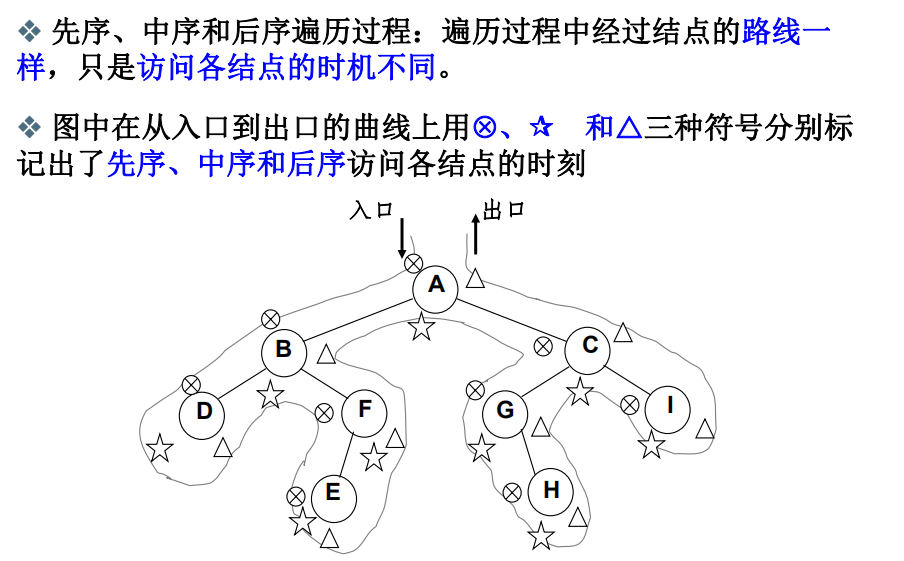
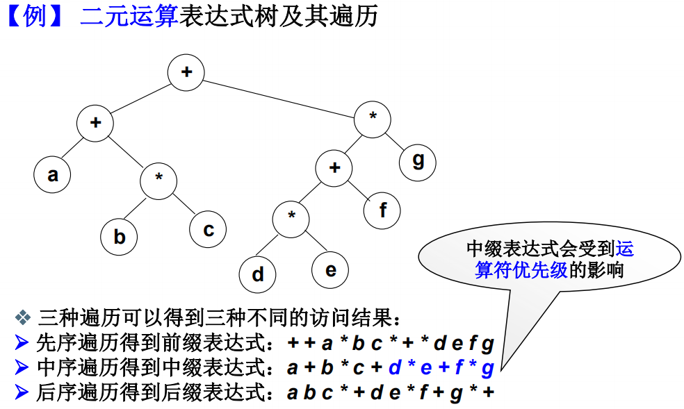
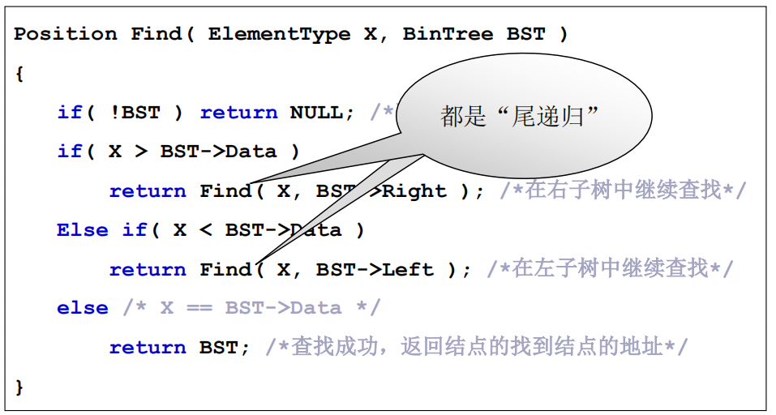

# 二叉树

每个节点都有两个指针，即每个节点有俩个儿子

 度为2的树


## 二叉树种类


## 重要性质


$$
求边数：n_0+n_1+n_2-1=0*n_0+1*n_1+2*n_2(012是贡献度)
$$

## 二叉树的抽象数据类型定义


## 存储结构

### 顺序存储


### 链表存储


## 遍历

递归

### 先序遍历


```C
// 先序遍历
//a. 遇到一个节点，访问它，然后把它压栈，并去遍历它的左子树；
//b. 当左子树遍历结束后，从栈顶弹出该节点并将其指向右儿子，继续a步骤；
//c. 当所有节点访问完即最后访问的树节点为空且栈空时，停止。
void PreOrderTraversal(BinTree BT)
{
    BinTree T = BT;
    Stack S = CreatStack(MAX_SIZE);    //创建并初始化堆栈S
    while(T || !IsEmpty(S))
    {
        while(T)        //一直向左并将沿途节点访问（打印）后压入堆栈 
        {
            printf("%d\n", T->Data);
            Push(S, T);
            T = T->Left;
        }
        if (!IsEmpty(S))
        {
            T = Pop(S);    //节点弹出堆栈
            T = T->Right;  //转向右子树
        }
    }
}
```

### 中序遍历


### 后序遍历





递归实现是堆栈，所以二叉树遍历用堆栈可实现非递归算法

```C
//后序遍历
// 对于一个节点而言，要实现访问顺序为左儿子-右儿子-根节点，可以利用后进先出的栈，在节点不为空的前提下，依次将根节点，右儿子，左儿子压栈
// 区别在于压栈顺序不同
void PostOrderTraversal(BinTree BT)
{
    BinTree T = BT;
    Stack S1 = CreatStack(MAX_SIZE);    //创建并初始化堆栈S1
    Stack S2 = CreatStack(MAX_SIZE);    //创建并初始化堆栈S2   
    while(T || !IsEmpty(S1))
    {
        while(T)        //一直向右并将沿途节点访问（压入S2）后压入堆栈S1 
        {
            Push(S2, T);
            Push(S1, T);
            T = T->Right;
        }
        if (!IsEmpty(S1))
        {
            T = Pop(S1);    //节点弹出堆栈
            T = T->Left;  //转向左子树
        }
    }
    while(!IsEmpty(S2))    //访问（打印）S2中元素
    {
        T = Pop(S2);
        printf("%d\n", T->Data);
    }          
}
```


### 层序遍历

二叉树遍历本质就是怎么把二维结构变成一维线性序列，不同的方法产生不同的一维序列


从上往下一层一层访问


## 应用




中缀表达式并不准确，看意思是对括号中优先级运算不准，需要输出左边添加左括号，输出右边添加右括号


## 二叉搜索树


### 二叉搜索树操作的特别函数


编译角度尾递归都可以用循环表示





### 查找最大和最小元素


### 二叉搜索树的插入

插入节点的复杂度和树的高度有关，O(log~2~n)，插入删除的复杂度都是树的高度


### 二叉搜索树的删除


左子树的最大值和右子树的最小值一定不是有两个儿子的节点，因为各自在最左边和最右边，要么没有儿子，要么只有一个儿子

## 平衡二叉树

也是一个搜索树，AVL树


### 平衡因子


### 调整

插入删除时怎么做平衡

调整后保证还是一个搜索树

#### RR旋转


#### LL旋转

下面直接被破坏者Mar，间接被破坏者May，只要直接被破坏者平衡了，间接被破坏者就平衡了


#### LR旋转


#### RL旋转


调整后，可能树结构不动，但平衡因子还是要动的


