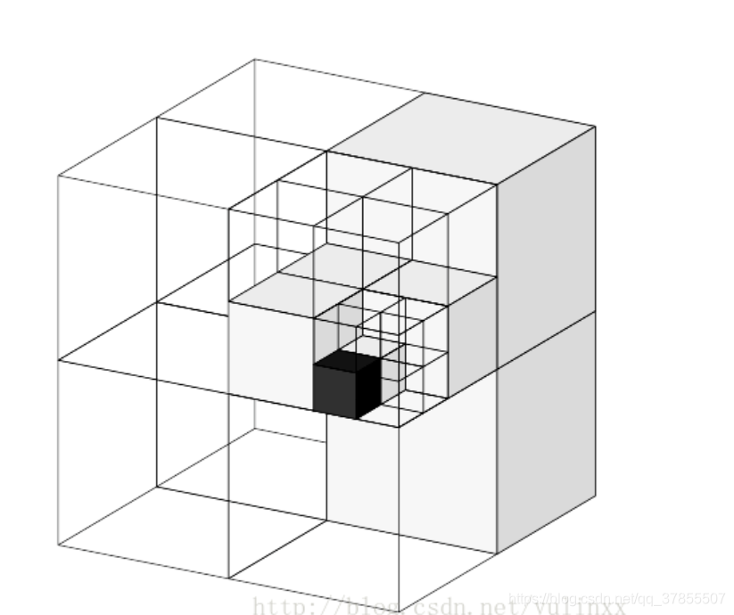
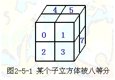
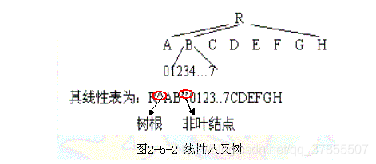
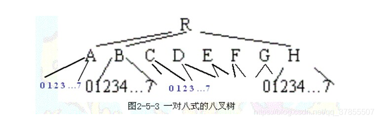

https://www.zhihu.com/question/25111128

# 八叉树

[雾江幽水](https://blog.csdn.net/qq_37855507) 2019-06-05 22:19:59  6786  收藏 13

http://hi.baidu.com/onlywater/blog/item/905c5e162ed18f4021a4e9c1.html

## 一、八叉树基本原理：

   用八叉树来表示三维形体，并研究这种表示下的各种操作以及应用，是进入80年代后开展起来的。这种方法，既可以看成是**四叉树方法在三维空间的推广**，**也可以认为是三维体素阵列表示形体方法的一种改进**。

   八叉树的逻辑结构如下：

   假设要表示的形体V可以放在一个充分大的正方体C中，C的边长为2n,形体V C，他的八叉树可以用以下的递归方法来定义：
   **八叉树的每一个节点与C的一个子立方体对应** ，树根与C本身相对应。**如果V=C，那么V的八叉树只有树根。** 如果V不等于C，则将C等分为8个子立方体，每个**子立方体**与树根的**一个子节点**相对应。只要某个子立方体不是完全空白，或者完全为V所占据，就要被八等分，从而对应的节点也就有了八个子节点。这样的递归判断，分割一直要进行到节点所对应的立方体或是完全空吧，或是完全为V所占据，或是其大小已经是预先定义的体素大小，并且对他与V之交左一定的“舍入”，使体素或认为是空白的，或认为是V占据的。

         
如果所生成的八叉树的节点可分为三类：

   **灰节点**： 它对应的立方体部分的为V所占据；
   **白节点**： 它对应的立方体没有V的内容；
   **黑节点**： 它对应的立方体全部为V所占据。

  后两类又称为**叶节点**。形体V关于C的八叉树的逻辑结构是这样的：他是一棵树，其上的节点要么是叶节点，要么是有八个子节点的灰节点。根节点与C相对应，其他节点与C的某个子立方体相对应。

  根据不同的存储方式，**八叉树也可以分别称为常规的、线性的、一对八的八叉树等。**

## 二、八叉树的存储结构：

  八叉树有三种不同的存贮结构，分别是**规则方式**、**线性方式**以及**一对八方式**。相应的八叉树也分别称为规则八叉树、线性八叉树以及一对八式八叉树。不同的存贮结构的空间利用率及运算操作的方便性是不同的。**分析表明，一对八式八叉树优点更多一些。**

### 1. 规则八叉树：

  规则八叉树的存储结构用一个有**九个字段的记录来表示树中的每个节点**。其中**一个字段来描述该节点的特性**（再目前假定下，只要描述他是**灰，白，黑**三类节点中的哪一类就行。）**其余八个字段分别用来存放指向其八个子节点的指针。** 这是最普遍使用的表示树形结构的存储结构的方式。

  规则八叉树缺陷较多，最大的问题是指针占用了大量的空间。假定每个指针要用两个字节表示，而结点的描述用一个字节，那么存放指针要占总的存贮量的94％。因此，这种方法虽然十分自然，容易掌握，但在存贮空间的使用率方面不很理想。

### 2.线性八叉树：

  线性八叉树注重考虑如何提高空间利用率。用某一预先确定的次序遍历八叉树（例如以深度第一的方式），将八叉树转换为一个线性表，表的每个元素与一个节点相对应。对于节点的描述可以相对丰富一点，一如可以用适当的方式来说明他是否是叶节点，如果不是叶节点的话，还可用其八个子节点值的平均值作为非叶节点的值。这样，可以再内存中以紧凑的方式来表示线性表，可以不用指针或者仅用一个指针即可。

线性八叉树不仅节省存储空间，对某些运算也较为方便。但为此的代价是丧失了一定的灵活性。

### 3.一对八式八叉树

  一个非叶结点有八个子结点，为了确定起见，将它们分别标记为0，1，2，3，4，5，6，7。从上面的介绍可以看到，如果一个记录与一个结点相对应，那么在这个记录中描述的是这个结点的八个子结点的特性值。而指针给出的则是该八个子结点所对应记录的存放处，而且还隐含地假定了这些子结点记录存放的次序。也就是说，即使某个记录是不必要的(例如，该结点已是叶结点)，那么相应的存贮位置也必须空闲在那里（图2-5-3），以保证不会错误地存取到其它同辈结点的记录。这样当然会有一定的浪费，除非它是完全的八叉树，即所有的叶结点均在同一层次出现，而在该层次之上的所有层中的结点均为非叶结点。
