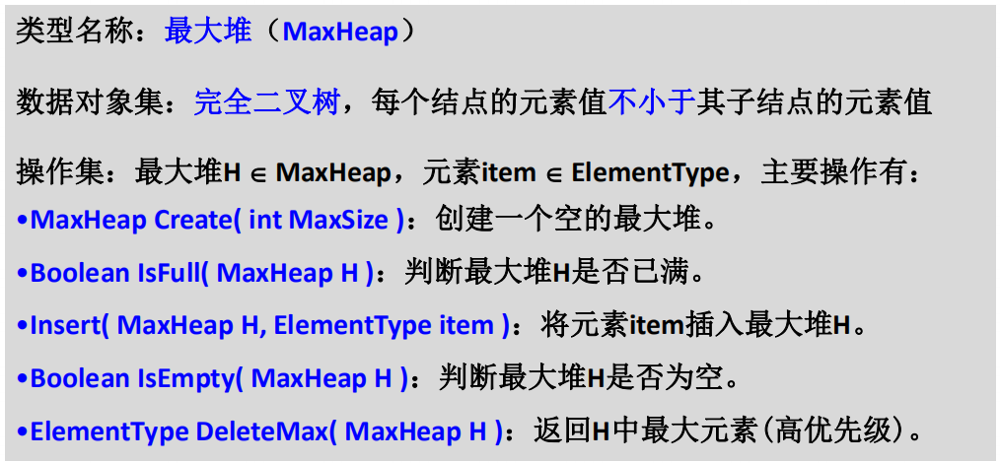

# 堆

## 完全二叉树表示堆

不用二叉搜索树是因为每次删除最大值或最小值后会造成树歪了，搜索效率降低

堆用数组存放时下标从1开始，所以申请空间时需要在数组空间最大值上+1，这是完全二叉树性质的影响

> 二叉堆的叶节点在数组中的下标从[n/2]+1开始
>
> ==二叉堆一般用数组来表示.如果根节点在数组中的位置是1,第n个位置的子节点分别在2n和 2n+1.因此,第1个位置的子节点在2和3,第2个位置的子节点在4和5.以此类推.这种基于1的数组存储方式便于寻找父节点和子节点==
>
> 用数组表示需要排序的序列的时候，理论上应该从index=1开始。因为对于二叉树，左子节点的序号一定是父节点的2倍，这样index=2的节点一定是index=4的节点的父节点。

## 最大堆和最小堆

性质：从根结点到任意结点路径上结点序列的有序性！

## 堆的抽象数据类型描述

## 最大堆

### 创建

### 插入

###  删除

