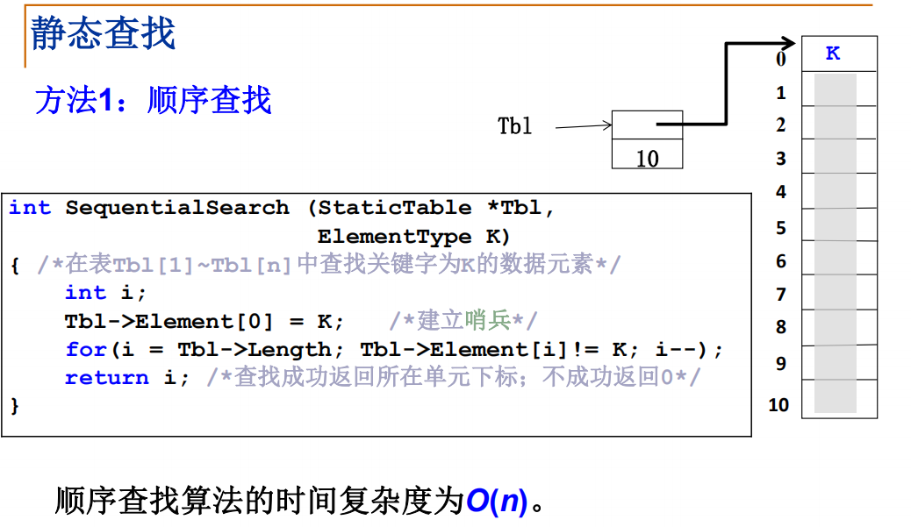
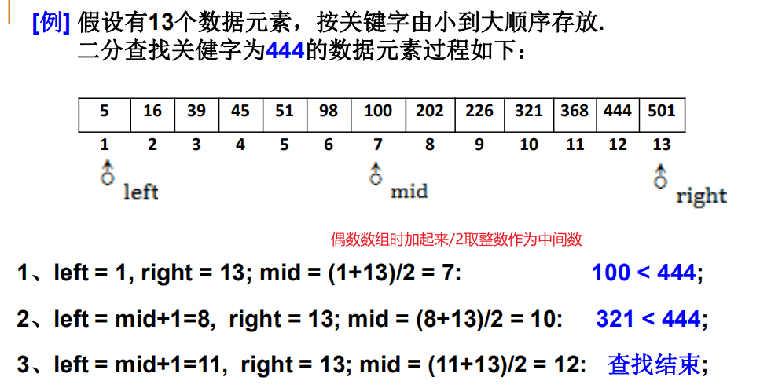
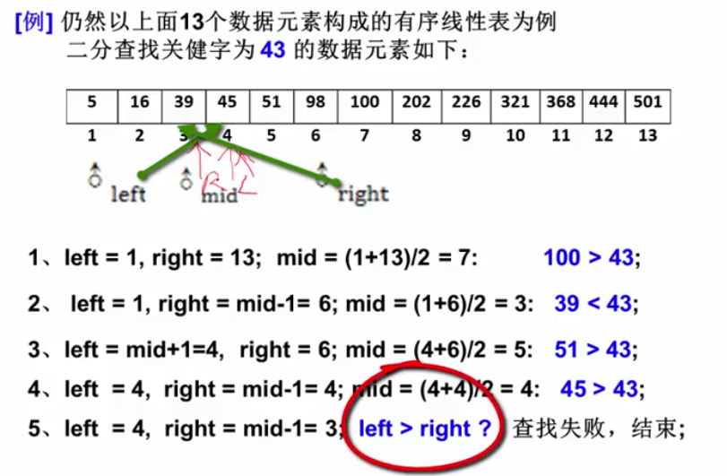
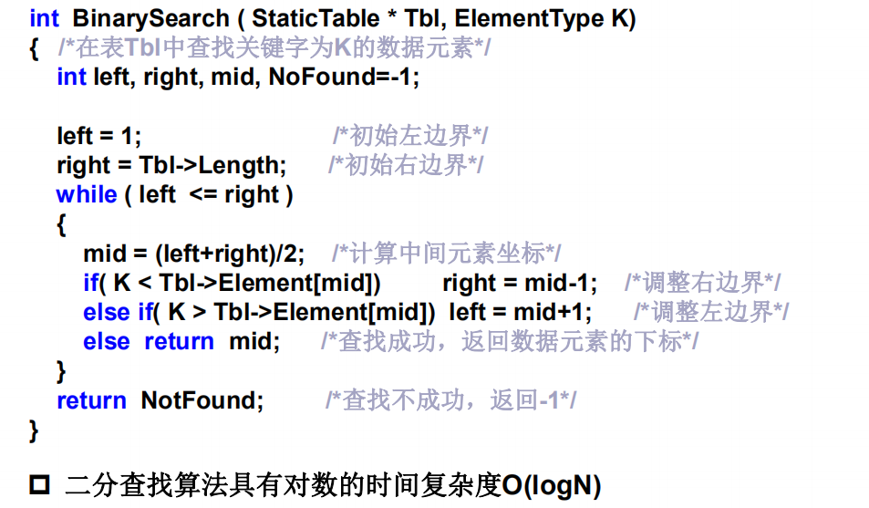
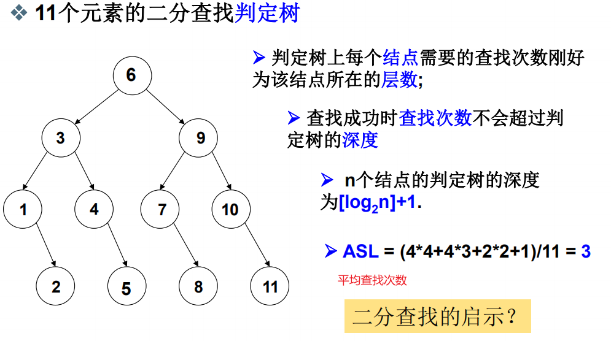

## 静态查找

常把数据放到数组中

==程序设计的技巧，哨兵，数据存储从1开始，过程中不断地对数据进行匹配或判断数据是都到达边界来判断是否要退出循环==

哨兵用来在数组最后设置一个值，只要循环碰到这里就退出，不需要每次判断下标是否达到边界。可以省略一个判断分支，这里少了i<0的判断

 ### 二分查找

Binary Search

==事先要把数据用数组顺序排好==

### 二分查找算法

### 二分查找判定树

## 动态查找

### 查找树

二叉搜索树

AVL树

可以很好的解决动态查找问题，速度和二分查找差不多，是将数据按树的形式进行保存

