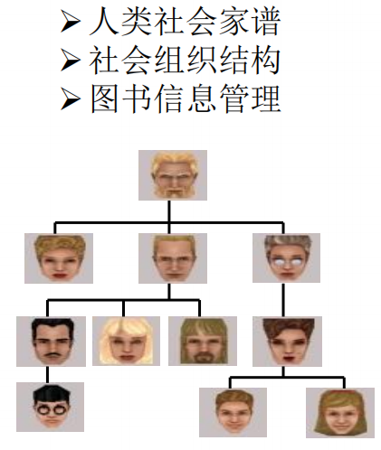
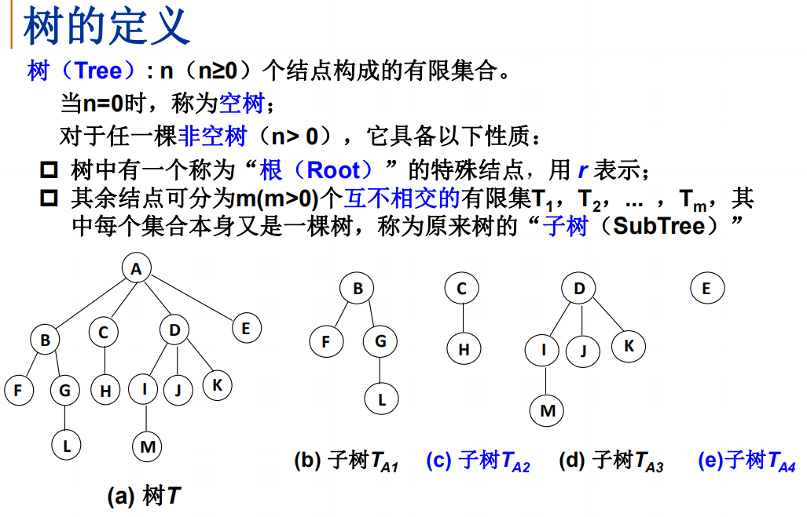
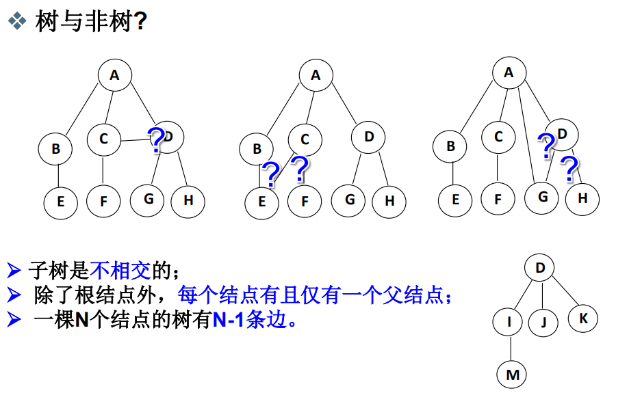
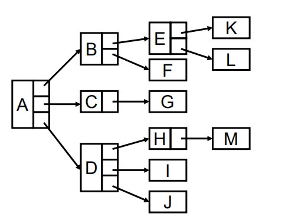
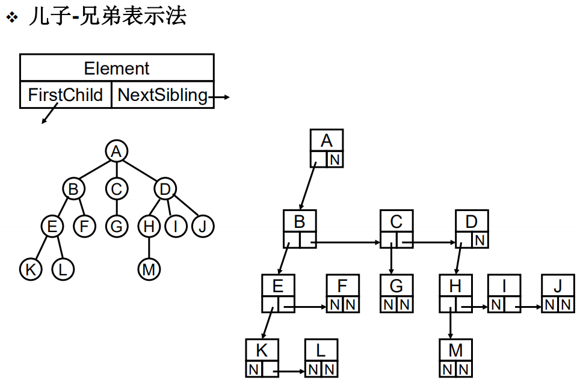
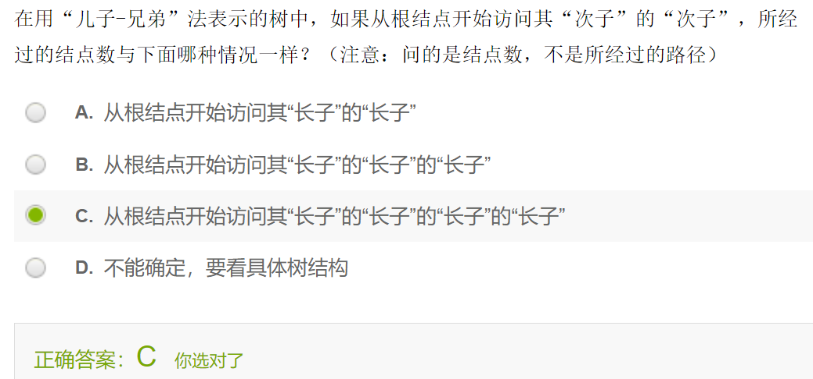
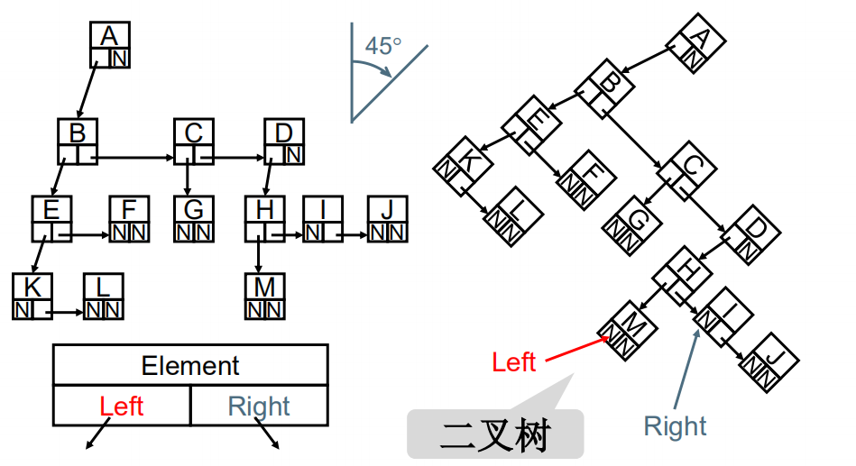

# 树

## 什么是树

客观世界中许多事物存在层次关系

分层次组织在管理上具有更高的效率！

数据管理：

- 查找
- 插入
- 删除

每个子树之间不联系，每个子树是一个集合，有了联系就很难判定元素属于哪个集合

==树是保证节点联通的最小连接方式==

## 基本术语

1. 结点的度（Degree)：结点的子树个数

2. 树的度：树的所有结点中最大的度数
3. 叶结点（Leaf)：度为0的结点
4. 父结点（Parent)：有子树的结点是其子树的根结点的父结点
5. 子结点（Child)：若A结点是B结点的父结点，则称B结点是A结点的子结点；子结点也称孩子结点。
6. 兄弟结点（Sibling)：具有同一父结点的各结点彼此是兄弟结点。

7. 路径和路径长度：从结点na到nk的路径为一个结点序列n1，n2…，nk，n是ne1的父结点。路径所包含边的个数为路径的长度。
8. 祖先结点（Ancestor)：沿树根到某一结点路径上的所有结点都是这个结点的祖先结点。
9. 子孙结点（Descendant)：某一结点的子树中的所有结点是这个结点的子孙。
10. 结点的层次（Level）：规定根结点在1层，其它任一结点的层数是其父结点的层数加1。
11. 树的深度（Depth)：树中所有结点中的最大层次是这棵树的深度。

## 树的表示

数组不好判别节点关系

链表节点的指针域若混乱不方便后续设计

## 二叉树

每个节点都有两个指针，即每个节点有俩个儿子

 度为2的树

