# 堆栈

一种特殊的线性表

一种管理机制。把调用之前的变量状态和准备返回地址保留起来，这是一系列的执行和恢复过程，这样一种能够保存变量和返回地址的数据结构组织方式，按顺序的存储，在按倒过来顺序的返回，这样一种机制就是堆栈

## 应用

函数调用及递归实现

表达式求值

深度优先搜索

回溯算法

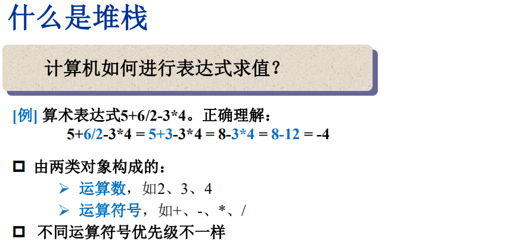

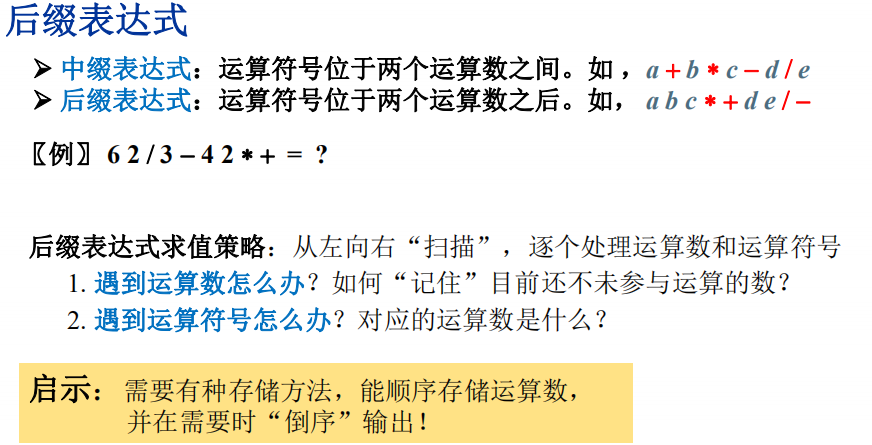

==先放进去的数后拿出来用，后放进去的数先拿出来，这就是堆栈==

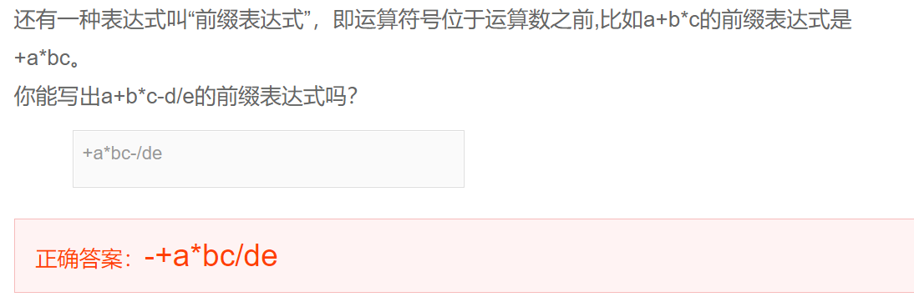

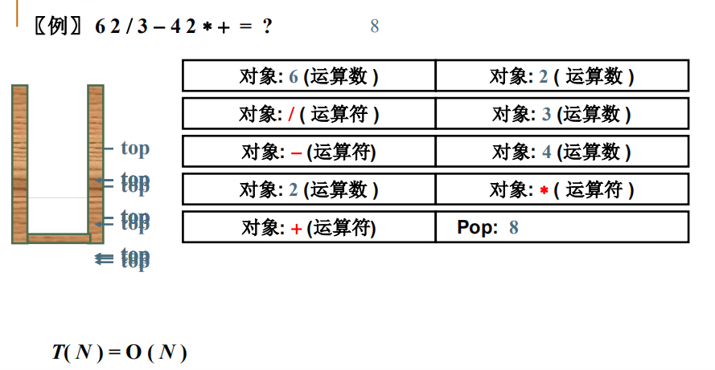

## 堆栈的抽象数据类型描述

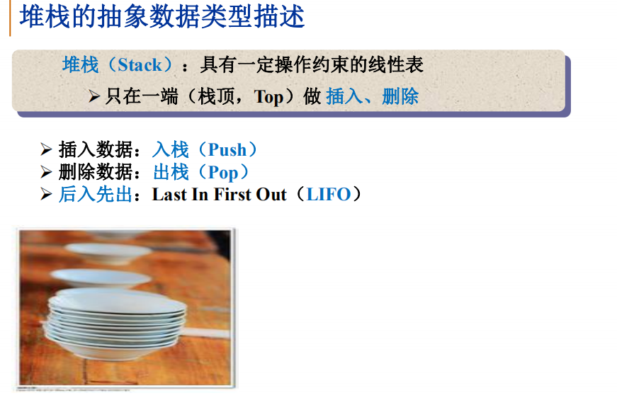

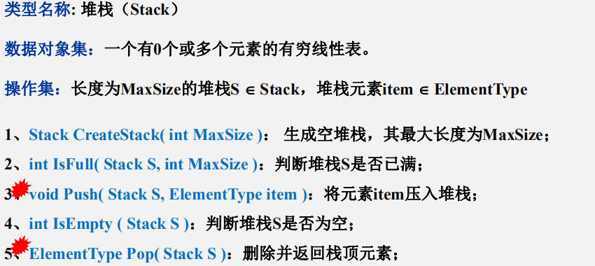

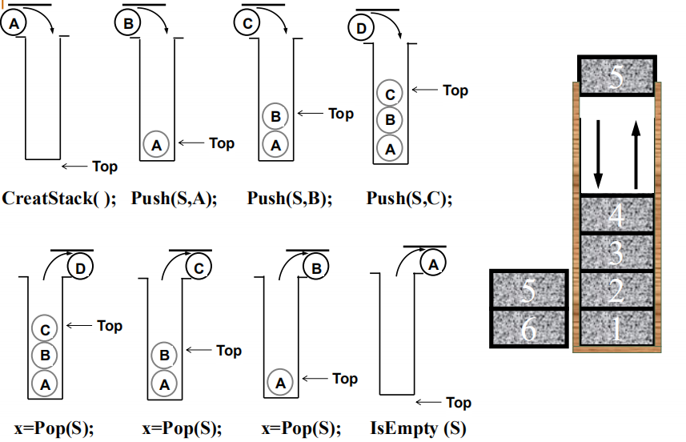

## 栈的顺序存储实现

### 入栈

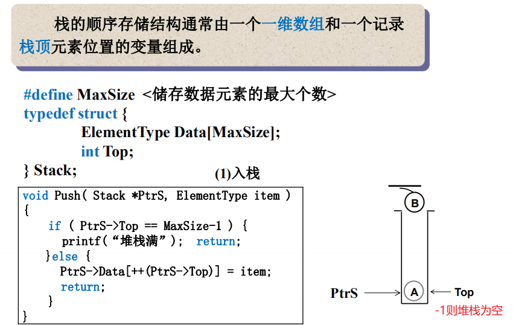

push时item放到top+1的位置，所以代码中先++，再赋值

### 出栈

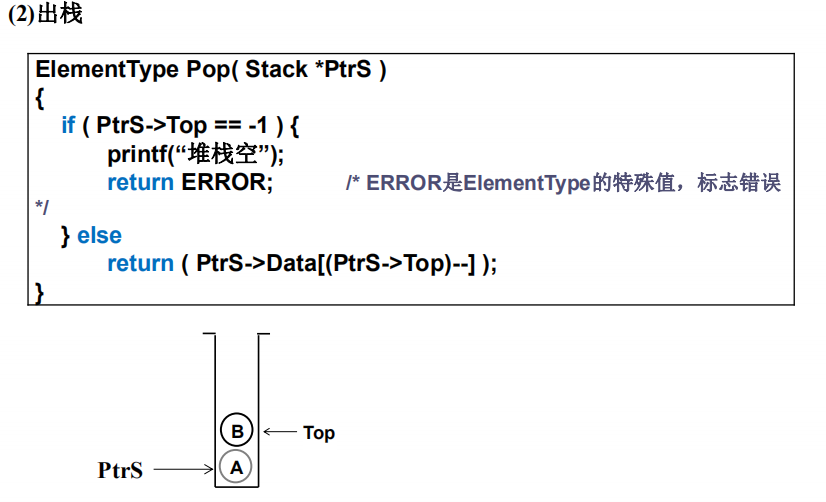

先抛出top值，再 - -

### 数组实现堆栈

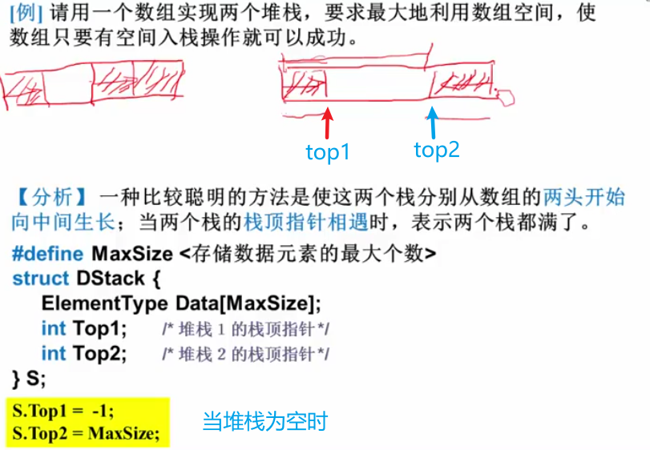

入栈出栈代码

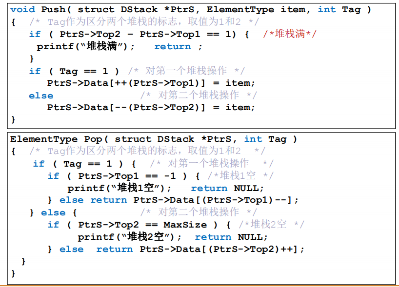

### 链表实现堆栈

top一定在链表头左边

定义了data域和Next域

==注意插入删除在栈顶，而栈顶在S节点后面==

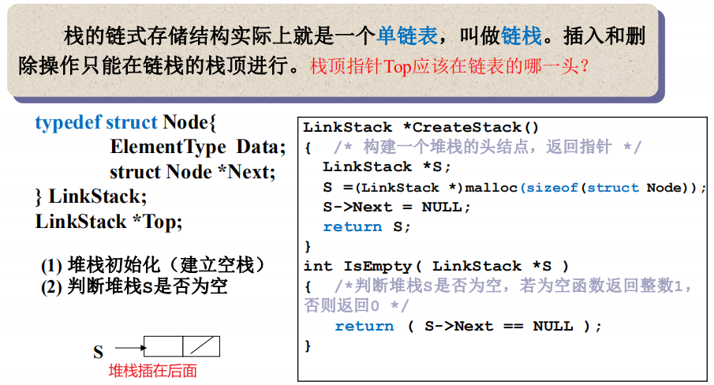

Push

不需要判别是否堆栈满了，是不断的申请节点插入的

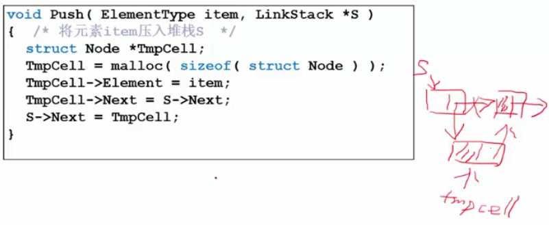

Pop

- 需要判断是否空

- 删除节点需要释放空间，但这就需要将节点赋值给一个变量

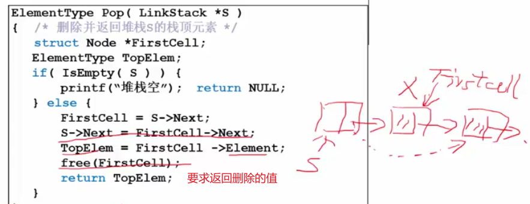

## 堆栈应用：表达式求值

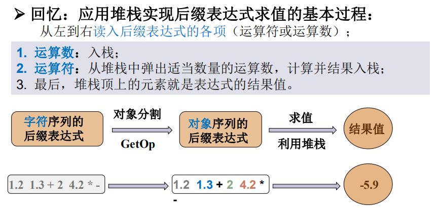

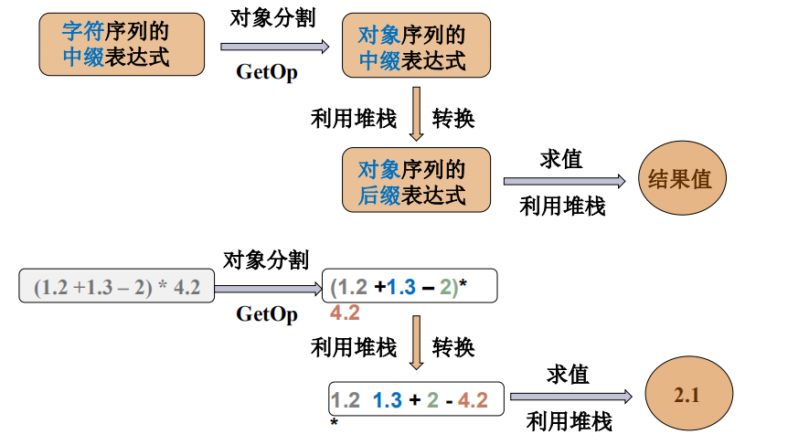

同一优先级看从左到右

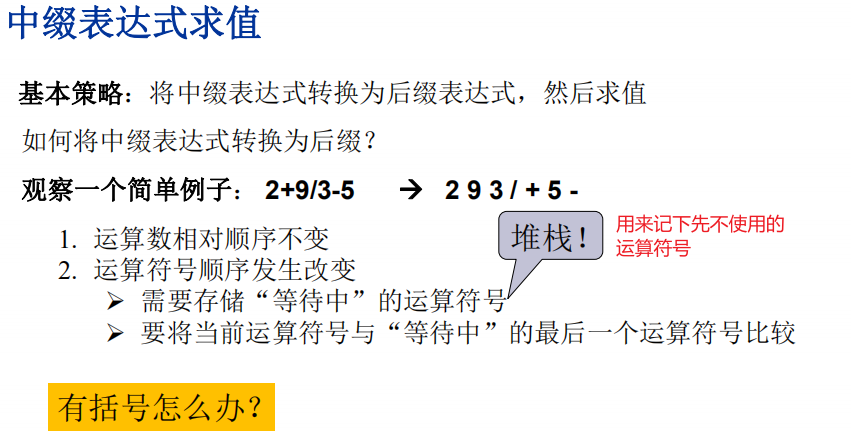

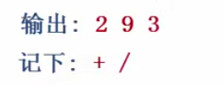

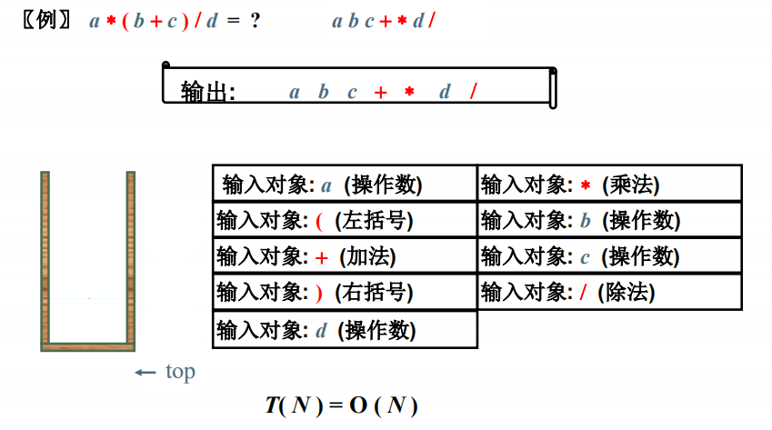

### 中缀表达式如何转换为后缀表达式

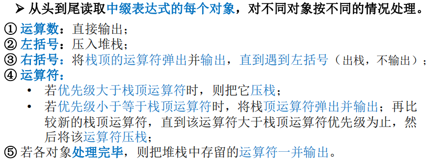

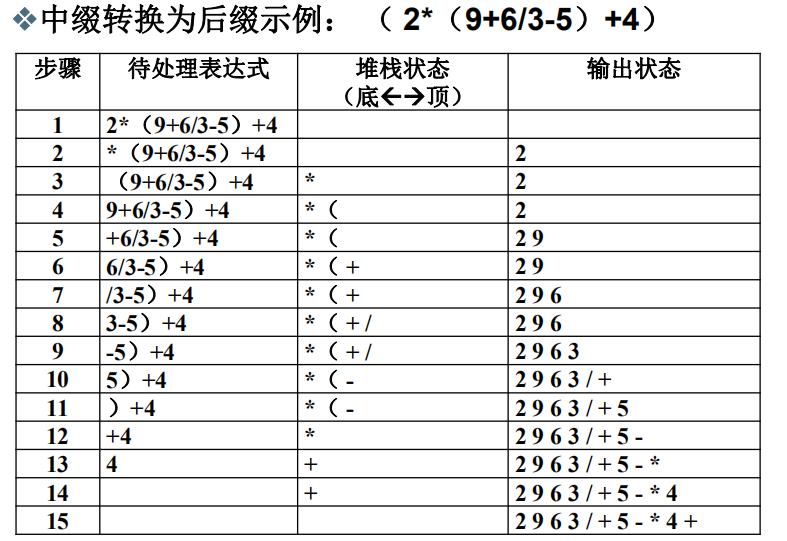

