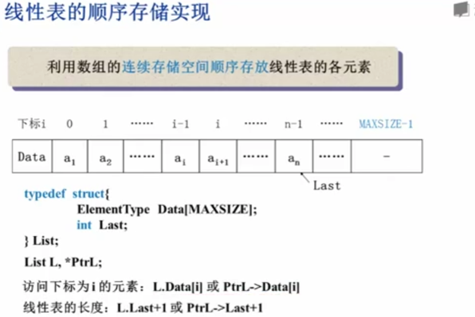
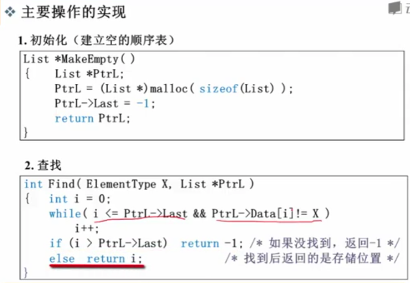
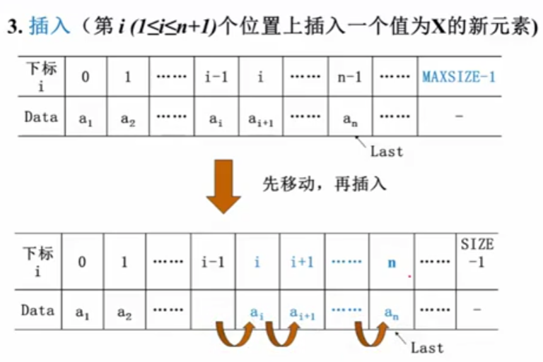
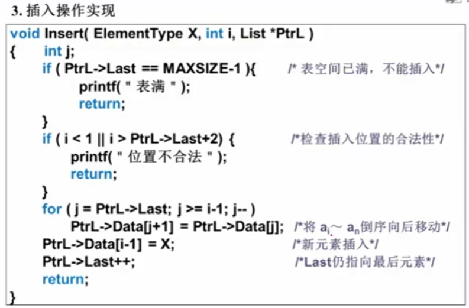
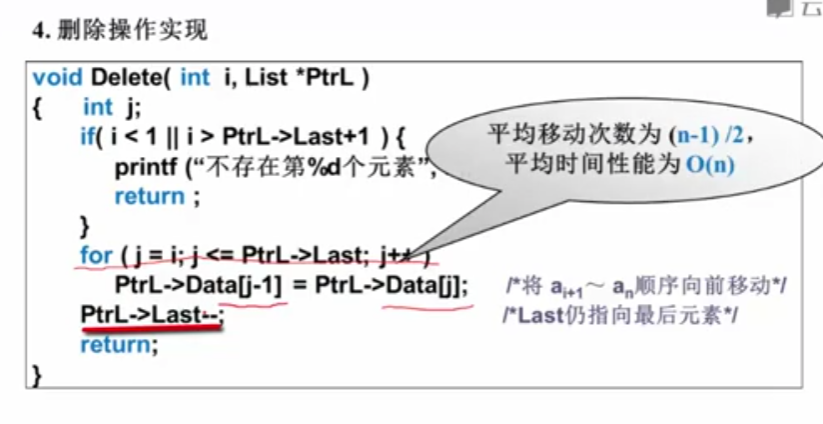
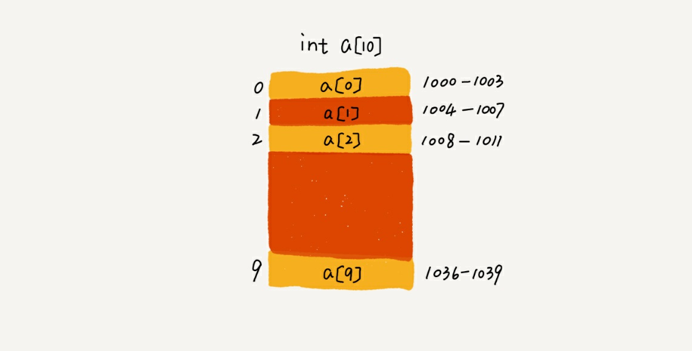
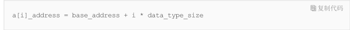

## 数组存储

数组的插入删除都需要对数组的一段数据进行整体前移或后移

### 初始化

建立表，申请一块空间 PtrL=(List *)malloc( sizeof(List));

### 查找

> 顺序存储是先根据数据量的需要先分配好存储空间的，相当于先给数据分好了带编号的座位，所以可以直接找到。而链式是不事先定好存储空间的，就是第一个数据好了再给存第二个，且有个指针区指向下个数据的位置，所以要想找到第几个数据都要从头来

### 插入

### 删除

## 

## 随机访问

为什么数组能支持随机访问呢，我们先来看看数组专业定义。`数组（ Array ）是一种线性表数据结构。它用一组连续的内存空间，来存储一组具有相同类型的数据`
这里有几个关键词，我们来分别仔细解释一下：

- 线性表：按线性结构存储，数组，链表，队列，栈都是经典的线性表
- 连续内存空间和相同数据类型：真是因为有这两个限制才会有随机访问这个性质的。 我们来看看int类型长度为10的数组在内存中是如何存储的。假设起始地址为1000
  

我们要把握一个最基本的原则，计算机去获取某个变量，本质都是去它对应的内存读取，所以必须要先获取对应的内存地址。

上面就是具体的计算公式，至此我们可以明白数组为什么支持随机访问了。

# 一些常见的错误

1、数组适合查找，查找的时间复杂度是O(1)
这种说法其实是不准确的。其实就算是排序好的数组，用二分查找，复杂度都为O(logn)。准确表达是，数组是支持下标机访问。时间复杂度O(1)