## 链表存储

链表不再需要对数组进行大规模的迁移

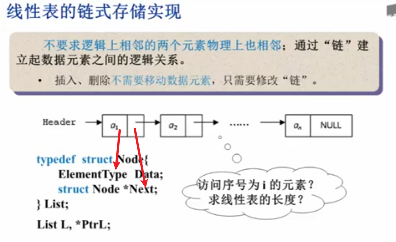

每个节点都包含两个量

### 求表长

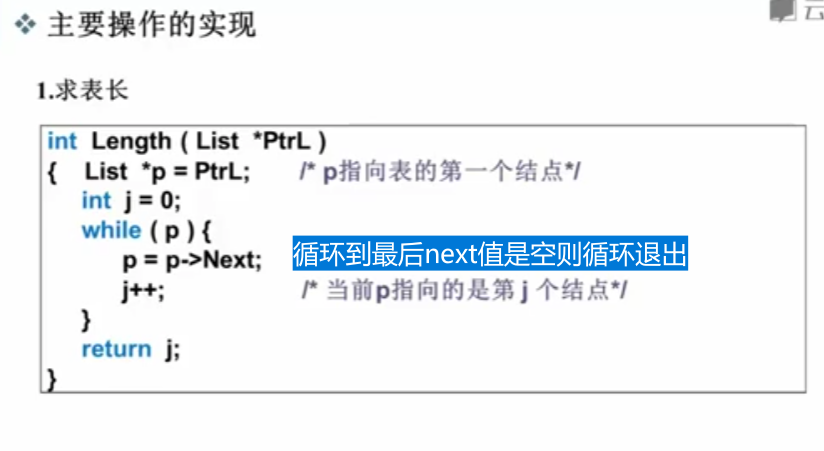

上图时间复杂度是O(n)，

7*p存储了第一个元素的地址

### 查找

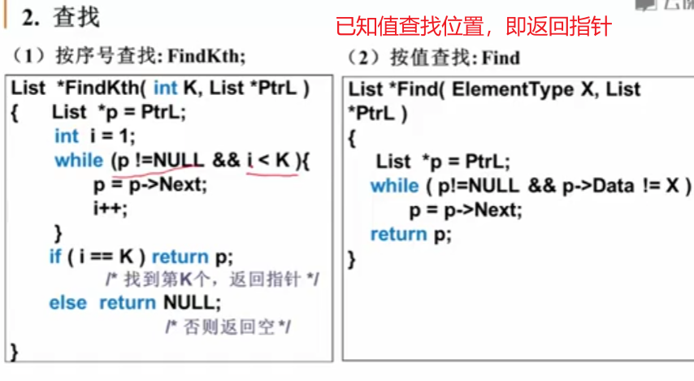

 ### 插入

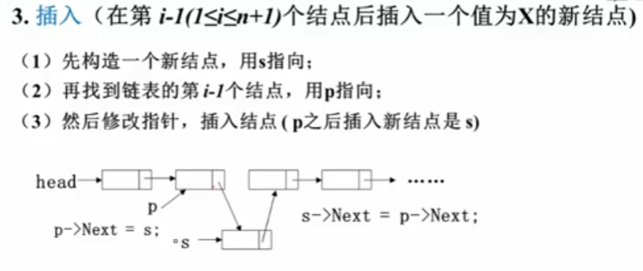 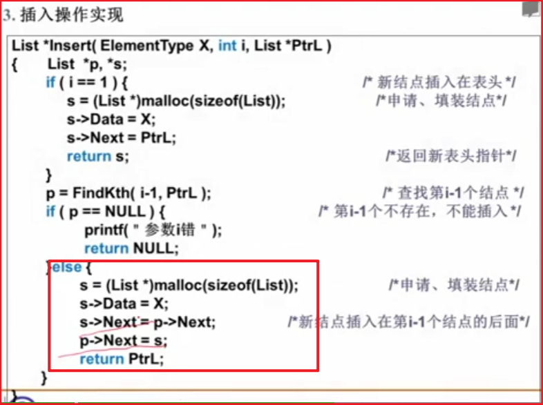

返回的是新链表的头指针

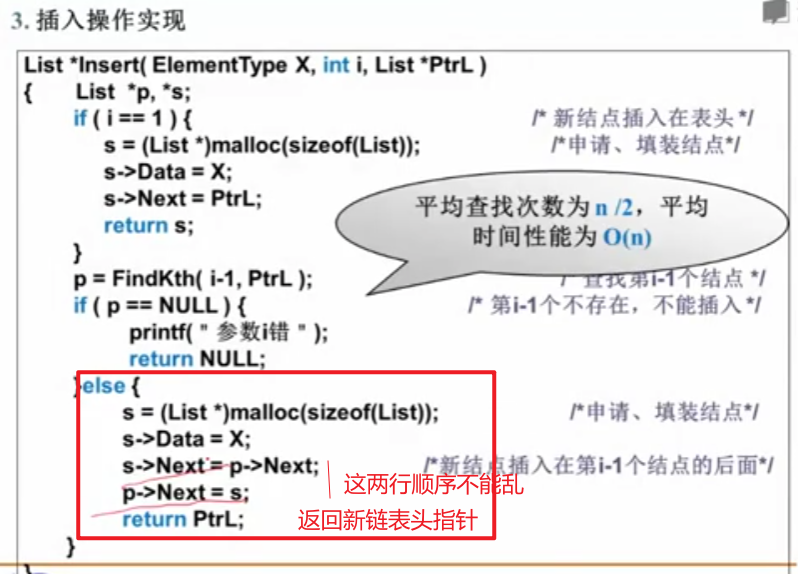

### 删除

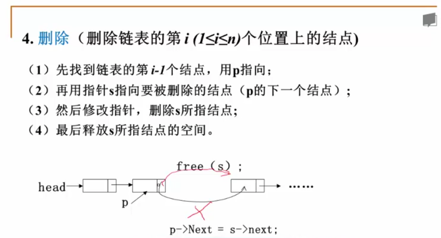

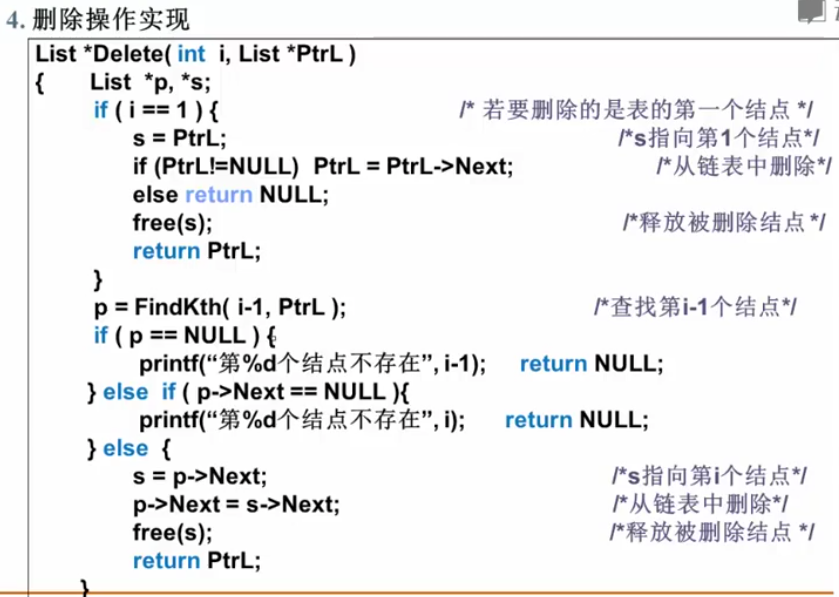

 删除就是用指针指向节点后，释放它就删除了，但要将前一个节点指向后一个节点

### 多重链表

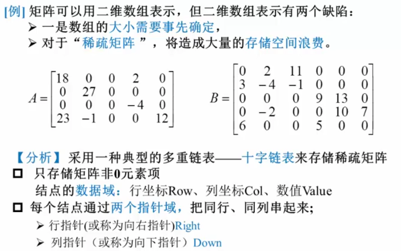

### 十字链表

4行5列7个非零项

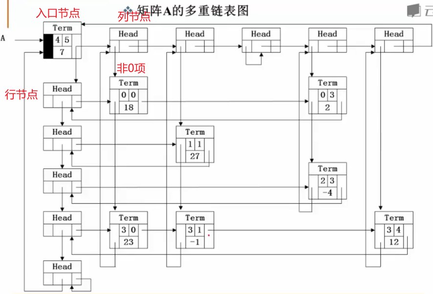

> 每个Head节点的Down域是左面的，Right是右面的，当然中间的叫MId。
>
> 这是我们会发现在每一个Head行节点的Right总是指向每一行的Term节点，这个时候Down没有利用。
>
> 同理，每一个Head列节点总是指向每一列的Term节点，这时候RIght域没有使用。
>
> 所以说我们可以利用这些没有使用的资源，整合起来重新利用，所以==**第i行的head和第i列的head实际上是同一个结点**==

利用都有down和right指针，所以将其中间union成一个域，复用空间

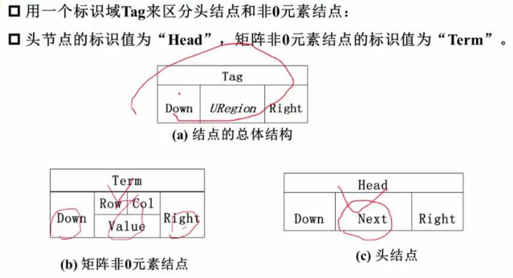