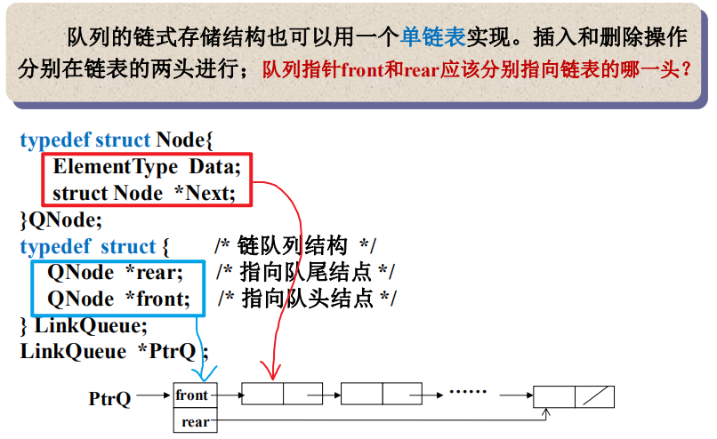

# 队列

先进先出表

## 队列的抽象数据类型描述

## 队列的顺序存储实现

==此时Front= =Rear，队列为空==

Front没有删除队首则值一直会保持-1，每删除一个则Front向后移一位，但加满后Rear就填不进去了，则把值填入前面删除的位置，引出顺环队列

队列大小为N，装载元素情况有N+1种情况，则n种状态区分n+1种矛盾

- Size记录当前插入元素个数，插入+1.删除-1，看Size值为0或N来判断堆栈空满

- tag插入1删除0，记录最后一次操作的情况

- ==不放满，一般使用第二种不放满==

==都是用余数来定位值的位置==

在不放满的做法下，Front == Rear则队列为空

## 队列的链式存储实现

**链表存储下，Front == Rear则队列只有一个元素，这是因为存储方式不同，做法不同导致的不同处**

## 多项式加法运算

代码前面为方便运算创建的临时节点在运算完成后要释放，所以代码最后做了释放和令front指向多项式第一个非零项 

