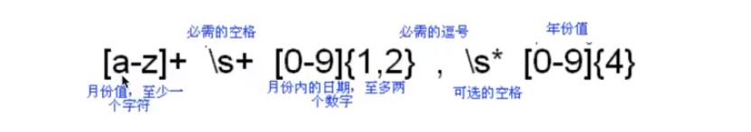
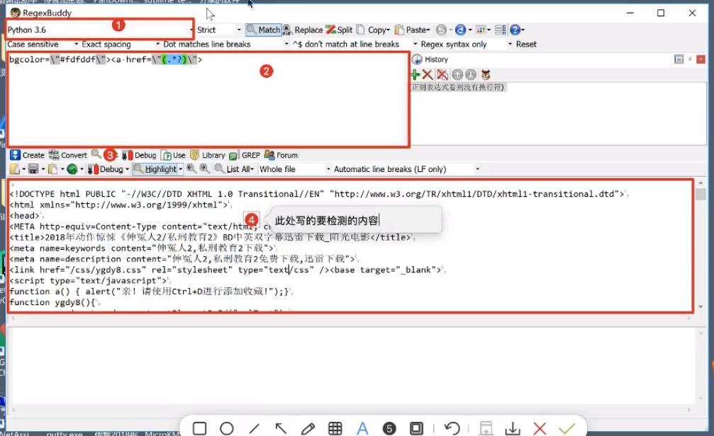
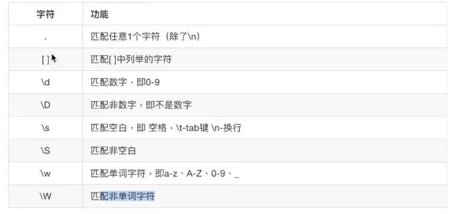
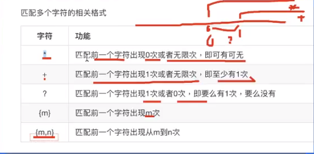
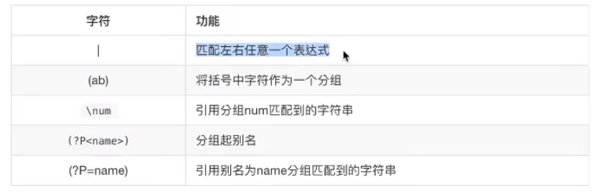
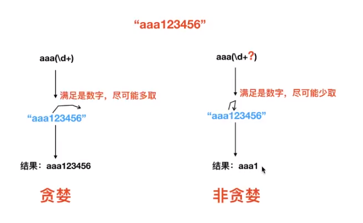

# 正则表达式

## 概念

又称规则表达式，（英语：Regular Expression，在代码中常简写为regexregexp或RE），计算机科学的一个概念。正则表达式通常被用来检索、替换那些符合某个模式（规则）的文本。



正则表达式可以、

- 测试字符串的某个模式，即数据有效性验证——查找

- 实现按照**某种规则**替换文本——替换

- ==根据模式匹配从字符串中提取一个子字符串（爬虫思想）==——提取

正则表达式的构成

- 原子（普通字符，如英文字符）：123abx

- 元字符（有特殊功用的字符）：\ ，*

- 模式修正字符

**在其他语言中基本通用，80%**

## 测试工具


RegexBuddy工具，用来测试正则表达式的正确性

http://www.regexbuddy.com/download.html



1. 语言支持
2. 正则表达式区域
3. test按钮，Highlight按钮记得打开
4. 检测内容

## 匹配单个字符



[a-h] 可代表[abcdefgh]

[a-zA-Z0-9] 匹配所有的单个字母大小写和数字

[a-zA-Z0-9_] = \w

[0-9] = \d

为匹配 . 需要转义字符 \\.

==大写取反，\D是\d取反==

[]只匹配一位字符，只是范围扩大。或者说是单个字符多次匹配


## 匹配多个字符



对前面字符匹配的修饰

变量名匹配：[a-zA-Z_]+\w

{m}表示前一个字符==连续==出现m次

{m,n}表示前一个字符==连续==出现最少m次，最多n次

==匹配时表达式是所有条件同时匹配，有一个不符合表达式的则整体全部不符合==

## 匹配开头结尾

开头 ^ 匹配后一个字符，必须以后一个字符开头

```
^[a-2A-2]+\w  #必须以小写字母、大写字母、下划线开头
```

> ==^ 还可用于取反。置入[]内部，[\^xxx]==

```
[^he]匹配不含有h和e的字符
```


结尾 $ 匹配前一个字符，必须以前一个字符结尾

`\d$`以数字结尾

## re模块

在Python中需要通过正则表达式对字符串进行匹配的时候，可以使用一个模块，名字为re

`re.match(pattern,string,flags=0)`

从头匹配一个符合规则的字符串，从超始位置开始匹配，匹配成功返回一个对象，未匹配成功返回None

- pattern：正则模型

- string：要匹配的字符串

- falgs：匹配模式

> 注：这个方法并不是完全匹配·当pattern结束时若string还有剩余字待，仍然视为成功。想要完全匹配，可以在表达式末尾加上边界匹配符 $ 

match()方法一旦匹配成功，就是一个match object对象，而match object对象有以下方法：

- group()返回被RE匹配的字符串，group(1)则是取出上方正则表达式中的（）分组号为1的字符串，表达式中分组从1开始
- start()返回匹配开始的位置，即返回字符串的下标
- end()返回匹配结束的位置
- span()返回一个元组包含匹配（开始，结束）的位置

**match()只会从开头进行匹配，开头不符合则匹配失败：**

> `result = re.match("hello", "xhello@163.com")`

### re模块高级用法

- search方法

re.search函数会在==字符串内==查找模式==匹配==，只要找到第一个匹配然后返回，如果字符串没有匹配，则返回None。

格式：`re.search(pattern,string,flags=0)`

match（）函数只检测RE是不是在string的开始位置匹配，search0会扫描整个string查找匹配

- sub方法

sub(”正别表达式”，”新的内容”，”要替换的字符事”）==字符串替换==（按照正别，查找字符串并替换为指定的内容，返回值是替换后的字符串

```python
result = re.sub("\d+", "10000", "阅读次数9999，转发次数：6666，评论次数：38")

匹配结果： 阅读次数10000，转发次数：10000，评论次数：10000
```

```python
str1 = """
<div>
    <p>岗位职责；</p>
<p>完成推荐算法、数据统计、接口、后台等服务器端相关工作</p>
<p><br></p>
<p>必备要求：</p>
<p>良好的自我驱动力和职业素养，工作积极主动、结果导向</p>
<p>&nbsp;<br></p>
<p>技术要求：</p>
<p>1、一年以上Python 开发经验，掌握面向对象分析和设计，了解设计模式</p>
<p>2、掌据HTTP协议，熟悉NVC、MVVM等概念以及相关WEB开发框架</p>
<p>3、掌握关系数据库开发设计，掌掘SQL，熟练使用MySQL/PostgreSoL中的一种<br></p><p>4、掌握NOSQL、MQ，熟练使用对应技术解决方案</p>
<p>5、熟悉Javascript/CSS/HTML5,]Query、React、Vue.js<p>
<p>&nbsp;<hr></p>
<p>加分项；</p>
<p>大数据，数理统计，机器学习，skLearn，高性能，大井发·</p>
</div>

"""
result = re.sub("<[^>]+>|&nbsp;| |\n", "", str1)


结果：岗位职责；完成推荐算法、数据统计、接口、后台等服务器端相关工作必备要求：良好的自我驱动力和职业素养，工作积极主动、结果导向技术要求：1、一年以上Python开发经验，掌握面向对象分析和设计，了解设计模式2、掌据HTTP协议，熟悉NVC、MVVM等概念以及相关WEB开发框架3、掌握关系数据库开发设计，掌掘SQL，熟练使用MySQL/PostgreSoL中的一种4、掌握NOSQL、MQ，熟练使用对应技术解决方案5、熟悉Javascript/CSS/HTML5,]Query、React、Vue.js加分项；大数据，数理统计，机器学习，skLearn，高性能，大井发·
```


- spilt方法

spilt("正则表达式", "待拆分的字符串")　　按照正则==拆分字符串==，返回值是一个列表

```python
result = re.split(":| ", "info:hello@163.com zhangsan lisi" )

结果：匹配结果： ['info', 'hello@163.com', 'zhangsan', 'lisi']
```


- findall方法

findall("正别表达式”。”待查找的内容”）==搜索全部==，返回值是个列表

## 匹配分组 



### “|”

“|” ，表示“或”，多个正则表达式满足任意一个都可以


`^[0-9]?[0-9]$|^100$` 匹配 100

### ‘’()’‘

分组，整体匹配，可用来提取子字符串

`\w{4,20}@(163|126|qq|sina)\.com$`

```python
"""
1、导入模块
2、match（）进行匹配
3、判断匹配的结果
4、取出匹配的内容
"""
import re

# 1、导入模块
# 2、match（）进行匹配
# result = re.match("\w{4,20}@(163|126|qq|sina)\.com$", "hello@126.com")
result = re.match("(\d{3,4})-(\d{7,8})", "310-12345678")
# 3、判断匹配的结果
if result:
    print("匹配成功！")
    print("匹配结果：", result.group())
    print("提取区号：", result.group(1))  # 相当于从字符串中提取出了内容，因为（）的存在
    print("提取电话号码：", result.group(2))   # 相当于从字符串中提取出了内容，因为（）的存在
else:
    print("匹配失败！")
# 4、取出匹配的内容
```

### “\”

引用，可给分组取别名

\1表示引用第一个字符

可解决的两个问题

- 分组（）太多，需要不同名字
- 保持每个分组名字相同

`<([a-zA-Z0-9]+)>.+</\1>`：<html>tesewffewfwefeft</html>

==这里小心，在程序中 \1可能表示转义，则需要写为 \\\\1==

**取别名：**

```python
# ?P<namel>给分组起别名，别名为name1
# ?P=name1引用别名为name1的分组
result = re.match("<(?P<name1>[a-zA-Z0-9]+)><(?P<name2>[a-zA-Z0-9]+)>.+</(?P=name2)></(?P=name1)>", "<html><h1>tesewffewfwefeft</h1></html>")
```

## 贪婪和非贪婪

Python里数量词默认是贪婪的（在少数语言里也可能是默认非贪婪），总是尝试匹配尽可能多的字符；非贪婪则相反，总是尝试匹配尽可能少的字符。

例如：\d+，本可以只匹配2个字符，但它会匹配全部

- 贪婪：满足正则的情况下，尽可能多的取内容
- 非贪婪：满足正则的情况下，尽可能少的取内容



把贪婪模式改为非贪婪。需要使用：`?`　在`＋`或`＊`或`?`或`｛｝`后面添加　`？`　可以变成非贪婪，但要注意要加成一个整体，负责识别错误，例如（\d+?）

```python
result = re.match("aaa(\d+?)", "aaa123456")

匹配结果： aaa1
```


# r的作用

Python中在正则字符串前面加上 “r” 表示，让正则中的 “\” 不再具有转义功能（默认为转义），就是表示原生字含义一个斜杠 \

但其他特殊字符还需要加 \ 进行转义，r只对 \ 起作用