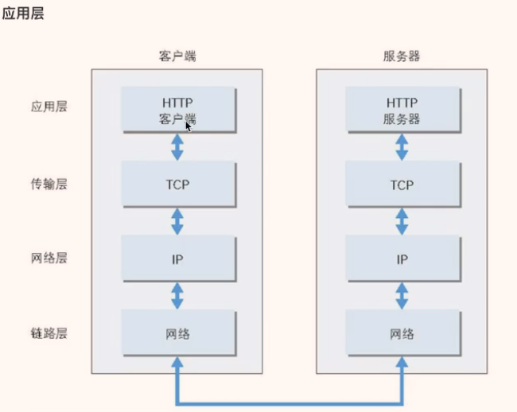
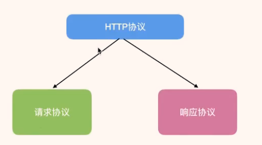
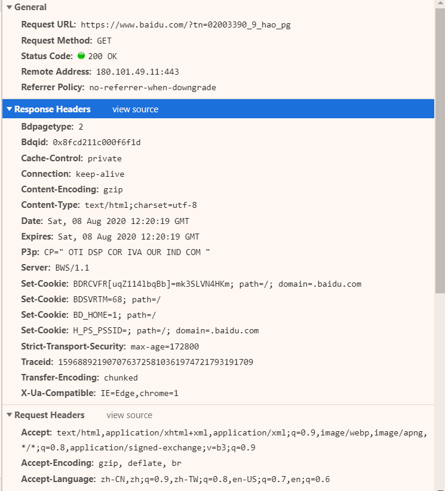
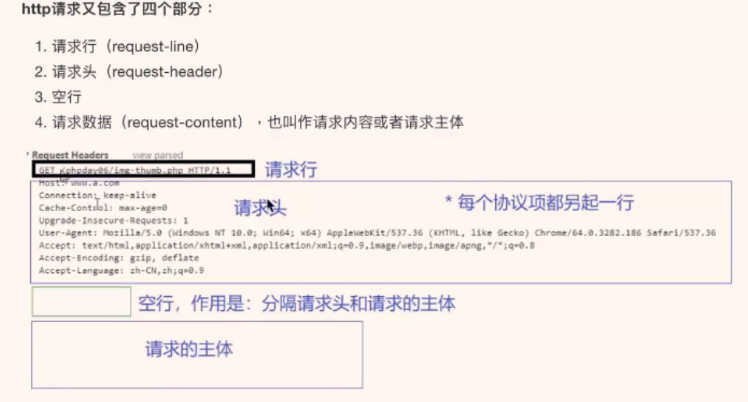
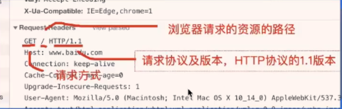
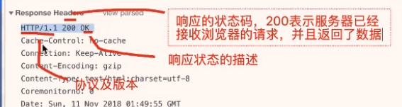
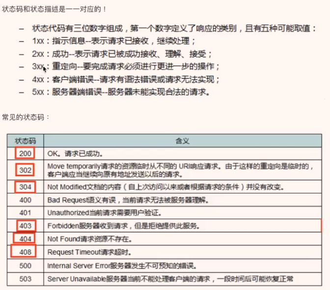
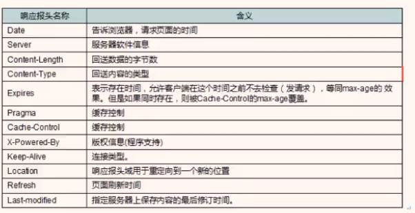
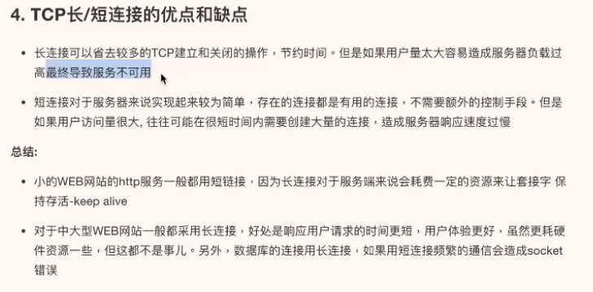

# HTTP

超文本传输协议

Hyper Text Transfer Protocol

互联网应用最广泛使用的协议

- 用来在网络上传输HTML文本的协议，用于浏览器和服务器的通信

设计目的是提供一种发布和接收HTML页面的方法

## OS

## 请求request-响应response式模式

每个协议项占一行

### 请求

**GET方式，只有请求行，请求头，空行**

- 

- 

- Host

	- 当前请求主机名

- accept-encoding

	- 浏览器发给服务器，声明浏览器支持的压缩编码类型

- accept-charset

	- 浏览器支持的字符集

- referer

	- 表示此次请求来自那个网址

- accept-language

	- 可以接收的语言类型，cn，en，有权重之分 q=0.9

- cookie

	- 从前对服务器请求时在浏览器客户端设置的数据，再次请求时传输从前的数据

- user-agent

	- 用户代理，当前发起请求的浏览器的内核信息

**POST方式，请求行，请求头，空行，请求主体**

### 响应

响应行

- 协议及版本、响应状态码，响应状态的描述

	- 子主题 1
	- 子主题 2

响应头

- server

	- 服务器名和版本

- date

	- 响应时间

- last-modified

	- 文件最后修改时间

- content-length

	- 响应主体的长度(字节)

- content-type

	- 响应内容的数据类型

- 。。。

	- 子主题 1

- 空行
- 响应主体

	- Response下

## 长连接和短连接

### 短连接

- 浏览器和服务器每进行一次HTTP操作，就建立一次连接，任务结束就中断连接
- HTTP/1.0
- 会频繁建立和断开连接，当瞬间访压力较大时，服务器响应慢

### 长连接

- HTTP/1.1
- 保持连接特性，在响应头加入 Connection：keep-alive
- 要不连不上，连上速度有保证，当服务器瞬间访问压力较大时，服务器不可用

