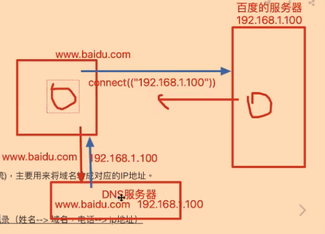
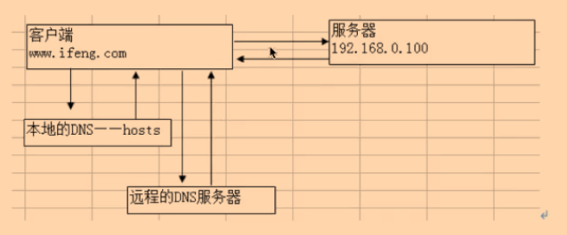

# 域名

DN(Domain Name)

因ip地址不好记忆才出现的域名

域名的构成：由字母、数字、中划线（-），长度不超过255个字符。

## localhost

专指本机

## DNS服务器

Domian Name System

- 是一台运行在互联网上的服务器

全球只有13台

电脑之间的互访，只能识别IP地址，不识别域名访问

主要用来将域名转为对应的IP地址

- 域名请求过程

- 先请求本地，再请求DNS

	- Windows C:\Windows\System32\drivers\etc\hosts

