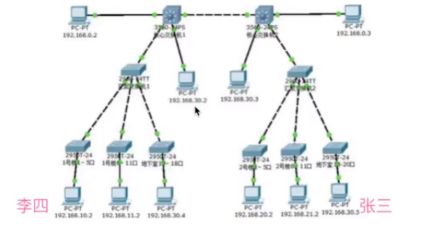
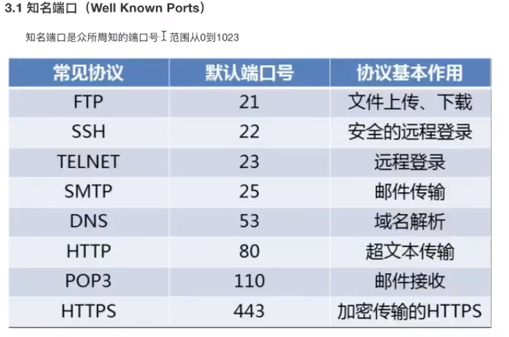

# 网络
[python](python.md)

## 概念

一些相互连接的，以资源共享为目的的计算机的集合

## 网络编程

让在不同的电脑上的软件能够进行数据传递

IP地址

## 网络通信

## 端口

## [网络传输方式](%E7%BD%91%E7%BB%9C%E4%BC%A0%E8%BE%93%E6%96%B9%E5%BC%8F.md)

## [域名](%E5%9F%9F%E5%90%8D.md)

## [HTTP](HTTP.md)

