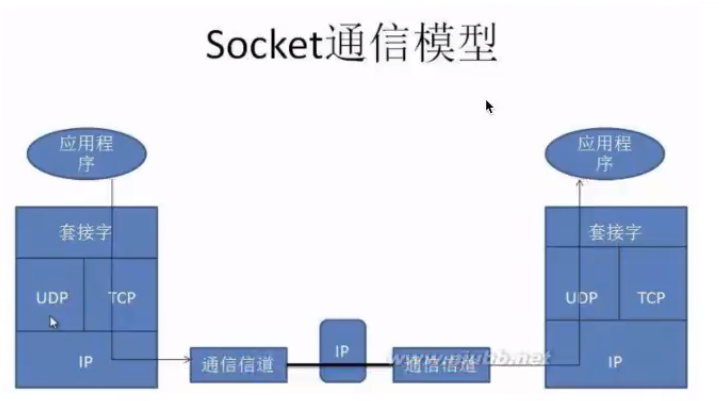
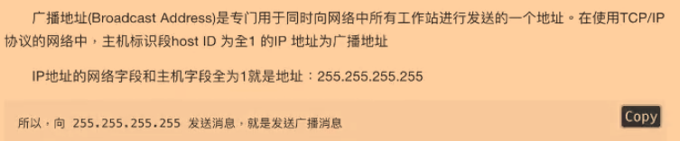

# 面向无连接

不建立和断开连接，发送端于任何时候自由发送数据，接收端不知道何时会·接收到数据

类似广播

## UDP

用户数据报协议

- 缺点

	- 在网络质量不稳定时，UDP协议数据包丢失会比较严重

- socket

	- 创建UDP socket时需要指定 socket.SOCK_DGRAM
	- 概念

	- 分类

		- 流套接字(SOCK_STREAM)
		- 数据报套接字(SOCK_DGRAM)
		- 原始套接字(SOCK_RAW)

	- 
	- socket模块

		- 发送

			- sendto

		- 接受

			- recvfrom

- 会变得端口号

	- bind（）

- 广播地址

	- 
	- xxx.xxx.xxx.255

		- 一个网络下

	- 255.255.255.255

