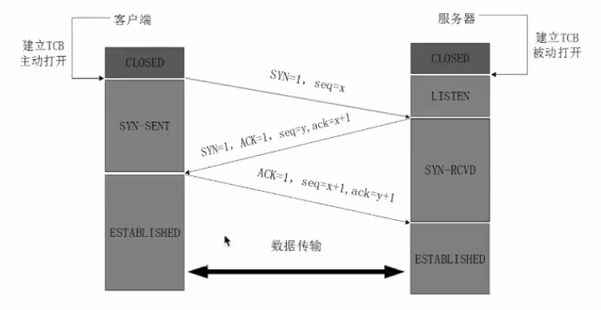
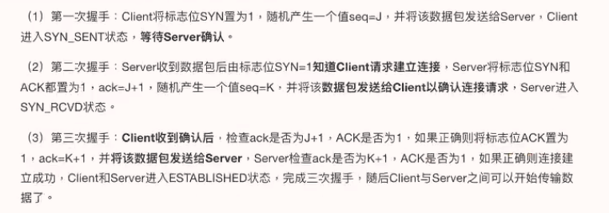
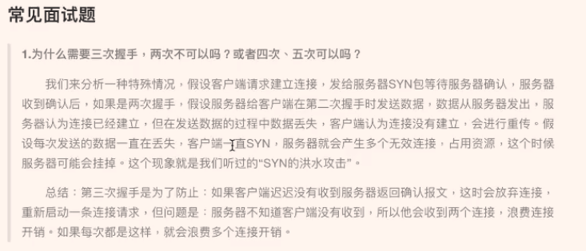
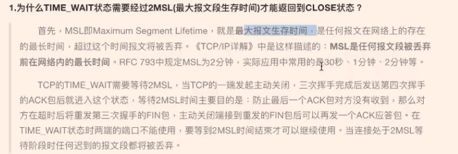

# 面向有连接

## TCP

### 传输控制协议

- 概念

	- 是一种面向连接的、可靠的、基于字节流的传输层通信协议（由IETF的RFC 793定义）

- socket

	- 创建TCP socket时需要指定 socket.SOCK_STREAM

- 特点

	- 采用应答机制
	- 超时重传

		- 为保证不丢包，给每个包序号，且做到按序接收

	- 错误校验

		- 顺序效验，去除重复

	- 流量控制和阻塞管理

		- 流量控制避免主机发送的过快而使接收方来不及完全收下

- 严格区分客户端和服务端

	- 案例

		- 文件下载器

			- 新点

				- with open("文件名", 打开方式）as file: 

					- file = with open("文件名", 打开方式）
					- with底层帮助我们关闭文件

- tcp的三次握手

	- 即建立TCP连接

		- 指建立一个TCP连接时需要客户端和服务端总共发送三个数据包来确认连接的建立
		- 在socket编程中，此过程由客户端执行connect来触发
		- 

			- 

		- 防止SYN的洪水攻击

- tcp的四次挥手

	- 断开tcp连接

		- 

### 补充细节和pipeline

- tcp简介

	- TCP传输协议

		- 1.1 tcp是传输控制协议，能保证数据的准确性和有效性。
		- 1.2 tcp是面向连接的，在发送数据之前需要和对方建立连接，那么间接验证对方的ip地址有效性
		- 1.3 tcp的通信过程，首先要先建立连接，然后才能发送和接收数据，最后关闭连接
		- 1.4 tcp可以发送大量数据。
		- 1.5 tcp不适合做广播的，比如： 文件上传和下载， 多数应用程序都是使用tcp
		- 1.6 tcp的传输速度没有udp传输速度快，因为udp不需要建立连接。

	- UDP传输协议

		- 2.1 udp是用户数据报协议(User Datagram Protocol)
		- 2.2 udp发送数据不需要建立连接
		- 2.3 udp不能保证数据的准确性和有效性
		- 2.4 udp只能发送少量数据，每个数据包最大64KB
		- 2.5 udp适合做广播，比如飞秋上线操作， 广播地址: 255.255.255.255， qq视频用udp
		- 2.6 udp主要用在广播和视频传输等方面，其它方面多数都是用tcp协议

	- tcp的特点

		- 3.1. 面向连接， 在发送数据之前需要建立连接，间接验证对方ip地址的有效性
		- 3.2. 可靠的传输
		- 3.2.1 应答机制，对方收到消息底层会回复，udp没有
		- 3.2.2 超时重传，比如给对方发送了一个数据，对方一直没有回复，那么会隔一段时间再次发送这个数据，如果对方一直没有回复，那么会认为对方掉线了。
		- 3.2.3 错误校验, 如果接收的数据，数据包序号发送了错乱，tcp会自动进行排序，保证数据的有序性， 数据包如果重复会删除重复的数据包，udp没有
		- 3.2.4 流量控制，tcp有流量控制，数据发送在网卡缓存区达到一定上限，对方不会一直发送数据，需要等接收方开始接收数据的时候，等没有达到上限的时候再次让对方发送的数据，保证数据在网卡缓存区不会超出。udp没有，如果对方使用循环一直发送数据的那么电脑会卡死

	- tcp 和 udp的不同的

		- 4.1 tcp是面向连接的，发送数据之前需要建立连接，间接验证对方ip地址的有效性，udp直接发送数据， 不需要建立连接
		- 4.2 tcp有应答机制，收到数据底层会进行回复，udp收到数据不好自动回复。
		- 4.3 tcp能保证数据的准确性和有效性，udp保证不了
		- 4.4 tcp有超时重传，udp没有
		- 4.5 tcp有流量控制，udp没有
		- 4.6 tcp需要建立连接需要额外的系统资源，而udp不需要建立连接，不需要额外的连接资源， upd比tcp要节省资源
		- 4.7 tcp的传输速度没有udp的传输速度快，因为udp不需要建立连接直接就发送数据了。
		- 4.8 udp适合做广播功能，tcp不适合做广播


- tcp客户端使用步骤

```python
导入socket模块
import socket
创建socket套接字
tcp_client_socket = socket.socket(socket.AF_INET, socket.SOCK_STREAM)
建立连接
tcp_client_socket.connect(("192.168.31.221", 8080))
发送数据
tcp_client_socket.send("hello world！".encode())
关闭socket套接字
tcp_client_socket.close()
```


- tcp服务器端使用步骤

```python
导入socket模块
import socket
创建socket套接字
tcp_server_socket = socket.socket(socket.AF_INET, socket.SOCK_STREAM)
绑定端口
tcp_server_socket.bind(("", 8081))
设置服务器套接字为被动监听模式
tcp_server_socket.listen(128)
接受客户端连接
new_client_socket, ip_port = tcp_server_socket.accept()
接收客户端发送的数据
recv_data = new_client_socket.recv(1024)
关闭和当前客户端的连接
new_client_socket.close()
服务器端不再接受新的客户端连接
tcp_server_socket.close()
```

